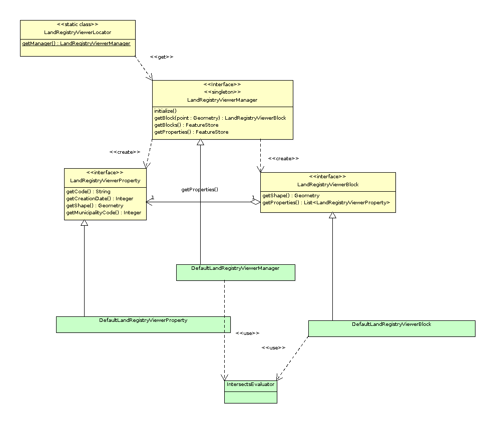

Building our first plugin
=========================

Planteamiento
-------------

Llegados aquí vamos a ver un projecto de ejemplo que nos permita ver
una serie de funcionalidades básicas de gvSIG.Los requerimientos podrían ser:

- Que nos permita ver la cartografía de manzanas 
- Que disponga de una herramienta de consulta que al pinchar sobre
  una manzana nos muestre la información de las parcelas catastrales
  asociadas a ella.
- Que personalice el *splash* de gvSIG, así como el fondo de la ventana
  principal de gvSIG con la imagen corporativa.
- Al arrancar gvSIG presentará una ventana con el mapa directamente,
  sin que el usuario deba interactuar con la aplicación para ello,
  y estará activada la herramienta de información catastral.
- Se personalizará el "acerca de" de gvSIG para introducir la información
  corporativa.
- Se deshabilitarán las herramientas de edición sobre el mapa de manzanas.
- Se preparará un paquete de instalación con el plugin para que los usuarios
  puedan instalarlo mediante el administrador de complementos de la aplicación. 

Para empezar a realizar nuestro proyecto utilizaremos el asistente para la generación
de proyectos que se incluye en la distribución de gvSIG.

Nuestro primer proyecto
-----------------------

Para gvSIG 2.2 disppone de un proyecto *base* que usar para la creacion de sus proyectos,
y que nos va a permitir disponer de un ejemplo para las principales formas de interaccionar
con gvSIG, y que normalmente usaremos como plantilla para crear nuestros proyectos.

Este proyecto podemos encontrarlo en el svn de gvsig, en la url:

http://devel.gvsig.org/svn/gvsig-plugintemplates/org.gvsig.landregistryviewer/trunk/org.gvsig.landregistryviewer/

Antes de empezar, deberemos realizar unas pocas tareas de configuracion:

- Disponer de un JDK 1.7 instalado y accesible en el PATH.

- Disponer de cliente de svn accesible en el PATH. 

- Disponer de maven accesible en el PATH.

- Configurar donde se encuetra la instalacion de gvSIG sobre la que vamos a trabajar.

Suponiendo que ya estan instalados y configurados el JDK, el cliente de svn, y maven, vamos
a ver como configurar donde se encuentra la instalacion de gvSIG que vamos a usar.

En el HOME de nuestro usuario deberemos tener un fichero **.gvsig-devel.properties**. Se trata de un
fichero properties standard de java. En el debera haber una entrada de clave **gvsig.product.folder.path**
que indicara el path donde esta la instalacion de gvSIG.

Deberemos tener especial cuidado de que tengamos permisos de escritura en la carpeta de la instalacion
de gvSIG que vayamos a utilizar ya que de lo contrario se produciran error en el despliegue de nuestro
plugin.

Procederemos a ejecutar::

  ~ $ cd $HOME/devel
  ~ $ svn checkout http://devel.gvsig.org/svn/gvsig-plugintemplates/org.gvsig.landregistryviewer/trunk/org.gvsig.landregistryviewer/
  ...salida del comando svn...
  ~ $ cd org.gvsig.landregistryviewer
  ~ $ mvn install
  ... salida del comando install...

..  note::
    Si estamos utilizando MS Windows deberemos tener especial cuidado con algunos detalles:
    
    - Podemos tener problemas con el tamaño de las rutas, en gvSIG se utilizan rutas muy largas.
      Es recomendable que cree una carpeta en el raiz de la unidad, por ejemplo **C:/devel** y
      usar esta para trabajar sobre ella.
    - Normalmente la instalacion de gvSIG se realizara en modo administrador, y nuestro usuario no dispondra
      de permisos para sobreescribir archivos y carpetas de esta, ademas de que puede contener rutas con 
      *espacios*  que puede ocasionarnos problemas de despliegue de nuestros plugins. 
      Para evitar problemas la sugerencia es que creemos la carpeta  *C:/devel/gvSIG-desktop* y copiemos 
      en ella la instalacion de gvSIG.
    - A la hora de crear el fichero *.gvsig-devel,properties* podemos tener algun problema. Deberemos 
      crearlo en el HOME de nuestro usuario, normalmente *C:/Usuario/mi-usuario*. Y tener especial 
      precaucion con:
      
      - el fichero debe llamarse exactamente ".gvsig-devel.properties", sin extension ".txt", asegurese
          de que al crearlo no tiene extension ".txt".
      - Puede tener problemas para crear un fichero que comienze por ".". Una forma de hacerlo puede ser
          abrir el bloc de notas y guardar el fichero en la ruta y nombre indicado.
    

Trabajando con un IDE, Netbeans
-------------------------------

Si estamos trabajando con un IDE como Netbeans podemos descargarnos el proyecto
de ejemplo con:

.. figure:: images/netbeans-checkout-1.png
  :align: center

Que nos mostrara el cuadro de dialogo de descargar proyectos desde SVN.

.. figure:: images/netbeans-checkout-2.png
  :align: center

Indicaremos en "Repository URL" el valor

  http://devel.gvsig.org/svn/gvsig-plugintemplates/org.gvsig.landregistryviewer/trunk/org.gvsig.landregistryviewer/

Despues nos pedira la carpeta donde queremos descargar el proyecto. Normalmente la dejaremos por defecto.

.. figure:: images/netbeans-checkout-3.png
  :align: center

Una vez descargados los proyectos, nos informara que entre los archivos descargados hay varios proyectos de maven, y si queremos
cargar estos en el IDE. Pulsaremos en "Open projects..."

.. figure:: images/netbeans-checkout-4.png
  :align: center
  
Nos mostrara los proyectos maven que ha encontrado. Seleccionaremos el primero y pulsaremos en "Open"

.. figure:: images/netbeans-checkout-5.png
  :align: center

  Una vez aqui ya nos mostrara en el arbol de proyectos el proyecto de ejemplo. Desplegando en "Modules" podemos ver la estructura de subproyectos o modulos de este.
  
.. figure:: images/netbeans-checkout-6.png
  :align: center

  

Estructura de un proyecto
-------------------------

..  tip::
    Puede resultarle útil consultar la documentación existente
    en la *Guía para desarrolladores* relacionada con esto, que 
    puede encontrar en la sección 
    `Estructura de un proyecto en gvSIG`_ asi como en
    `Cosas a tener en cuenta antes de desarrollar un plugin`_ .

.. _`Cosas a tener en cuenta antes de desarrollar un plugin` : https://gvsig.org/web/reference_catalog/lookupObject?uuid=eb91eb79e1e1f2ec730bfe13bb649f6c
.. _`Estructura de un proyecto en gvSIG` : https://gvsig.org/web/reference_catalog/lookupObject?uuid=1dad723b0c168999e622de9c6bf03017

Vamos a echarle un vistazo al código del proyecto. 
Los proyectos que encontraremos son:

- *org.gvsig.landregistryviewer*. Se trata de un proyecto Maven con varios subproyectos. En ellos
  encontraremos dividido, la parte de la lógica, con su API
  e implementación, así como la parte de interface de usuario asociada a los componentes
  de la lógica, también con su API e implementación, y un proyecto que nos permitirá
  probar esa lógica e interfaces de usuario sin necesidad de arrancar gvSIG. En general
  los distintos componentes que encontremos aquí serán independientes del framework
  de Andami así como de los plugins de gvSIG, siendo dependientes únicamente de otras
  librerías. Los proyectos que nos encontraremos serán:
  
  - *org.gvsig.landregistryviewer.lib* con la lógica de nuestro proyecto

    - *org.gvsig.landregistryviewer.lib.api*

    - *org.gvsig.landregistryviewer.lib.impl*

  - *org.gvsig.landregistryviewer.swing* con el interface de usuario de nuestros
    componentes lógicos.

    - *org.gvsig.landregistryviewer.swing.api*

    - *org.gvsig.landregistryviewer.swing.impl*

  - *org.gvsig.landregistryviewer.main*, nuestra *main* de pruebas.

  - *org.gvsig.landregistryviewer.app*. Este proyecto contendrá la implementación de los distintos plugins que 
    se van a añadir a gvSIG. Normalmente usará los componentes de los proyecto *org.gvsig.landregistryviewer.lib* y *org.gvsig.landregistryviewer.swing*, y se encargará de la integración de estos en gvSIG. En el ejemplo solo hay un subproyecto, *org.gvsig.landregistryviewer.app.mainplugin* ya que vamos a aportar un único plugin. Si tuviésemos necesidad de aportar más de un plugin tendríamos un subproyecto por plugin.

.. note::

   TODO:

   Añadir el ejemplo de Chart como proyecto que aporta mas de un plugin.

   nota sobre balancear un solo plugin monolitico muchos pequeños.

  
  
Las dependencias en los distintos proyectos
-------------------------------------------

A la hora de identificar un *artefacto* en maven, lo normal es que que intervengan al menos tres componentes, sin los cuales no es posible identificar al *artefacto*. Estos serian:

- Grupo, **groupId**. Normalmente hace referencia al nombre de nuestra organización.
  Por ejemplo en gvSIG utilizamos *"org.gvsig"*, por otras organizaciones o empresas pueden
  utilizar uno propio.

- Identificador, **artefactId**. Deber ser un identificador del proyecto único dentro del
  grupo.

- Versión, **version**. En el proceso de desarrollo iremos generando distintas revisiones o versiones
  de nuestros productos o *artefactos*. Para identificarlos no solo deberemos indicar su nombre, 
  si no también la versión a la que nos referimos.

Todo proyecto maven deberá identificarse por estos tres datos. Así en el *pom.xml* del raíz de nuestro
proyecto encontraremos algo como:

.. code-block:: xml

   org.gvsig
   org.gvsig.landregistryviewer
   1.0.0-SNAPSHOT

Donde se declaran esos valores.

Además en el *pom* de nuestro proyecto raíz también encontraremos:

- Una declaración de quien es el padre o de quien extiende nuestro proyecto, sección **parent**:

  .. code-block:: xml
  
    
      org.gvsig
      org.gvsig.desktop
      2.0.100
    

  Aquí observaremos que, normalmente, en un proyecto gvSIG, extenderemos o heredaremos del proyecto *org.gvsig:org.gvsig.desktop*.
  Este proyecto tiene la configuración necesaria para compilar y desplegar proyectos gvSIG, normalmente plugins para la aplicacion
  *gvSIG desktop* y las librerias que estos precisen. Además de la configuración básica, también tiene declarada la versión de
  todos los componentes que forman el núcleo de gvSIG, de forma que no tengamos que declararla cada vez que indiquemos una dependencia 
  con un subproyecto del núcleo.
  

- Una sección donde declararemos las versiones de los subproyectos que conforman nuestro
  proyecto. En maven esto lo realizaremos en la sección **dependencyManagement**. Normalmente aquí
  especificaremos:
  
  - Declararemos todos los subproyectos de nuestro proyecto.
  
  - Declararemos las dependencias con los proyecto o artefactos que no formen parte del 
    núcleo de gvSIG, como otras librerías que podamos necesitar.
  
  Hay que tener en cuenta que en esta sección, **dependencyManagement**, indicamos que versiones de que artefactos queremos usar cuando especifiquemos una dependencia con estos en la sección **dependencies**. Que aparezca una depedencia en  **dependencyManagement** no le esta indicando a *maven* que exista una dependencia real con ese artefacto, esto solo sucederá con las que se incluyan en la sección **dependencies**.

  Para nuestro caso tendríamos algo como:
  
  .. code-block:: xml

    
      
        
          org.gvsig
          org.gvsig.landregistryviewer.lib.api
          1.0.0-SNAPSHOT
        
        
          org.gvsig
          org.gvsig.landregistryviewer.lib.api
          1.0.0-SNAPSHOT
          test-jar
        
        
          org.gvsig
          org.gvsig.landregistryviewer.lib.impl
          1.0.0-SNAPSHOT
        
        
          org.gvsig
          org.gvsig.landregistryviewer.swing.api
          1.0.0-SNAPSHOT
        
        
          org.gvsig
          org.gvsig.landregistryviewer.swing.api
          1.0.0-SNAPSHOT
          test-jar
        
        
          org.gvsig
          org.gvsig.landregistryviewer.swing.impl
          1.0.0-SNAPSHOT
        
        
          org.gvsig
          org.gvsig.landregistryviewer.app.mainplugin
          1.0.0-SNAPSHOT
        
      
    

  Muy importante que las versiones de los subproyectos aquí indicadas coincidan siempre con la versión del proyecto raíz.

  La finalidad principal sera centralizar en este *pom* la declaración de las versiones de las
  dependencias de nuestro proyecto de cara a facilitar su mantenimiento.
  
  Si dependediesemos de algún otro proyecto de gvSIG, normalmente lo que haremos seria importar las 
  dependencias que este tuviese declaradas en su *dependencyManagement* en lugar de ir declarando una
  a una las que precisemos. Esto reduce la posibilidad de confusión al declarar las dependencias
  de estos. Así por ejemplo si quisiésemos declarar las versiones de los subproyectos base de raster
  pondríamos algo como:
  
  .. code-block:: xml
  
    
      
        
          org.gvsig
          org.gvsig.raster
          ${org.gvsig.raster.version}
          pom
          import
        
        
          org.gvsig
          org.gvsig.landregistryviewer.lib.api
          1.0.0-SNAPSHOT
        
    ...
  
  Y declararíamos la propiedad *"org.gvsig.raster.version"* en la sección *properties*:

  .. code-block:: xml
  
    
      2.2.16
    

  Podemos o no usar un *property* para indicar la versión del proyecto del cual importamos las dependencias.
  La ventaja de usar un *property* es que podemos actualizar nuestro proyecto fácilmente a la ultima revisión
  de gvSIG con::
  
    mvn versions:update-parent  versions:update-properties
    
  Pero antes de ejecutar esto es conveniente informarse de si se ha generado ya alguna versión de desarrollo
  para la siguiente versión a la ultima *"final"* liberada.
  
Una cuestión mas a tener en cuenta relacionada con las versiones de los artefactos que podemos encontrar en 
el *"pom"* es que estas no se corresponden con las versiones de la aplicación "gvSIG desktop". La aplicación
de usuario lleva su linea de versiones y cada uno de los artefactos de gvSIG la suya. Siendo así...

¿ Como podemos saber que versión de artefacto debemos usar ?

Para saber la versión de *org.gvsig.desktop* que debemos usar, deberemos decidir contra que versión de
la aplicación *gvSIG desktop* deberemos trabajar, y disponer de una versión de esta instalada.

Miraremos la versión del jar::

  org.gvsig.andami-*.jar

de dentro de la carpeta *"lib"* de la instalación de gvSIG. La versión de ese jar nos dirá la versión
que debemos usar como versión de *"org.gvsig.desktop"*.

Para *"gvSIG desktop 2.2.0-2313"* es **2.0.100**.

En el caso de la librería base de raster, org.gvsig.raster, en la carpeta
*lib* del plugin *org.gvsig.raster.mainplugin*, y podemos encontrar::

  org.gvsig.raster.lib.api-*.jar

del que podemos obtener la versión de esta. O si queremos enlazar con el plugin de *"mapas"*, consultaríamos
en el plugin *org.gvsig.app.document.layout2.app.mainplugin*, en la carpeta *lib* la versión de::

  org.gvsig.app.document.layout2.app.mainplugin-*.jar

Las versiones de las dependencias mas comunes a usar podemos encontrarlas en:

.. list-table:: Registro de cambios
   :header-rows: 1

   * - Proyecto
     - jar
     
   * - org.gvsig.desktop
     - lib/org.gvsig.andami-...jar

   * - org.gvsig.raster
     - gvSIG/extensiones/org.gvsig.raster.mainplugin/lib/org.gvsig.raster.lib.api-...jar
     
   * - org.gvsig.geoprocess
     - gvSIG/extensiones/org.gvsig.geoprocess.app.mainplugin/lib/org.gvsig.geoprocess.app.mainplugin-...jar
     
   * - org.gvsig.hyperlink.app
     - gvSIG/extensiones/org.gvsig.hyperlink.app.extension/lib/org.gvsig.hyperlink.app.extension-...jar
     
   * - org.gvsig.mapsheets.app
     - gvSIG/extensiones/org.gvsig.mapsheets.app.mainplugin/lib/org.gvsig.mapsheets.app.mainplugin-...jar
     
   * - org.gvsig.vectorediting
     - gvSIG/extensiones/org.gvsig.vectorediting.app.mainplugin/lib/org.gvsig.vectorediting.app.mainplugin-...jar
     
   * - org.gvsig.tools
     - lib/org.gvsig.tools.lib-...jar

Además de la sección **parent** y **dependencyManagement**, en el *pom* podemos encontrarnos una sección **dependencies**.
Esta sección es donde se declaran las dependencias reales de nuestro proyecto, a partir de las que se construirá el 
*classpath* de compilación y ejecución. Sin embargo recomendamos que en proyectos de tipo *pom*, como es el raíz, 
no incluyamos ninguna dependencia, incluyéndolas únicamente en los proyectos *hoja*, de tipo *jar*, ya que 
en un momento dado puede desvirtuarnos los informes de dependencias de nuestros proyectos.

Por ultimo, relacionado con el *pom* del proyecto raíz, es importante la sección **modules**, que indica cuales son
los subproyectos de este. Es importante tener en cuenta que una carpeta dentro del proyecto raíz no es un subproyecto 
o modulo de este si no se declara aquí.

Vamos a comentar ahora sobre los demás *poms* que encontraremos en los distintos subproyectos.

Primero, sobre los *poms* de los subproyectos o módulos de tipo *pom*, que no son subproyectos *hoja*.
En estos lo mas importante es tener en cuenta que:

- Deberemos indicar siempre una sección **parent** en la que referenciaremos al pom padre
  de este, utilizando su **groupId**, **artifactId** y **version**.
  
- Incluiremos solo **artifactId**, ya que la *version* y *groupId* lo heredara del padre.

- No incluiremos sección **dependencies**.

- Incluiremos la sección **modules** con los subproyectos de este.

Ahora pasemos a ver que tendremos en los *poms* de los proyectos *hoja*, de tipo *jar*.
Estos proyectos son los que generan *artefactos*, normalmente *jars* con nuestro código y
los que precisan que especifiquemos dependencias de cara a su correcta compilación. Asi 
que sera en estos donde deberemos incluir la sección **dependencies**. A la hora de 
especificar una dependencia tendremos que tener en cuenta que:

- Siempre especificaremos su **groupId** y **ArtefactId**.

- No especificaremos nunca su **version**, esta deberemos haberla incluido
  en el **dependenciesManagement** de nuestro proyecto raíz o vendrá heredada
  del proyecto *org.gvsig.desktop*.
  
- Deberemos especificar siempre el *scope* de la dependencia. Aunque maven no 
  lo requiere siendo *compile* si no se especifica, desde el proyecto gvSIG 
  recomendamos que se incluya siempre de cara a evitar confusiones.

  Normalmente el **scope** sera:
  
  - compile
  - runtime
  
  Aunque hay algunos mas. Este nos indicara si esa dependencia debe incluirse en 
  el *classpath* de compilación o de ejecución.
  
  
Vamos a comentar ahora algunas consideraciones sobre las dependencias entre los
distintos subproyectos. En gvSIG tendemos a separar *conceptos*, API/implementacion -
logica/GUI/plugin, influyendo esto directamente en la estructura de proyectos, ya que
como vimos anteriormente disponemos de un proyectos para la lógica (...lib) con su 
API e implementación, otro proyecto para el interface de usuario (...swing), también
con su API e implementación, y otro para los plugins de gvSIG (...app). 
Ahora bien... ¿ Que dependencias podemos encontrar en cada uno de ellos ?

Normalmente tendremos en cuenta una serie de reglas:

- La definición de APIs solo dependerá de proyectos que definan APIs.
  Normalmente en los proyectos que definen APIs su *artifactId* termina en *".api"*.
  
- Nadie tendrá dependencias con proyectos que contengan la implementación de un API, 
  dependiendo estos exclusivamente de APIs.
  
- En general, una librería, de API o implementación, nunca dependerá de una implementación, 
  un plugin de gvSIG a el framework de runtime de la aplicación gvSIG (andami).

- Las librerías que contienen el interface de usuario, tanto su API como su implementación,
  no deberán depender de la librería que implementa la lógica de ese interface de usuario,
  solo de su API.

- Solo los proyectos de tipo plugin de gvSIG podrán tener dependencias con otros plugins
  o el framework de ejecución de gvSIG.
  
Con esto en mente podemos echar un vistazo a las dependencias de los distintos *poms*
de nuestros proyectos.

- **org.gvsig.landregistryviewer.lib.api**:

  .. code-block:: xml

    
      
        org.gvsig
        org.gvsig.tools.lib
        compile
      
      
        org.gvsig
        org.gvsig.tools.lib
        test-jar
        test
      
      
        org.gvsig
        org.gvsig.fmap.geometry.api
        compile
      
      
        org.gvsig
        org.gvsig.fmap.dal.api
        compile
      
    

  Depende de la librería *org.gvsig.tools.lib*, que contiene todas las utilidades básicas
  para separación de API e implementación, con lo que prácticamente todos nuestros proyectos
  dependerán de ella, y del API de las librerías de acceso a datos, *org.gvsig.fmap.dal.api*
  y de manejo de geometrías, *org.gvsig.fmap.geometry.api*. Como se aprecia, solo depende
  de APIs.

- **org.gvsig.landregistryviewer.lib.impl**, básicamente mantiene las mismas dependencias
  que el API, pero además tiene dependencias de compilación con este.
  
- **org.gvsig.landregistryviewer.swing.api**:

  .. code-block:: xml

    
      
        org.gvsig
        org.gvsig.tools.lib
        compile
      
      
        org.gvsig
        org.gvsig.tools.lib
        test-jar
        test
      
      
        org.gvsig
        org.gvsig.tools.swing.api
        compile
      
      
          org.gvsig
          org.gvsig.landregistryviewer.lib.api
          compile
      
        

  Dependerá del API de la parte de lógica, *org.gvsig.landregistryviewer.lib.api*, y además
  del API de la parte de *swing* de la libreria org.gvsig.tools, *org.gvsig.tools.swing.api*.

- **org.gvsig.landregistryviewer.swing.impl**, dependerá básicamente de su API.

- **org.gvsig.landregistryviewer.app.mainplugin**, la parte del plugin para gvSIG desktop, 
  dependerá de:

  .. code-block:: xml  
  
    
        
            org.gvsig
            org.gvsig.landregistryviewer.lib.api
            compile
        
        
            org.gvsig
            org.gvsig.landregistryviewer.swing.api
            compile
        

        
            org.gvsig
            org.gvsig.tools.lib
            compile
        
        
            org.gvsig
            org.gvsig.tools.swing.api
            compile
        

        
            org.gvsig
            org.gvsig.andami
            compile
        
        
            org.gvsig
            org.gvsig.app.mainplugin
            compile
        
        
        
            org.gvsig
            org.gvsig.fmap.control
            compile
        
        
            org.gvsig
            org.gvsig.fmap.mapcontext.api
            compile
        
        
            org.gvsig
            org.gvsig.fmap.geometry.api
            compile
        
        
            org.gvsig
            org.gvsig.fmap.dal.api
            compile
        
        
            org.gvsig
            org.gvsig.projection.api
            compile
        

        
            org.gvsig
            org.gvsig.landregistryviewer.lib.impl
            runtime
        
        
            org.gvsig
            org.gvsig.landregistryviewer.swing.impl
            runtime
        
                
    

  
  Como se trata del plugin para gvSIG, este depende específicamente del framework
  de la aplicación gvSIG desktop, *org.gvsig.andami*, y del plugin principal de la aplicación, 
  *org.gvsig.app.mainplugin*. Además depende de algunas otras librerías de gvSIG, como:
  
  - org.gvsig.fmap.control, componente gráfico para visualizar un mapa.
  - org.gvsig.fmap.mapcontext.api, la parte de lógica del componente del mapa.
  - org.gvsig.fmap.geometry.api, la librería de geometrías.
  - org.gvsig.fmap.dal.api, la librería de acceso a datos.
  - org.gvsig.projection.api, la librería de proyecciones.
  - org.gvsig.tools.lib.
  - org.gvsig.tools.swing.api.

  Además de depender para compilación de los APIs de las librerías del proyecto:
  
  - org.gvsig.landregistryviewer.lib.api
  - org.gvsig.landregistryviewer.swing.api
  
  Y lo mas importante, deberá depender de las implementaciones de las librería del 
  proyecto en modo runtime.

  - org.gvsig.landregistryviewer.lib.impl
  - org.gvsig.landregistryviewer.swing.impl
  
  Es importante esto por dos razones. Por un lado debe ser solo de runtime, si no significaría
  que no hemos definido correctamente el API de nuestro proyecto, y por otro, es preciso que 
  se incluya la dependencia como de runtime ya que necesitaremos desplegarlas en nuestro 
  plugin y para ello es obligatorio que nuestro plugin dependa de ellas, como veremos mas
  adelante cuando comentemos el código del plugin.
    
    

    
La librería con la lógica
-------------------------

La parte de la lógica de nuestro desarrollo la encontraremos dividida en dos proyectos:

- org.gvsig.landregistryviewer.lib.api

- org.gvsig.landregistryviewer.lib.impl

En el proyecto del API encontraremos principalmente interfaces. Estos interfaces compondrán
el API de los componentes de lógica que precisemos desarrollar. 
EL modelo de clases del ejemplo es el que se muestra en el siguiente diagrama:

.. figure:: images/org.gvsig.visor.api.png
   :align: center

   Modelo de clases del API
   
Tendremos las siguientes entidades:

- **landregistryviewerLibrary**, que representa al objeto *Library*. De esta clase señalar los métodos:

  - *doRegistration*, que se ejecuta al cargar la librería e informa qué clase de librería
    es, en nuestro caso la definición de un API, así como qué otras librerías requiere que estén
    inicializadas antes que esta, la librería de acceso a datos, y la de geometrías. El código
    que hace esto es:

    .. code-block:: java

      public void doRegistration() {
        this.registerAs(landregistryviewerLibrary.class, Library.TYPE.API);
        this.require(DALLibrary.class);
        this.require(GeometryLibrary.class);
      }

  - *doPostInitialize*, que se ejecuta cuando se han inicializado todas las librerías.
    En nuestro caso realiza comprobaciones para verificar que al menos una implementación
    del API ha sido registrada. El código que hace esto es:
  
    .. code-block:: java

      protected void doPostInitialize() throws LibraryException {
        // Validate if there are any implementation registered.
        landregistryviewerManager manager = landregistryviewerLocator.getManager();
        if (manager == null) {
            throw new ReferenceNotRegisteredException(
                landregistryviewerLocator.MANAGER_NAME, landregistryviewerLocator.getInstance()
              );
        }
      }

  
  .. note TODO: Comentar algo sobre la referencia al META-INF/services

- **landregistryviewerLocator**, es el *locator* de nuestra librería, el encargado de
  suministrarnos la instancia de nuestro manager. Se trata de una clase con métodos
  estáticos para registrar implementaciones de este API u obtener una implementación
  de él.

- **landregistryviewerManager**. Un interface. El del manager de la librería. Define métodos para obtener las
  manzanas y parcelas así como para localizar una manzana dado un punto. Es la
  entrada a las distintas entidades de nuestro modelo.

- **landregistryviewerBlock**. Un interface que representa a una manzana, y aporta métodos para obtener la geometría
  que define la manzana o para obtener las parcelas que la constituyen.

- **landregistryviewerProperty**. Un interface que representa una parcela catastral. Tiene métodos para obtener
  la geometría que la define, su código o municipio.

Vamos a ver qué nos encontramos en la parte de implementación. Observaremos que
mientras que en el API lo normal ha sido encontrarnos interfaces, en la implementación
nos encontraremos clases. Clases que implementan los distintos interfaces que se
definieron en el API.  Por convenio, a la implementación de los distintos interfaces
que aparecen en el API las llamaremos igual que en el API anteponiéndole el prefijo *Default*.

El modelo de clases de la implementación para nuestro ejemplo es:

   Modelo de clases de la implementación
   
Vamos a ir viendo las partes más relevantes de la implementación. 

- **landregistryviewerDefaultImplLibrary**. Al igual que en el API, esta clase se encarga de
  inicializar la librería de la implementación. De esta clase señalar los métodos:
  
  - *doRegistration*, que se encarga de registrar la librería como una implementación
    del API de *landregistryviewerLibrary*. Si tuviese otras dependencias distintas de las marcadas en el 
    API, se añadirían aquí para asegurarnos que esas librerías se inicializan antes
    que esta, pero no es el caso de nuestro ejemplo. Al registrar esta librería como
    una implementación de *landregistryviewerLibrary*, se cubren dos funciones. Por un lado la librería
    del API será inicializada siempre antes que esta implementación, y por otro lado
    cuando alguna otra librería fije dependencias con el API, el mecanismo de inicialización
    de librerías se encargará de inicializar la implementación junto con el API para 
    asegurarnos de que dispondremos de una implementación del API que hemos requerido.
    El código que necesitaremos poner en nuestro ejemplo será:

    .. code-block:: java

      public void doRegistration() {
        this.registerAsImplementationOf(landregistryviewerLibrary.class);
      }

  - *doInitialize*, que se encarga de registrar en el locator del API la implementación
    del manager que tenemos en esta librería. El código que hace esto es:  

    .. code-block:: java

      protected void doInitialize() throws LibraryException {
          VisorLocator.registerManager(DefaultlandregistryviewerManager.class);
      }

- **DefaultlandregistryviewerManager**. De esta clase conviene resaltar principalmente:

  - El método *getBlock*. Podemos ver cómo realizar una busqueda de un registro
    filtrando por una condición espacial:    

    .. code-block:: java

      try {
        String attrGeomName = blocks.getDefaultFeatureType().getDefaultGeometryAttributeName();
        FeatureQuery query = blocks.createFeatureQuery();
        query.setFilter( new IntersectsEvaluator(attrGeomName,point) );
        set = blocks.getFeatureSet(query);
        if( set.isEmpty() ) {
          return null;
        }
        it = set.fastiterator();
        Feature f = (Feature) it.next();
        LandregistryviewerBlock block = new DefaultLandregistryviewerBlock(this,f.getGeometry(attrGeomName));
        return block; 
      } catch (DataException e) {
        ...
      } finally {
        if( it != null ) {
          it.dispose();
        }
        if( set != null ) {
          set.dispose();
        }
      }
      
    
    ..  Tip::
        Puede encontrar información sobre los mecanismos
        disponibles para el acceso a datos consultando la
        `Guía para el desarrollador de la Librería de Acceso a Datos (DAL)`_ 

    .. _`Guía para el desarrollador de la Librería de Acceso a Datos (DAL)` : https://gvsig.org/web/reference_catalog/lookupObject?uuid=b676641c65b75fd97c3f1cedb8482073

    De aquí resaltar:
    
    - Podemos averiguar qué atributo de la *feature* es el que contiene la geometría 
      a través del *getDefaultGeometryAttributeName* del *feature type* de nuestro *store*.
    
    - Para realizar una búsqueda de *features* en un *store* lo haremos invocando al método
      *getFeatureSet* pasando como parámetro una instancia de *FeatureQuery* en la que se
      especifiquen las condiciones de filtrado. En ella también se pueden especificar 
      orden o atributos que queremos recuperar en nuestra query.
  
    - La condición de filtro se especifica suministrando un Evaluator al método *setFilter*
      de nuestra query.
    
    - Debemos encargarnos de liberar los objetos que creemos, como son *iteradores* o *feature sets*.
      Hay que tener en cuenta que dependiendo del tipo de *store* con el que estemos trabajando
      estos pueden tener reservados recursos como conexiones a BBDD, recordsets o conexiones a
      servidores remotos.
      
  - El método *openShape*. Aquí podemos ver cómo abrir un *store* basado en shapes
    ya existentes:

    .. code-block:: java

      parameters = manager.createStoreParameters("Shape");
      parameters.setDynValue("shpfile", shape);
      parameters.setDynValue("crs", "EPSG:23030");
      return (FeatureStore) manager.openStore("Shape", parameters);

    Observaremos que para abrir un *store* lo realizaremos en dos fases. Por un lado crearemos
    una estructura para albergar los parámetros necesarios para abrir nuestro *store*, la
    inicializaremos con los valores adecuados e invocaremos al método *openStore* del manager
    de acceso a datos con esos parámetros.
    
    Cada tipo de *store* tendrá un juego de parámetros específicos de él. Para abrir un shape, 
    deberemos indicarle como mínimo el nombre del fichero y el sistema de referencia en el que
    se encuentra.
    
- **IntersectsEvaluator**. Se trata de la clase que evalúa la condición usada en el filtro.
  Esta clase comprueba si el campo geometría especificado de una feature dada intersecta con
  una geometría concreta. En su construcción se le suministran el campo que contiene la
  geometría de la feature y la geometría con la que hay que comprobar si intersecta. De esta 
  clase conviene resaltar:
  
  - el método *evaluate*, encargado de realizar la comprobación:

    .. code-block:: java
  
      Geometry op1geom = (Geometry) data.getDataValue(this.op2attrname);
      return new Boolean(this.op1geom.intersects(op1geom));

    Sabiendo cómo se llama el atributo que contiene la geometría podemos obtener esta
    a través del método *getDataValue*. Una vez tenemos las dos geometrías podemos
    invocar el método *intersecs* de la geometría para comprobar si intersectan.
    
  - El método *getCQL*. Este método devolverá una cadena siguiendo el formato de un *where* de
    sql a utilizar como filtro en *stores* que ataquen a la BBDD sql. El filtro devuelto puede 
    no ser exactamente el mismo que el implementado por el código del método *evaluate*, actuando
    a modo de filtro previo a este siempre que el store lo soporte.
    
    
- **DefaultLandregistryviewerBlock**. Representa a una manzana de nuestro dominio. Almacena la 
  geometría que da forma a la manzana. La parte más relevante de esta clase es el
  método *getProperties* que retorna todas las parcelas que se encuentran sobre
  esa manzana:

  .. code-block:: java

    List properties = new ArrayList();		

    FeatureStore store = this.manager.getProperties();
    String attrGeomName = store.getDefaultFeatureType().getDefaultGeometryAttributeName();
    FeatureQuery query = store.createFeatureQuery();
    query.setFilter( new IntersectsEvaluator(attrGeomName, this.shape) );
    set = this.manager.getProperties().getFeatureSet(query);
    if( set.isEmpty() ) {
      return null;
    }
    it = set.fastiterator();
    while( it.hasNext() ) {
      Feature f = (Feature) it.next();
      LandregistryviewerProperty property = new DefaultLandregistryviewerProperty(
        this.manager,
        f.getString(PROPERTIES_CODE),
        f.getGeometry(attrGeomName),
        f.getInt(PROPERTIES_CREATIONDATE),
        f.getInt(PROPERTIES_MUNICODE)
      );
      properties.add(property);
    }
    return properties;

  Podemos observar que utiliza el mismo mecanismo para filtrar las parcelas que
  usa el manager para recuperar un manzana. En este caso una vez a conseguido el *set*
  con las parcelas, lo recorre, recuperando los datos de estas y creando los
  objetos parcela.

- **DefaultLandregistryviewerProperty**. Se trata de la clase que representa a un parcela. En nuestro 
  ejemplo no tiene apenas lógica, limitándose a almacenar los datos y exponerlos mediante
  *geters*.
  
    

La librería con la presentación
-------------------------------

Al igual que sucedía con la parte de la lógica, la presentación también estará dividida en 
dos proyectos, por un lado el API y por otro la implementación.

- org.gvsig.Landregistryviewer.swing.api

- org.gvsig.Landregistryviewer.swing.impl

De forma similar a como sucedía con la lógica en la presentación, en el proyecto del
API sólo tenemos los interfaces y clases abstractas que definen nuestro API. El API
de la parte de presentación está formado por el interface del *manager* junto con
una serie de clases abstractas que definen el API público de nuestros componentes,
generalmente componentes que extenderán al componente de swing JPanel. Son clases
abstractas y no interfaces debido a que swing no presenta un modelo de interfaces
para sus componentes. En nuestro ejemplo, el único componente que tendremos es el
componente visual asociado a una manzana, el *JLandregistryviewerBlockPanel*,que extiende de
*JPanel* añadiéndole a nivel de API un único método que nos permita obtener el
componente lógico *LandregistryviewerBlock* que tiene asociado en un momento dado.

En la parte de implementación nos encontraremos con la clase *DefaultJLandregistryviewerBlockPanel*
que recibe en su constructor la instancia de *LandregistryviewerBlock* de la que debe presentar
sus datos. En general la parte de presentación no tiene una complicación mas allá
de la propia que pueda tener el manejo de swing. Lo único a resaltar
es que la parte de presentación no debería usar nada que no este expuesto en el API
de nuestra librería de lógica.
View source document

Integrándolo con gvSIG
----------------------

..  attention:: 
    
    Documento en construcion, pendiente de actualizar a 2,2.

Hasta ahora hemos visto cómo crear nuestros componentes, lógica e interface de usuario, usando 
las librerías de gvSIG para acceder a los datos geográficos o para presentarlos, así como una
forma simple de crear una pequeña aplicación que los utilice. Vamos a ver ahora como integraríamos
esas funcionalidades en la aplicación gvSIG.

Si observamos los proyectos que tenemos en nuestro workspace veremos que aun hay uno sobre el que
no hemos trabajado, **org.gvsig.visor.app.mainplugin** . Es aquí donde está implementado nuestro 
plugin. Antes de ver el código del plugin comentar un detalle. Cuando describíamos lo que tenía
que hacer nuestro plugin, dijimos que debía presentar un *splash* personalizado. Veamos primero 
como podemos hacer esto.

En la carpeta *"src/main/resources"* encontraremos una carpeta *theme*, y dentro de esta un 
fichero *andami-theme.xml*. Este fichero es el encargado de especificar al framework de andami
que *splash* se debe presentar así como si hay que utilizar alguna imagen de fondo en el MDI
de la aplicación o los iconos de las ventanas de gvSIG. Andami, al arrancar, buscará en las 
carpetas de los plugins uno que tenga la carpeta *theme* y dentro este fichero y cuando
encuentre uno lo utilizará. El fichero xml de nuestro ejemplo contiene:

.. code-block:: xml

  
    
      
        
      
      
      
      
    
    
  

Por defecto las rutas que aparezcan en el fichero se interpretarán relativas a 
la ubicación de este fichero, disponiendo de una variable *GVSIG_INSTALL* que 
apuntará a la carpeta en la que está instalado gvSIG. En el ejemplo podemos
ver como en el tag *Splash* no se indica ruta para el fichero *"splash.png"*,
usándose el fichero que hay en la carpeta del plugin mientras que en el tag
*Icon* se usa la variable *GVSIG_INSTALL* para hacer referencia al fichero
que hay en el tema por defecto de Andami.

Podemos arrancar gvSIG y comprobar que sale el *splash* indicado en 
nuestro fichero *andami-theme.xml*.

Una vez visto como podemos cambiar el *splash*, podemos echar un vistazo a la
extensión de nuestro plugin.

.. note el config.xml !!!!!!!!!!

Vamos ahora a ver el código de nuestro *plugin*. Veremos que solo existen 
dos clases, *VisorExtension* y PropertiesOfBlockListener. La clase que integra nuestra funcionalidad
en gvSIG es *VisorExtension*. Esta clase extiende la clase *Extension* de *Andami* 
para integrarse con los menús y barras de herramientas, así como implementa
el interface *ExclusiveUIExtension*, para controlar la visibilidad de otras extensiones de 
gvSIG.

Para controlar la visibilidad de las otras extensiones de gvSIG, el interface
*ExclusiveUIExtension* aporta los métodos:

- **isEnabled** recibiendo como parametro la extensión sobre la que se
  quiere averiguar si debe estar habilitada o no:

  .. code-block:: java

    public boolean isEnabled(IExtension extension)
  
  En nuestro caso, como lo que queremos es deshabilitar todas las extensiones
  de edición, comprobaremos si la extensión que nos llega está en el paquete
  java *"org.gvsig.editing"* y para todas las que se encuentren en ese paquete
  devolveremos *false*, mientras que para el resto, delegaremos en ellas para
  averiguar si deben o no estar habilitadas.
  
- **isVisible** recibiendo como parametro la extensión sobre la que se
  quiere averiguar si debe estar visible o no:

  .. code-block:: java

    public boolean isVisible(IExtension extension)
  
  En nuestro caso, utilizaremos para determinar qué extensiones deben estar visibles
  el mismo que usamos para determinar si deben estar deshabilitadas.

Es muy importante delegar en los métodos *isEnabled* o *isVisible* de cada extensión
y no devolver *true* ya que puede que la extensión precise de algunas condiciones específicas
para estar visible o activa que ella misma comprueba.

Los métodos que nos encontramos en nuestra clase *VisorExtension* que precisa por extender
a *Extension* son:

- **initialize**. Se invoca al cargar la extensión. Aquí nos limitaremos a registrar
  servicios que ofrezca nuestra extensión. En nuestro caso nos limitaremos a informar al 
  *manager* de *plugins* que nuestra clase visor quiere actuar como controladora de la
  visibilidad de todas las extensiones. Esto lo haremos a través del método 
  *setExclusiveUIExtension* :
  
  .. code-block:: java

    PluginsManager manager = PluginsLocator.getManager();
    manager.setExclusiveUIExtension(this);

- **postInitialize**. Se invoca durante la inicialización de los plugins, una vez invocado 
  al método *initialize* de todas las extensiones. Esto nos garantiza que cuando se ejecuta
  estarán disponinles prácticamente todos los servicios de gvSIG. Aprovecharemos este método
  para:
  
  - Añadir nuestra información al *acerca de gvSIG*, esto lo haremos a través de nuestra
    función *addToAbout*. El código que lo realiza es:
    
    .. code-block:: java

      AboutManager about = AboutLocator.getManager();
      
      URL description = getResourceURL("about/description.html");
      URL icon = getResourceURL("about/icon.png");
      AboutParticipant dev = about.addDeveloper("Mi empresa", description, 1, icon);
      dev.addContribution("Mi visor", "Visor para consulta de parcelas catastrales", 2011, 5, 1, 2011, 7, 1);

    Cuando vamos a añadir nuestra información al *"acerca de"*, tendremos que hacer dos
    cosas:
  
    - Añadir una entrada como desarrolladores con nuestra información. Deberemos
      proporcionar el nombre de nuestra empresa y una descripción de esta mediante
      la URL a un documento en HTML. Normalmente este documento formará parte
      de los recursos de nuestro proyecto.
      
      Si dos extensiones intentan añadir más de una vez como desarrollador a empresas
      con el mismo nombre sólo será añadida la primera.
      
    - Añadiremos a nuestra empresa información sobre el desarrollo que hemos hecho, un 
      nombre y una pequeña descripción.
        
    Normalmente cada plugin que realicemos registrará la empresa, como la información del
    desarrollo en concreto de ese plugin.
  
  - Crear el manager de la parte de lógica de nuestra librería.
  
  - Inicializar los *stores* a través de nuestra función *initializeStores*. Como el manager de nuestra
    librería de lógica disponía de métodos para inicializar los *stores* nos limitaremos a 
    invocarlos:

    .. code-block:: java
    
      manager.initialize(
        getResource("data/properties.shp"), 
        getResource("data/blocks.shp")
      );
      
  - Y por último crear y mostrar la venta con nuestra vista, a través del método *createViewWindow*. 
    vamos a ver con un poco más de detalle cómo se realiza esto. Antes de empezar 
    lo primero que haremos será obtener una referencia del objeto *aplicacion* y del
    manager de *proyectos*:

    .. code-block:: java

        ApplicationManager application = ApplicationLocator.getManager();
        ProjectManager projectManager = application.getProjectManager();

    Una vez disponemos de estas referencias, podemos crear nuestra vista:
    
    .. code-block:: java

      // 1. Create a new view and set the name.
      ViewManager viewManager = (ViewManager) projectManager.getDocumentManagers(ViewManager.TYPENAME);
      ViewDocument view = (ViewDocument) viewManager.createDocument();
      view.setName(MY_VIEW_NAME);

    Para crear la vista, pediremos al *ProjectManager* que nos devuelva el manager de vistas, y a
    este le pediremos una nueva instancia del documento vista. Debemos recordar aquí, 
    que una de las principales
    funcionalidades de los *manager* es actuar a modo de factorías para obtener instancias de los 
    objetos que gestiona ese *manager*. Una vez disponemos del documento vista, le asignaremos el
    nombre que nosotros consideremos oportuno.
    
    Con la vista ya creada, procederemos a ver cómo hemos de hacer para añadir a esta las capas que
    necesitemos. Para ello crearemos una capa con las manzamas, esto lo realizaremos a través
    del método *createLayer*, indicándole el nombre de la capa y el *store* en que queremos que
    se base:

    .. code-block:: java
    
      // 2. Create a new layer with the blocks
      FLyrVect layer = (FLyrVect) application.getMapContextManager().createLayer("Blocks", this.manager.getBlocks());

    Con la capa ya creada, añadiremos al *mapa* de la vista la nueva capa:

    .. code-block:: java
    
      // 3. Add this layer to the mapcontext of the new view.
      view.getMapContext().getLayers().addLayer(layer);

    Añadiremos al proyecto corriente la vista:

    .. code-block:: java
    
      // 4. Add the view to the current project.
      projectManager.getCurrentProject().add(view);

    Y por último nos encargaremos de presentar la ventana asocida a la vista que
    acabamos de crear:

    .. code-block:: java
    
      // 5. Force to show the view's window.
      IView viewWindow = (IView) viewManager.getMainWindow(view);

      application.getUIManager().addWindow(viewWindow, GridBagConstraints.CENTER);
      try {
        application.getUIManager().setMaximum((IWindow) viewWindow, true);
      } catch (PropertyVetoException e) {
        logger.info("Can't maximize view.",e);
      }

    Una vez ya tenemos mostrada nuestra ventana de la vista, precisaremos registrar en el
    componente gráfico del mapa la nueva herramienta que aportamos, de forma similar a
    como hicimos para añadirla a nuestro mapa en el proyecto de pruebas:

    .. code-block:: java
    
      // 6. Register my tool in the mapcontrol of the view.
      PropertiesOfBlockListener listener = new PropertiesOfBlockListener();
      viewWindow.getMapControl().addBehavior(TOOL_NAME, new PointBehavior(listener));

  Con todo esto tendremos inicializado nuestro plugin.
  
- *execute*. Este metodo será invocado cada vez que el usuario interactue con las opciones
  de menú o botones que se configuraron en el fichero *config.xml* de nuestro plugin.
  En nuestro caso, se configuró para que se dispare este evento cuando el usuario
  quisiese activar la herramienta de información sobre parcelas catastrales de 
  una manzana. Así que el código que tendríamos que tener ahí debe corresponderse
  con esto:

  .. code-block:: java
  
    if( ACTION_SETINFOTOOL.equalsIgnoreCase(actionCommand) ) {
      // Set the tool in the mapcontrol of the active view.
      ApplicationManager application = ApplicationLocator.getManager();
      if( application.getActiveWindow() != viewWindow ) {
        return;
      }
      viewWindow.getMapControl().setTool(TOOL_NAME);
      }
    }

  Observaremos que lo primero que hacemos es comprobar si el comando que recibimos
  es el correspondiente a la activación de nuestra herramienta, y que fijamos
  en el *config.xml*. Esto es debido a que en una misma extensión podemos
  agrupar varias herramientas, indicando nombres de comando distintos en el
  *config.xml* para cada una de ellas.
  
  Una vez sabemos que se está tratando de activar nuestra herramienta de información,
  comprobaremos si está activa la ventana de nuestra vista, ya que sobre otras vistas u
  otros tipos de documento, no debemos hacer nada. Y por último, nos dedicaremos
  a activar nuestra herramienta en el mapa de la vista. Herramenta que habíamos registrado
  en el *postInitialize* de nuestra extensión.
  

- *isVisible*. En este método deberemos informar si los menús y botones asociados a nuestra
  herramienta deben estar visibles. En nuestro caso dejaremos visible nuestra herramienta
  siempre que la ventana activa sea la de nuestra vista:
  
  .. code-block:: java

    ApplicationManager application = ApplicationLocator.getManager();
    return application.getActiveWindow() == viewWindow;

- *isEnabled*, que devolveremos siempre 'true', ya que nuestra herramienta estará activa 
  siempre que esté visible, y allí ya pusimos las comprobaciones necesarias. Si la 
  logica de nuestra herramienta permite que no esté activa en algunos casos para
  los que sí se permite que esté visible, será aquí donde deberemos realizar esas comprobaciones.

Básicamente, hemos repasado como sería la integración de nuestra funcionalidad en gvSIG.
Nos queda por ver la clase *PropertiesOfBlockListener* que usamos para crear nuestra 
herramienta. El código del *listener* es básicamente similar al empleado por nuestra
aplicación de pruebas.

Distribuyendo nuestro proyecto
------------------------------

Una vez, tenemos nuestro desarrollo desplegado sobre un gvSIG podemos ejecutar ese
gvSIG y comprobar si funciona correctamente. Ahora bien, normalmente nuestro trabajo
no termina ahí. Lo normal es que tengamos que hacer llegar esos plugins a nuestros
usuarios, o incluso antes a testers que verifiquen que todo funciona correctamente.

Con la versión 2.0 de gvSIG se desarrolló un sistema de paquetes que nos permiten
distribuir plugins de forma que los usuarios puedan instalarlos fácilmente desde
el *administrador de complementos* de gvSIG.

Cada vez que compilamos nuestro proyecto usando *"mvn install"*, además de compilarlo
se realizan algunas funciones mas. Las que nos interesan ahora mismo son:

- Los plugins de gvSIG de este se despliegan e instalan en la 
  instalación de gvSIG con la que estamos trabajando de forma que con solo arrancar 
  gvSIG observamos que estos ya están funcionales.

- Además de desplegar e instalar nuestros plugins, se dejan los paquetes de estos
  en la carpeta "install" de la instalación de gvSIG.

El paquete de instalación generado podemos distribuirlo directamente a nuestros usuarios
o hacerlo llegar al proyecto gvSIG para que se exponga en el repositorio de complementos de gvSIG
y esté disponible a los usuarios directamente desde el *Administrador de complementos* a través
de la URL que muestra por defecto.

.. tip::

   Puede consultar el articulo `Crea tu propio gvSIG`_
   del blog de gvSIG para leer más sobre ello.

Así mismo, podríamos generar una distribución personalizada de gvSIG desktop que incluyese
una selección de los plugins *standard* junto con nuestros plugins de forma que podamos disponer 
de un instalable personalizado con nuestros plugins para entregar a nuestros clientes. 

View source document

.. _Crea tu propio gvSIG: http://blog.gvsig.org/2015/09/04/crea-tu-propio-gvsig-nuevo-plugin/

