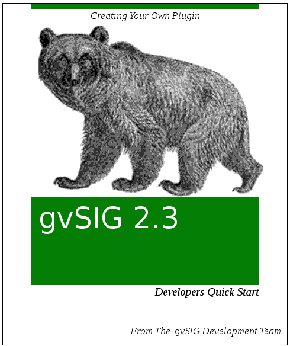

Introducción
============

..  note:: 
 
    Si va a desarrollar sobre otra versión de gvSIG compruebe si 
    existe documentación específica para esa versión.
    

El presente documento pretende ser una introducción al desarrollo con 
gvSIG 2.3.
No pretende profundizar en los entresijos de gvSIG, simplemente dar una
visión de las principales piezas de este y cómo pueden ser utilizadas para
construir nuestro primer desarrollo con gvSIG.

El lenguaje de desarrollo empleado en gvSIG es Java, con lo que si no 
está familiarizado con él es recomendable que antes lo haga. 
Como entorno integrado de desarrollo en el proyecto se emplea 
Eclipse_ y NetBeans_, así que también deberá estar familiarizado con alguno
de estos. Además se emplean otras herramientas como Maven_,
con las que es recomendable estar familiarizado, aunque no imprescindible
para una primera aproximación al desarrollo con gvSIG.

Además de estos conocimientos es **muy recomendable** que el desarrollador
esté familiarizado con la aplicación desde el punto de vista del usuario.
Puede encontrar en la web de gvsig.com_  la documentación de usuario, y
aunque no se corresponda exactamente con la versión de gvSIG con la que 
vaya a trabajar le ayudará a comprender mejor las distintas piezas de 
código.

Resumiendo, antes de continuar deberá conocer:

:Java: nivel medio o avanzado, necesario:
:Eclipse/NetBeans: necesario:
:Maven: recomendado:
:La aplicación gvSIG: recomendado:

Además de estos conocimientos deberá disponer:

- Un ubuntu (o derivado) 14.04, o un Windows 7, 8 o 10.
- Eclipse_ (recomendable Helios o superior) o NetBeans_ (8 o superior).
- Maven_ version 3.0.5 (con versiones superiores hemos obserbado algun problema de compatibilidad). Puede descargar esta version especifica de maven desde la web de gvSIG en `Maven version 3.0.5`_.
- Conexión a internet para poder acceder a los repositorios públicos de maven.
- Un JDK 1.8. instalado y correctamente configurado (la compilación con maven precisa de un JDK aparte del que incluya el IDE).
- Un gvSIG 2.3.1 final instalado.

..  tip::
    Puede encontrar informacion sobre las lista de desarrollo y en 
    general sobre todas las lista del proyecto en el documento `Listas de correo del proyecto`_ .

Si tiene problema para seguir este documento en algún momento puede preguntar en las lista de desarrollo del proyecto. Allí atenderemos las dudas que se le puedan plantear.

.. note::
   **Nota para impacientes**
   
   Si eres un desarrollador con conocimientos de *java*, *svn* y *maven* y quieres empezar por ver el 
   plugin funcionando puedes descargarte de aqui el `proyecto de ejemplo`_ crear en tu home el fichero 
   properties *.gvsig-devel.properties* con la entrada *gvsig.product.folder.path* apuntando a tu instalacion
   de gvSIG y hacer un *"mvn install"* del proyecto que te has descargado.
   
   Tras esto, arranca gvSIG y ya tendras desplegado el plugin de ejemplo que acabas de compilar sobre
   él.
   
   Despues ya puedes mirar los fuentes o echar un vistazo a esta guia para saber algo mas o intentar resolver
   algun problema que hayas tenido.
   
    
.. _`Listas de correo del proyecto` : http://www.gvsig.org/plone/community/mailing-lists/directory
.. _Ant: http://ant.apache.org
.. _Maven: http://maven.apache.org
.. _Eclipse: http://www.eclipse.org
.. _NetBeans: http://www.netbeans.org
.. _gvsig.com: http://www.gvsig.com
.. _`proyecto de ejemplo`: http://devel.gvsig.org/svn/gvsig-plugintemplates/org.gvsig.landregistryviewer/tags/gvsig-desktop-2.3.1-2501/org.gvsig.landregistryviewer/
.. _`Maven version 3.0.5` : http://devel.gvsig.org/download/runtimes/maven/apache-maven-3.0.5-bin.tar.gz

