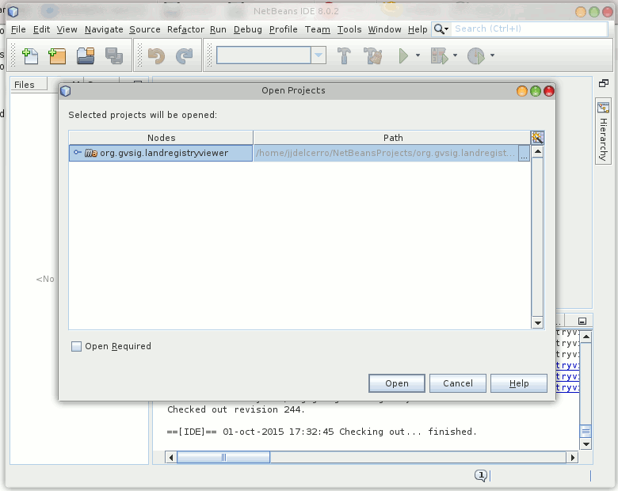
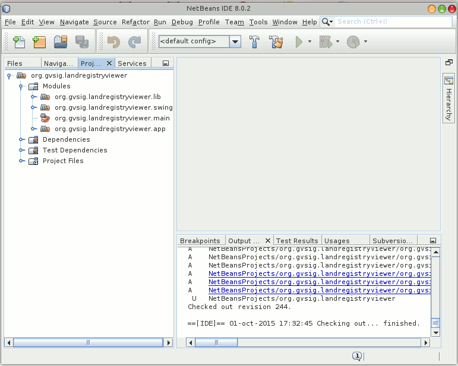

Trabajando con un IDE, Netbeans
-------------------------------

Si estamos trabajando con un IDE como Netbeans podemos descargarnos el proyecto
de ejemplo con:

.. figure:: ../images/netbeans-checkout-1.png
  :align: center

Que nos mostrara el cuadro de dialogo de descargar proyectos desde SVN.

Indicaremos en "Repository URL" el valor

  http://devel.gvsig.org/svn/gvsig-plugintemplates/org.gvsig.landregistryviewer/tags/gvsig-desktop-2.3.1-2501/org.gvsig.landregistryviewer/

Despues nos pedira la carpeta donde queremos descargar el proyecto. Normalmente la dejaremos por defecto.

.. figure:: ../images/netbeans-checkout-3.png
  :align: center

Una vez descargados los proyectos, nos informara que entre los archivos descargados hay varios proyectos de maven, y si queremos
cargar estos en el IDE. Pulsaremos en "Open projects..."

.. figure:: ../images/netbeans-checkout-4.png
  :align: center
  
Nos mostrara los proyectos maven que ha encontrado. Seleccionaremos el primero y pulsaremos en "Open"

  Una vez aqui ya nos mostrara en el arbol de proyectos el proyecto de ejemplo. Desplegando en "Modules" podemos ver la estructura de subproyectos o modulos de este.
  

  
