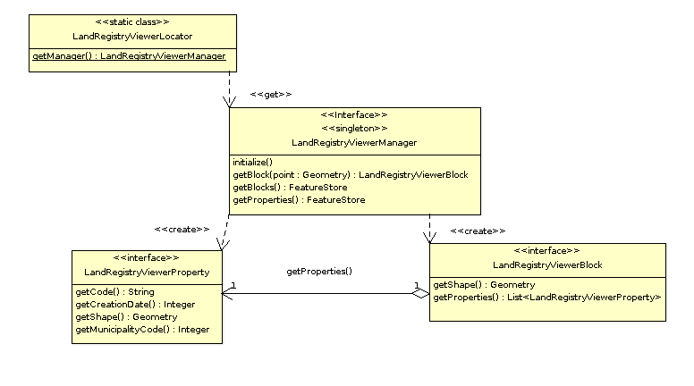

    
La librería con la lógica
-------------------------

La parte de la lógica de nuestro desarrollo la encontraremos dividida en dos proyectos:

- org.gvsig.landregistryviewer.lib.api

- org.gvsig.landregistryviewer.lib.impl

En el proyecto del API encontraremos principalmente interfaces. Estos interfaces compondrán
el API de los componentes de lógica que precisemos desarrollar. 
EL modelo de clases del ejemplo es el que se muestra en el siguiente diagrama:

   Modelo de clases del API
   
Tendremos las siguientes entidades:

- **LandregistryviewerLibrary**, que representa al objeto *Library*. De esta clase señalar los métodos:

  - *doRegistration*, que se ejecuta al cargar la librería e informa qué clase de librería
    es, en nuestro caso la definición de un API, así como qué otras librerías requiere que estén
    inicializadas antes que esta, la librería de acceso a datos, y la de geometrías. El código
    que hace esto es:

    .. code-block:: java

      public void doRegistration() {
        this.registerAs(landregistryviewerLibrary.class, Library.TYPE.API);
        this.require(DALLibrary.class);
        this.require(GeometryLibrary.class);
      }

  - *doPostInitialize*, que se ejecuta cuando se han inicializado todas las librerías.
    En nuestro caso realiza comprobaciones para verificar que al menos una implementación
    del API ha sido registrada. El código que hace esto es:
  
    .. code-block:: java

      protected void doPostInitialize() throws LibraryException {
        // Validate if there are any implementation registered.
        landregistryviewerManager manager = LandregistryviewerLocator.getManager();
        if (manager == null) {
            throw new ReferenceNotRegisteredException(
                LandregistryviewerLocator.MANAGER_NAME, LandregistryviewerLocator.getInstance()
              );
        }
      }

  Esta clase debera ir acompañada del fichero::
  
    src/main/resources/META-INF/services/org.gvsig.tools.library.Library
 
  En donde exista una linea con el nombre completo (nombre y paquete) de la clase.
  Esto es usado por el mecanismo de inicialización de librerias de gvSIG para localizar que
  clases *"library"* deben ser cargadas e inicializadas al inicio de la aplicación.
  
  Si ha de cambiar el nombre a la clase *LandregistryviewerLibrary* recuerde editar este fichero
  para cambiarlo en el tambien ya que el IDE no lo hara por usted.

- **landregistryviewerLocator**, es el *locator* de nuestra librería, el encargado de
  suministrarnos la instancia de nuestro manager. Se trata de una clase con métodos
  estáticos para registrar implementaciones de este API u obtener una implementación
  de él.

- **landregistryviewerManager**. Un interface. El del manager de la librería. Define métodos para obtener las
  manzanas y parcelas así como para localizar una manzana dado un punto. Es la
  entrada a las distintas entidades de nuestro modelo.

- **landregistryviewerBlock**. Un interface que representa a una manzana, y aporta métodos para obtener la geometría
  que define la manzana o para obtener las parcelas que la constituyen.

- **landregistryviewerProperty**. Un interface que representa una parcela catastral. Tiene métodos para obtener
  la geometría que la define, su código o municipio.

Vamos a ver qué nos encontramos en la parte de implementación. Observaremos que
mientras que en el API lo normal ha sido encontrarnos interfaces, en la implementación
nos encontraremos clases. Clases que implementan los distintos interfaces que se
definieron en el API.  Por convenio, a la implementación de los distintos interfaces
que aparecen en el API las llamaremos igual que en el API anteponiéndole el prefijo *Default*.

El modelo de clases de la implementación para nuestro ejemplo es:

.. figure:: ../images/org.gvsig.visor.impl.png
   :align: center

   Modelo de clases de la implementación
   
Vamos a ir viendo las partes más relevantes de la implementación. 

- **LandregistryviewerDefaultImplLibrary**. Al igual que en el API, esta clase se encarga de
  inicializar la librería de la implementación. De esta clase señalar los métodos:
  
  - *doRegistration*, que se encarga de registrar la librería como una implementación
    del API de *landregistryviewerLibrary*. Si tuviese otras dependencias distintas de las marcadas en el 
    API, se añadirían aquí para asegurarnos que esas librerías se inicializan antes
    que esta, pero no es el caso de nuestro ejemplo. Al registrar esta librería como
    una implementación de *landregistryviewerLibrary*, se cubren dos funciones. Por un lado la librería
    del API será inicializada siempre antes que esta implementación, y por otro lado
    cuando alguna otra librería fije dependencias con el API, el mecanismo de inicialización
    de librerías se encargará de inicializar la implementación junto con el API para 
    asegurarnos de que dispondremos de una implementación del API que hemos requerido.
    El código que necesitaremos poner en nuestro ejemplo será:

    .. code-block:: java

      public void doRegistration() {
        this.registerAsImplementationOf(LandregistryviewerLibrary.class);
      }

  - *doInitialize*, que se encarga de registrar en el locator del API la implementación
    del manager que tenemos en esta librería. El código que hace esto es:  

    .. code-block:: java

      protected void doInitialize() throws LibraryException {
          VisorLocator.registerManager(DefaultlandregistryviewerManager.class);
      }

- **DefaultlandregistryviewerManager**. De esta clase conviene resaltar principalmente:

  - El método *getBlock*. Podemos ver cómo realizar una busqueda de un registro
    filtrando por una condición espacial:    

    .. code-block:: java

      try {
        String attrGeomName = blocks.getDefaultFeatureType().getDefaultGeometryAttributeName();
        FeatureQuery query = blocks.createFeatureQuery();
        query.setFilter( new IntersectsEvaluator(attrGeomName,point) );
        set = blocks.getFeatureSet(query);
        if( set.isEmpty() ) {
          return null;
        }
        it = set.fastiterator();
        Feature f = (Feature) it.next();
        LandregistryviewerBlock block = new DefaultLandregistryviewerBlock(this,f.getGeometry(attrGeomName));
        return block; 
      } catch (DataException e) {
        ...
      } finally {
        if( it != null ) {
          it.dispose();
        }
        if( set != null ) {
          set.dispose();
        }
      }
      
    
    ..  Tip::
        Puede encontrar información sobre los mecanismos
        disponibles para el acceso a datos consultando la
        `Guía para el desarrollador de la Librería de Acceso a Datos (DAL)`_ 

    .. _`Guía para el desarrollador de la Librería de Acceso a Datos (DAL)` : http://docs.gvsig.org/plone/projects/gvsig-desktop/docs/devel/org.gvsig.fmap.dal/2.0.0

    De aquí resaltar:
    
    - Podemos averiguar qué atributo de la *feature* es el que contiene la geometría 
      a través del *getDefaultGeometryAttributeName* del *feature type* de nuestro *store*.
    
    - Para realizar una búsqueda de *features* en un *store* lo haremos invocando al método
      *getFeatureSet* pasando como parámetro una instancia de *FeatureQuery* en la que se
      especifiquen las condiciones de filtrado. En ella también se pueden especificar 
      orden o atributos que queremos recuperar en nuestra query.
  
    - La condición de filtro se especifica suministrando un Evaluator al método *setFilter*
      de nuestra query.
    
    - Debemos encargarnos de liberar los objetos que creemos, como son *iteradores* o *feature sets*.
      Hay que tener en cuenta que dependiendo del tipo de *store* con el que estemos trabajando
      estos pueden tener reservados recursos como conexiones a BBDD, recordsets o conexiones a
      servidores remotos.
      
  - El método *openShape*. Aquí podemos ver cómo abrir un *store* basado en shapes
    ya existentes:

    .. code-block:: java

      parameters = manager.createStoreParameters("Shape");
      parameters.setDynValue("shpfile", shape);
      parameters.setDynValue("crs", "EPSG:23030");
      return (FeatureStore) manager.openStore("Shape", parameters);

    Observaremos que para abrir un *store* lo realizaremos en dos fases. Por un lado crearemos
    una estructura para albergar los parámetros necesarios para abrir nuestro *store*, la
    inicializaremos con los valores adecuados e invocaremos al método *openStore* del manager
    de acceso a datos con esos parámetros.
    
    Cada tipo de *store* tendrá un juego de parámetros específicos de él. Para abrir un shape, 
    deberemos indicarle como mínimo el nombre del fichero y el sistema de referencia en el que
    se encuentra.
    
- **IntersectsEvaluator**. Se trata de la clase que evalúa la condición usada en el filtro.
  Esta clase comprueba si el campo geometría especificado de una feature dada intersecta con
  una geometría concreta. En su construcción se le suministran el campo que contiene la
  geometría de la feature y la geometría con la que hay que comprobar si intersecta. De esta 
  clase conviene resaltar:
  
  - el método *evaluate*, encargado de realizar la comprobación:

    .. code-block:: java
  
      Geometry op1geom = (Geometry) data.getDataValue(this.op2attrname);
      return this.op1geom.intersects(op1geom);

    Sabiendo cómo se llama el atributo que contiene la geometría podemos obtener esta
    a través del método *getDataValue*. Una vez tenemos las dos geometrías podemos
    invocar el método *intersecs* de la geometría para comprobar si intersectan.
    
  - El método *getCQL*. Este método devolverá una cadena siguiendo el formato de un *where* de
    sql a utilizar como filtro en *stores* que ataquen a la BBDD sql. El filtro devuelto puede 
    no ser exactamente el mismo que el implementado por el código del método *evaluate*, actuando
    a modo de filtro previo a este siempre que el store lo soporte.
    
    
- **DefaultLandregistryviewerBlock**. Representa a una manzana de nuestro dominio. Almacena la 
  geometría que da forma a la manzana. La parte más relevante de esta clase es el
  método *getProperties* que retorna todas las parcelas que se encuentran sobre
  esa manzana:

  .. code-block:: java

    List properties = new ArrayList();		

    FeatureStore store = this.manager.getProperties();
    String attrGeomName = store.getDefaultFeatureType().getDefaultGeometryAttributeName();
    FeatureQuery query = store.createFeatureQuery();
    query.setFilter( new IntersectsEvaluator(attrGeomName, this.shape) );
    set = this.manager.getProperties().getFeatureSet(query);
    if( set.isEmpty() ) {
      return null;
    }
    it = set.fastiterator();
    while( it.hasNext() ) {
      Feature f = (Feature) it.next();
      LandregistryviewerProperty property = new DefaultLandregistryviewerProperty(
        this.manager,
        f.getString(PROPERTIES_CODE),
        f.getGeometry(attrGeomName),
        f.getInt(PROPERTIES_CREATIONDATE),
        f.getInt(PROPERTIES_MUNICODE)
      );
      properties.add(property);
    }
    return properties;

  Podemos observar que utiliza el mismo mecanismo para filtrar las parcelas que
  usa el manager para recuperar un manzana. En este caso una vez a conseguido el *set*
  con las parcelas, lo recorre, recuperando los datos de estas y creando los
  objetos parcela.

- **DefaultLandregistryviewerProperty**. Se trata de la clase que representa a un parcela. En nuestro 
  ejemplo no tiene apenas lógica, limitándose a almacenar los datos y exponerlos mediante
  *geters*.
  
    
