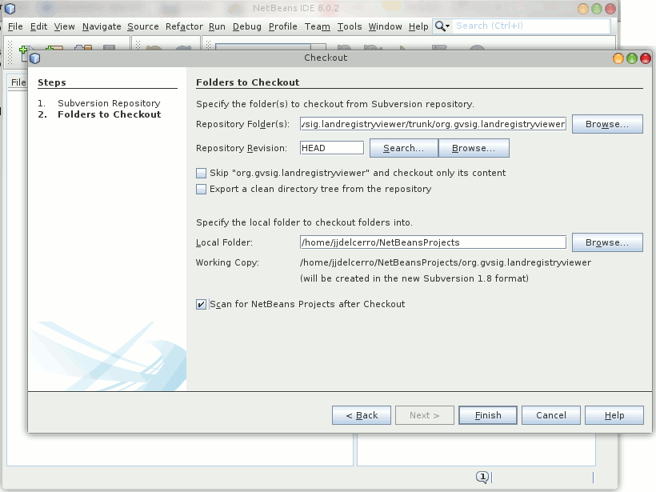
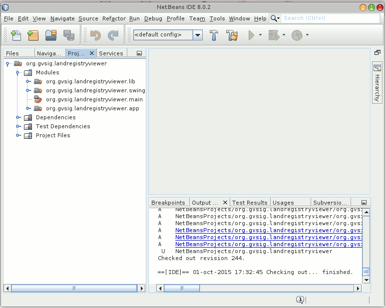
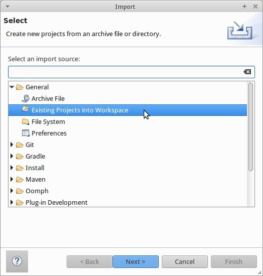
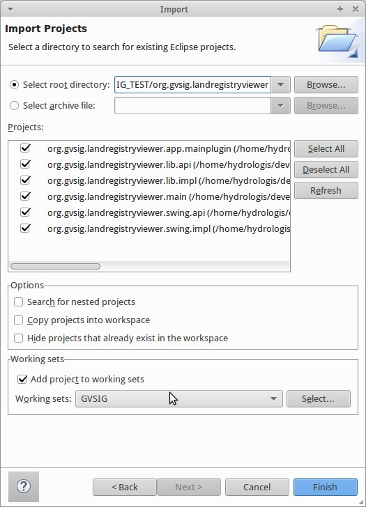
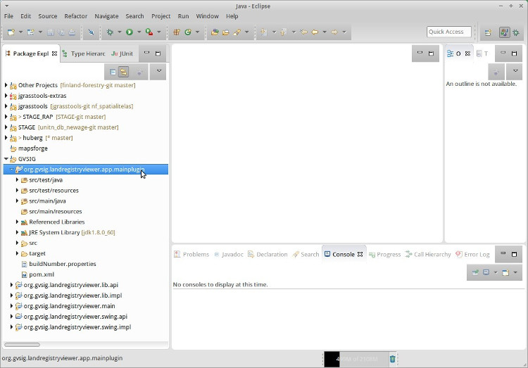
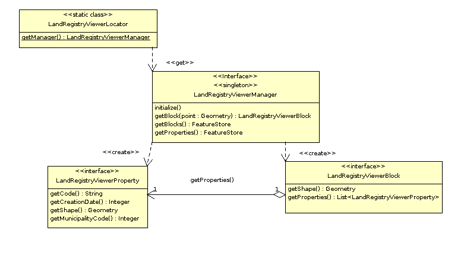

Building our first plugin
=========================

First approach
--------------

We will now see a sample project that allows us to describe a number of basic features of gvSIG. Possible requirements could be:

- enable us to see the mapping of houseblocks
- it should contain a query tool that by clicking on a houseblock shows us information about the cadastral parcels associated with it
- customize the *splash screen* of gvSIG and the bottom of the main window of gvSIG with a corporate logo
- when starting gvSIG it should display directly a window with the map, without the user having to interact with the application. Also, the tool to get cadastral information should be enabled.
- customize the "About" dialog of gvSIG to display corporate information.
- editing tools for the map of houseblocks will be disabled.
- an installation package will be prepared with the plugin so that users can install it using the Add-ons Manager of the application.

To start with our project we will use the wizard to generate projects included in the distribution of gvSIG.

Our first project
-----------------

GvSIG 2.2 has a *base* project to use for the creation of new projects, which can be used as an example to the main ways of interacting with gvSIG, and normally we will use that one as template for any new project.

This project can be found in the gvSIG SVN at the url:

http://devel.gvsig.org/svn/gvsig-plugintemplates/org.gvsig.landregistryviewer/trunk/org.gvsig.landregistryviewer/

Before we start, a few configuration tasks are mandatory:

- have a JDK 1.7 installed and available in the PATH.

- have an svn client accessible in the PATH.

- have maven accessible in the PATH.

- configure where the gvSIG installation on which we will work, is placed.

Assuming that are already installed and configured the JDK, svn client and maven, we will have a look at how to configure installation folder of gvSIG that is going to be used.

In the HOME folder of our user we need to have the file **.gvsig-devel.properties**. It is a standard Java properties file. In it we need a key named **gvsig.product.folder.path** holding the the path of the installation of gvSIG.

It is necessary to have write permissions to the used installation folder of gvSIG, otherwise errors will occur in the deployment of the new plugin.

Assuming we are woring in a linux environment, let's start by executing::

  ~ $ cd $HOME/devel
  ~ $ svn checkout http://devel.gvsig.org/svn/gvsig-plugintemplates/org.gvsig.landregistryviewer/trunk/org.gvsig.landregistryviewer/
  ... svn command output ...
  ~ $ cd org.gvsig.landregistryviewer
  ~ $ mvn install
  ... install command finishes ...

If you are using MS Windows some details need special care:
    
- We may have problems with the size of the folder paths since in gvSIG very long paths are used. It is therefore recommended that you create a folder on the root of the drive, for example **C:/devel**, to keep the base path short

- In a default installation gvSIG is held in administrator mode, and our users will not have permission to overwrite files and folders, apart of the fact that the paths could contain *spaces* that could cause problems during the deployment of the plugins. To avoid problems we suggest to create the folder *C:/devel/gvSIG-desktop* and copy the gvSIG installation into it.

While creating the file *.gvsig-devel.properties* there might be some problems. We have to create it in the HOME of our user, usually *C:/Users/my-user*. Special attention goes to:
    
- The file must be named exactly ".gvsig-devel.properties" without extension ".txt". Make sure that when you create it, it doesn't have extension ".txt".

- You may have troubles creating a file that start with a period ("."). One possible way is to open the notepad application and save the file in the indicated path and name.

Working with the IDE
--------------------

.. contents::

Working with Netbeans
--------------------------

If for example we are working with Netbeans, we can download the projects' sources as follows:

.. figure:: images/netbeans-checkout-1.png
  :align: center

the dialog to download projects from SVN:

.. figure:: images/netbeans-checkout-2.png
  :align: center

Paste in the "Repository URL" value:

  http://devel.gvsig.org/svn/gvsig-plugintemplates/org.gvsig.landregistryviewer/trunk/org.gvsig.landregistryviewer/

Then the folder in which to download the project is asked. The default is usually ok.

Once downloaded, we find among the downloaded files several maven projects, that we can load in the IDE. Select "Open projects ..."

.. figure:: images/netbeans-checkout-4.png
  :align: center
  
Here we see the maven projects that have been found. Select the first and select "Open"

.. figure:: images/netbeans-checkout-5.png
  :align: center

At this point we should see the project tree of the sample project. Visualizing "Modules" we can see the structure of its subprojects or modules.
  

Working in linux with commandline and the Eclipse IDE
--------------------------------------------------------

Assuming you are experienced with linux and a commandline, and that you have svn installed, we can proceed be checking out the source code of the template module by issuing the following command (from within the folder you want to work in)::

     svn co http://devel.gvsig.org/svn/gvsig-plugintemplates/org.gvsig.landregistryviewer/trunk/org.gvsig.landregistryviewer/

This will checkout all the code of the plugin we want to get started with.

Next we are going to create the Eclipse IDE project of the plugin. Here Maven helps us. Just run::

     mvn eclipse:eclipse -DdownloadSources=true -DdownloadJavadocs=true

This will not only **gather any necessary dependencies of gvSIG** to develop on the plugin and **create the Eclipse project**, it will also 
download the source code and javadoc of the dependencies plugin, which is always a good thing to have.

If it is the first time, this is the moment to go and get a beer with a colleague and chat about open 
source GIS development, depending on your internet connection this might take a while.

The maven process will produce a quite large output in console. It is mandatory that the process completes successfully,
which means it should finish with more or less the following output::

        ...
	[INFO] ------------------------------------------------------------------------
	[INFO] Reactor Summary:
	[INFO] 
	[INFO] org.gvsig.landregistryviewer ...................... SUCCESS [0.335s]
	[INFO] org.gvsig.landregistryviewer.lib .................. SUCCESS [0.025s]
	[INFO] org.gvsig.landregistryviewer.lib.api .............. SUCCESS [0.275s]
	[INFO] org.gvsig.landregistryviewer.lib.impl ............. SUCCESS [0.236s]
	[INFO] org.gvsig.landregistryviewer.swing ................ SUCCESS [0.015s]
	[INFO] org.gvsig.landregistryviewer.swing.api ............ SUCCESS [0.100s]
	[INFO] org.gvsig.landregistryviewer.swing.impl ........... SUCCESS [0.166s]
	[INFO] org.gvsig.landregistryviewer.main ................. SUCCESS [0.986s]
	[INFO] org.gvsig.landregistryviewer.app .................. SUCCESS [0.006s]
	[INFO] org.gvsig.landregistryviewer.app.mainplugin ....... SUCCESS [2.492s]
	[INFO] ------------------------------------------------------------------------
	[INFO] BUILD SUCCESS
	[INFO] ------------------------------------------------------------------------
	[INFO] Total time: 5.835s
	[INFO] Finished at: Sat Oct 17 07:52:40 CEST 2015
	[INFO] Final Memory: 43M/652M
	[INFO] ------------------------------------------------------------------------

Once this process has finished, we can open Eclipse and load the project. 

From the project view, select the **Import** command:

.. figure:: images/eclipse_import01_en.jpg
  :align: center

From there you are taken to the dialog in which you can select that you are importing existing projects:

In the following dialog just supply the folder inside which you are working (and you ran the svn command):

Once that is done, you will find all the modules of the example project in your development environment:

  
Project structure
-----------------

..  tip::
    You may find it useful to consult the existing documentation in the *Developer's Guide* related to this. In particular sections `Structure of a project in gvSIG`_ and `Things to consider before developing a plugin`_.

.. _`Things to consider before developing a plugin`: https://gvsig.org/web/reference_catalog/lookupObject?uuid=eb91eb79e1e1f2ec730bfe13bb649f6c
.. _`Structure of a project in gvSIG`: https://docs.gvsig.org/web/reference_catalog/lookupObject?uuid=1dad723b0c168999e622de9c6bf03017

Let's finally take a look at the code of the plugin.

Inside the folder we find several projects:

- *org.gvsig.landregistryviewer*: this is a Maven project with several subprojects. Inside them we find the parts of the logic, with both its API and implementation, as well as the part associated user interface components logic, also with its API and implementation. We also find a project which will allow us to test the logic and user interface without the need to start gvSIG. In general the different components that we find here will be independent from the Andami framework and gvSIG plugins, while it depends only on other libraries. The projects that we will find are:

  - *org.gvsig.landregistryviewer.lib* containing the logic of our project

    - *org.gvsig.landregistryviewer.lib.api*

    - *org.gvsig.landregistryviewer.lib.impl*

  - *org.gvsig.landregistryviewer.swing* containing the user interface components.

    - *org.gvsig.landregistryviewer.swing.api*

    - *org.gvsig.landregistryviewer.swing.impl*

  - *org.gvsig.landregistryviewer.main*, the *main* to try it out.

  - *org.gvsig.landregistryviewer.app*. This project will contain the implementation of the various plugins that will be added to gvSIG. It will use the components of the *org.gvsig.landregistryviewer.swing* and *org.gvsig.landregistryviewer.lib* projects and  will be responsible of their integration into gvSIG. This example contains only one subproject *org.gvsig.landregistryviewer.app.mainplugin*, since we are going to provide a single plugin. If we need to provide more than one plugin, then one subproject for each plugin should be present.
  
  
  
The project dependencies
------------------------

..  attention:: 
    
    Document under construction. Pending upgrade to 2.2.
    

    
The library containing the logic
--------------------------------
    
The development logic of is divided into two projects:

- org.gvsig.landregistryviewer.lib.api

- org.gvsig.landregistryviewer.lib.impl

In the API project we mainly find interfaces. These interfaces make up the API of the logic components that we want to develop.

The model of the classes of the example is shown in the following diagram:

   API class model

There are the following entities:

- **LandregistryviewerLibrary**, which represents the object *Library*. Let's see the following methods:

  - *doRegistration*, is run to load the library and informs about the library type; in our case the definition of an API as well as what other libraries are required before initialization. In this casethe data access and geometry libraries. The code that does this is:

    .. code-block:: java

      public void doRegistration() {
         this.registerAsAPI(LandRegistryViewerLibrary.class);
         this.require(DALLibrary.class);
         this.require(GeometryLibrary.class);
      }

  - *doPostInitialize*, which is executed when all libraries have been initialized. In our case it checks that at least one implementation of the API has been registered. The code that does this is:

    .. code-block:: java

      protected void doPostInitialize() throws LibraryException {
         // Validate there is any implementation registered.
         LandRegistryViewerManager manager = LandRegistryViewerLocator.getManager();
         if (manager == null) {
             throw new ReferenceNotRegisteredException(
                 LandRegistryViewerLocator.MANAGER_NAME, LandRegistryViewerLocator
                     .getInstance());
         }
      }

  
  .. note TODO: Comentar algo sobre la referencia al META-INF/services

- **LandregistryviewerLocator** is the *locator* of our library, responsible for providing us our manager instance. It is a class with static methods to register implementations of this API or obtain an implementation of it.

- **LandregistryviewerManager**. An interface. It is the manager of the library. It defines methods to get the houseblocks and parcels as well as locate a houseblock in a particular position. It is the entry point to the various entities of our model.

- **LandregistryviewerBlock**. An interface representing a houseblock. It provides methods to get the geometry of the houseblock or the parcel that contains it.

- **LandregistryviewerProperty**. An interface representing a cadastral parcel. It has methods to get the geometry that defines it, and its code or city.

Let's see what we find in the implementation part. We observe that while in the API we find  interfaces, in the implementation we find the classes that implement the API interfaces. By convention, the implementation of the various interfaces of the API are called the same why as in the API and prepending the prefix *Default*.

The model of the implementation classes for our example is:

.. figure:: images/org.gvsig.visor.impl.png
   :align: center

   Implementation classes model
   
Let's see the most important parts of the implementation.

- **LandregistryviewerDefaultImplLibrary**. As in the API, this class loads the implementation library. This class has the methods:
  
  - *doRegistration *, which is responsible for registering the library as an implementation of the *landregistryviewerLibrary* API. If I had other dependencies than those marked in the API, they should be added here to make sure that these libraries are initialized before this (but it is not the case of the example). By recording this library as an implementation of *LandregistryviewerLibrary*, two things are assured. On the one hand the API library will always be initialized before its implementation, and on the other hand when any other library sets a dependency with the API, the initialization mechanism of the libraries will be responsible for initializing the implementation together with the API and ensure that the required implementation of the API is available. The code you need in the example is:

    .. code-block:: java

      public void doRegistration() {
        this.registerAsImplementationOf(landregistryviewerLibrary.class);
      }

  - *doInitialize*, which is responsible for registering the implementation of the manager we have in this library with the locator API. The code that does this is:  

    .. code-block:: java

      protected void doInitialize() throws LibraryException {
          VisorLocator.registerManager(DefaultlandregistryviewerManager.class);
      }

- **DefaultlandregistryviewerManager**. Of this class particular attention should be put on:

  - The *getBlock* method. In it we can see how to search a record by means of spatial filtering:    

    .. code-block:: java

      try {
        String attrGeomName = blocks.getDefaultFeatureType().getDefaultGeometryAttributeName();
        FeatureQuery query = blocks.createFeatureQuery();
        query.setFilter( new IntersectsEvaluator(attrGeomName,point) );
        set = blocks.getFeatureSet(query);
        if( set.isEmpty() ) {
          return null;
        }
        it = set.fastiterator();
        Feature f = (Feature) it.next();
        LandregistryviewerBlock block = new DefaultLandregistryviewerBlock(this,f.getGeometry(attrGeomName));
        return block; 
      } catch (DataException e) {
        ...
      } finally {
        if( it != null ) {
          it.dispose();
        }
        if( set != null ) {
          set.dispose();
        }
      }
      
    
    ..  Tip::
        You can find more information on the available data access  mechanisms at the `Guide for the developer of the Data Access Library (DAL)`_ 

    .. _`Guide for the developer of the Data Access Library (DAL)`: https://docs.gvsig.org/web/reference_catalog/lookupObject?uuid=b676641c65b75fd97c3f1cedb8482073

    Some parts to note:
    
    - We can find out what attribute of the *feature* contains the geometry through the *getDefaultGeometryAttributeName* of the *feature type* of the *store*.
    
    - To search for a *feature* in a store we invoke the method *getFeatureSet* passing as parameter an instance of *FeatureQuery* in which the filter condition needs to be specified. It is also possible to specify an order or attributes that we want to extract with our query.
    
    - The filter condition is specified by providing an Evaluator to the *setFilter*  method of our query.
    
    - We must take care of freeing the objects that we create, such as *iterators* or *feature sets*. Keep in mind that depending on the type of *store* with which we are working these resources could be also connections to databases, recordsets or connections to remote servers.
      
  - The *openShape* method. Here we can see how to open a *store* based on existing shapefiles:

    .. code-block:: java

      parameters = manager.createStoreParameters("Shape");
      parameters.setDynValue("shpfile", shape);
      parameters.setDynValue("crs", "EPSG:23030");
      return (FeatureStore) manager.openStore("Shape", parameters);

    We see that opening of a *store* is done in two phases. First we create
    a structure to house the necessary parameters to open our *store* and then
    we initialize it with the proper values ​​and invoke the method *openStore* of the 
    Data Access Manager.
    
    Each type of *store* has a specific parameters set. To open a shapefile,
    we at least need to set the name of the file and its reference system.
    
- **IntersectsEvaluator**. This is the class that evaluates the condition used in the filter. This class checks whether the specified geometry field intersects a given feature with a specific geometry. In its constructor the field containing the geometry and geometry feature to check intersection against, are passed. Of this class we should note:
  
  - the *evaluate* method, responsible for the testing of the condition:

    .. code-block:: java
  
      Geometry op1geom = (Geometry) data.getDataValue(this.op2attrname);
      return new Boolean(this.op1geom.intersects(op1geom));

    Knowing the name of the attribute that contains the geometry we can do so through the *getDataValue* method. Once we have the two geometries we can invoke the *intersects* method to check geometry intersection.
    
  - The method *getCQL*. This method returns a string in the format of an SQL *where* clause to use as filter in *stores* attached to SQL databases. The return filter could also not be exactly the same as that implemented by the code of the *evaluate* method acting as a filter prior to this, provided that the store supports it.
    
    
- **DefaultLandregistryviewerBlock**. It represents one houseblock from our domain. It stores geometry that gives the shape to the houseblock. The most important part of this class is *getProperties* method that returns all parcels that are on that houseblock:

  .. code-block:: java

    List properties = new ArrayList();		

    FeatureStore store = this.manager.getProperties();
    String attrGeomName = store.getDefaultFeatureType().getDefaultGeometryAttributeName();
    FeatureQuery query = store.createFeatureQuery();
    query.setFilter( new IntersectsEvaluator(attrGeomName, this.shape) );
    set = this.manager.getProperties().getFeatureSet(query);
    if( set.isEmpty() ) {
      return null;
    }
    it = set.fastiterator();
    while( it.hasNext() ) {
      Feature f = (Feature) it.next();
      LandregistryviewerProperty property = new DefaultLandregistryviewerProperty(
        this.manager,
        f.getString(PROPERTIES_CODE),
        f.getGeometry(attrGeomName),
        f.getInt(PROPERTIES_CREATIONDATE),
        f.getInt(PROPERTIES_MUNICODE)
      );
      properties.add(property);
    }
    return properties;

  We can see that it uses the same mechanism to filter plots that the manager uses to retrieve a houseblock. In this case, once I created the *set* with the parcels, it runs, extracting the data to create parcel objects.

- **DefaultLandregistryviewerProperty**. This is the class that represents a parcel. In our example it doesn't contain any logic, it merely stores the data and expose them through *getters*.

The library containing the user interface
-----------------------------------------

Same as with the logic, also the presentation is divided into two projects: on one hand the API and on the other hand the implementation.

- org.gvsig.Landregistryviewer.swing.api

- org.gvsig.Landregistryviewer.swing.impl

In a similar way as it happened with the logic in the presentation, in the API project we only keep interfaces and abstract classes that define our API. The API of the display portion is made of the interface of the *manager* together with a set of abstract classes that define the public API of our components, usually components that extend the swing JPanel component. These are abstract classes and not interfaces because the swing model doesn't expose interfaces for its components. In our example, the only component we will have is the visual component associated with a houseblocks, the *JLandregistryviewerBlockPanel*, which extends *JPanel* adding to the API only one method that allows us to obtain the *LandregistryviewerBlock* logical component that is associated with it at a given time.

In the implementation part we find the class *DefaultJLandregistryviewerBlockPanel* which takes in its constructor a *LandregistryviewerBlock* of which it will show the data. The only important thing to note is that the presentation part should not use anything that is not exposed in the API our logic library.

Integration with gvSIG
----------------------

..  attention:: 
    
    Document under construction. Pending upgrade to 2.2.

So far we have seen how to create our components, logic and user interface, using the gvSIG libraries to access or visualize geographic data, as well as a simple way to create a small application that uses them. Let's now see how to integrate these features in the gvSIG application.

Looking at the projects we have in our workspace we can see that there is one that has not yet been cited **org.gvsig.landregistryviewer.app.mainplugin**. This is where our plugin is implemented. Before looking at the code of the plugin let's first fulfill one requirement we had, i.e. a customized splashscreen. This is done as follows:

In the folder *"src/main/resources"* we find a folder *theme* and within that one a file named *andami-theme.xml*. This file is responsible for specifying to the andami framework which *splashscreen* to use as well as whether to use a background image in the MDI application or the window icons of gvSIG. Andami, on startup, looks in the plugins folder for one containing the *theme* folder and will use that one if available. The xml file of our example contains the following:

.. code-block:: xml

  
    
      
        
      
      
      
      
    
    
  

By default the paths that appear in the file are interpreted relative to the file position, basing on the *GVSIG_INSTALL* that points to gvSIG's installation folder. In the example we can
see the tag *Splash* has no additional basepath, but only *"splash.png"*, in order to use the image inside the folder, while for the *Icon* tag the *GVSIG_INSTALL* variable is used to reference the file contained in the default Andami theme.

We can now start gvSIG  and make sure that the right splashscreen is pulled. Once verified that we can change the splashscreen, we can take a look at extending our plugin.

.. Note the config.xml !!!!!!!!!!

Now let's see the code of our *plugin*. We will see that only 3 classes are contained in the plugin, the 2 extensions *LandRegistryViewerExtension* and *DisableEditingExtension*, and the *PropertiesOfBlockListener*. The class that integrates our main functionality is the *LandRegistryViewerExtension*. This class extends Andami's *Extension* to properly integrate with the menus and toolbars, and implements the *IExtension* interface, to control the visibility othe extention.

To control the visibility of other extensions of gvSIG the interface provides the methods:

- **isEnabled** which checks if the current tools are enabled:

  .. code-block:: java

    public boolean isEnabled() {
    	//
        // By default the tool is always enabled
        //
        return true;
    }
  
  In our case we want the tool to be always enabled and simply return *true*.

- **isVisible** which checks if the tools of the extension are visible or not:

  .. code-block:: java

    public boolean isVisible() {
        //
        // The tool is visible only when our view is active
        //

        ApplicationManager application = ApplicationLocator.getManager();

        return application.getActiveWindow() == viewWindow;
    }

  The check is done by checking if the window created in the *postInitialize* method is indeed the current active window.

- **initialize**. It is invoked when the extension is loaded. Here we will just register the services that our extension offers. In our example we just set the icon for the action offered by the plugin.

- **postInitialize**. It is invoked during initialization of the plugins, once the *initialize* method of all extensions has been invoked. This guarantees that when running, virtually all services of gvSIG will be available. We use this method to:

  - Create the manager of the logic part of our library.
  
  - Initialize the *stores* through the *initializeStores* function. Since the manager of our logic library has the methods to initialize *stores* we will just them:

    .. code-block:: java
    
      manager.initialize(
        getResource("data/properties.shp"), 
        getResource("data/blocks.shp")
      );
      
  - And finally create and display the window with our view, through the *createViewWindow* method. Let's investigate a little more in detail how this is done. The first thing we do is getting an object reference to the *application* and *project* managers:

    .. code-block:: java

        ApplicationManager application = ApplicationLocator.getManager();
        ProjectManager projectManager = application.getProjectManager();

    Once we have these references, we can create our view:
    
    .. code-block:: java

      // 1. Create a new view and set the name.
        ViewManager viewManager = (ViewManager) projectManager.getDocumentManager(ViewManager.TYPENAME);
        ViewDocument view = (ViewDocument) viewManager.createDocument();

        view.setName(i18nManager.getTranslation(MY_VIEW_NAME));

    To create the view, we ask the *ProjectManager* to give us the ViewManager and ask that one  for a new instance of the document view. We need to bare in mind that a major functionality of the *manager* is to act as a factory to get instances of the objects managed by that manager. Once we have have the document, we assign it a proper name.

    With the just created view we will see how to add the necessary layers to it. To do so we will create a layer with houseblocks, which is done through the *createLayer* method, indicating the name of the layer and the *store* on which it will be based:

    .. code-block:: java
    
      // 2. Create a new layer with the blocks
      FLyrVect layer = (FLyrVect) application.getMapContextManager().createLayer(
                i18nManager.getTranslation("_Blocks"), this.manager.getBlocks());

    With the layer created, we add to the *map* view the new layer:

    .. code-block:: java
    
        // 3. Add this layer to the mapcontext of the new view.
        view.getMapContext().getLayers().addLayer(layer);

    Then we add the view to the current project:

    .. code-block:: java
    
      // 4. Add the view to the current project.
      projectManager.getCurrentProject().add(view);

    And finally we'll visualize the window associated to the just created view:

    .. code-block:: java
    
        // 5. Force to show the view's window.
        IView viewWindow = (IView) viewManager.getMainWindow(view);

        application.getUIManager().addWindow(viewWindow, GridBagConstraints.CENTER);
        try {
            application.getUIManager().setMaximum((IWindow) viewWindow, true);
        } catch (PropertyVetoException e) {
            logger.info("Can't maximize view.", e);
        }

    Once we have shown the new view window, we need to register to the graphical map component the new tool, similar to as we did when adding it to our map in the test project:

    .. code-block:: java
    
        // 6. Register my tool in the mapcontrol of the view.
        PropertiesOfBlockListener listener = new PropertiesOfBlockListener();
        viewWindow.getMapControl().addBehavior(TOOL_NAME, new PointBehavior(listener));

    After all this our plugin is initialized.
  
- *execute*. This method will be invoked whenever the user interacts with the menu items or buttons that are configured in the *config.xml* file of our plugin. In our case, the event is configured to be triggered when the user wants to enable the information tool to query a houseblock in a cadastral parcel. So the code would look like:

  .. code-block:: java
  
    if( ACTION_SETINFOTOOL.equalsIgnoreCase(actionCommand) ) {
      // Set the tool in the mapcontrol of the active view.
      ApplicationManager application = ApplicationLocator.getManager();
      if( application.getActiveWindow() != viewWindow ) {
        return;
      }
      viewWindow.getMapControl().setTool(TOOL_NAME);
      }
    }

  We observe that the first thing we do is to check if the command received is the corresponding to the activation of our tool, and that was set in the *config.xml*. This is because in the same extension we can have various tools, indicating different command names in the *config.xml* for each of them.

  Once we know that it is trying to activate our information tool, we check whether the view of our window is active, as if it is on other views or other document types, we must do nothing. And finally, we will activate our tool in the map view.

Basically, we have reviewed how the integration of functionality in gvSIG would look like.
What is left to do is to look at the *PropertiesOfBlockListener* class, which we use to create our tool. The *listener* code is basically similar to that used by our test application.

Distribution of the project
---------------------------

Once we have deployed the developed plugin against an installed gvSIG, we can run that gvSIG and see if it works correctly. But usually our work doesn't end here. Most of the times we have to get these plugins to our users and before maybe to testers to verify that everything works properly.

From version 2.0 of gvSIG on we have a packaging system that allow us to distribute developed plugins so that users can easily install them from the *Plugin Manager of gvSIG*.

Each time a project is compiled using *"mvn install"*, some additional functionalities are performed. Those that interest us now are:

- the plugins of gvSIG are packaged and installed in the gvSIG installation against which we are developing so that in a just started gvSIG we can check that these are already functional.

- in addition to deployment and installation of our plugins, the packages are left in the "install" folder of the installation of gvSIG.

We can distribute the generated installation package directly to our users, or one can 
get in touch with the gvSIG project to have it exposed in the official repository of gvSIG addons and they will be available to users directly from the *Add-On Manager* through the URL displayed by default.

.. tip::

   You can view the article `Create Your Own gvSIG `_ on the gvSIG blog to read more about it.

Likewise, we could generate a custom distribution of gvSIG desktop that includes a selection of *standard* plugins containing also our plugins. That way we would have a custom installer with our plugins to deliver to our customers.
View source document

