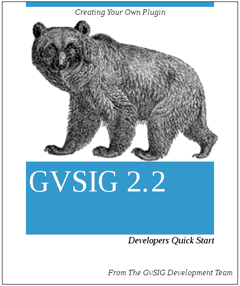

Introduction
============

..  note:: 
 
    If you are developing on another version of gvSIG check if there is specific documentation for that version. 
    

This document is intended as an introduction to the development of gvSIG 2.2.
It is meant to be an overview of the main pieces and how they can be used to do our first development with gvSIG.

The development language used in gvSIG is Java. If the developer is not familiar with it is advisable to do so before.
As integrated project development environments NetBeans_ and Eclipse_  can be used
and so it would be good to be familiar with one of these. Besides that also Maven_ is used,
for which it is advisable to be familiar with, but not essential for a first approach to gvSIG based development.

In addition to this knowledge it is **highly recommended** that the developer is familiar with the application from the user perspective.
User documentation can be found on the website of gvsig.com_, and
even if it doesn't exactly match the version of gvSIG with which one is going to work, it will help to better understand the different parts of the code.

In summary, before proceeding you need to know:

:Java: medium or advanced level necessary:
:Eclipse / NetBeans: necessary:
:Maven: recommended:
:The gvSIG application: recommended:

Besides this knowledge you should have:

- A ubuntu (or derivate) 14.04, or Windows 7.
- Eclipse_ (Helios or higher recommended) or NetBeans_ (8 or higher).
- Maven_ version 3.0.5 (with higher versions some compatibility issues were reported)
- Internet connection to access public maven repository.
- An installed and configured JDK 1.7, with JDK 1.8 gvSIG does not compile correctly .
- A gvSIG 2.2 final installed.

..  tip::
    Information can be found in the developers list and in general on all `lists of the project`_.

If you have trouble following this document you can ask for help in the developers' mailinglist. 

.. _`lists of the project`: http://www.gvsig.org/plone/community/mailing-lists/directory
.. _Ant: http://ant.apache.org
.. _Maven: http://maven.apache.org
.. _Eclipse: http://www.eclipse.org
.. _NetBeans: http://www.netbeans.org
.. _gvsig.com: http://www.gvsig.com
