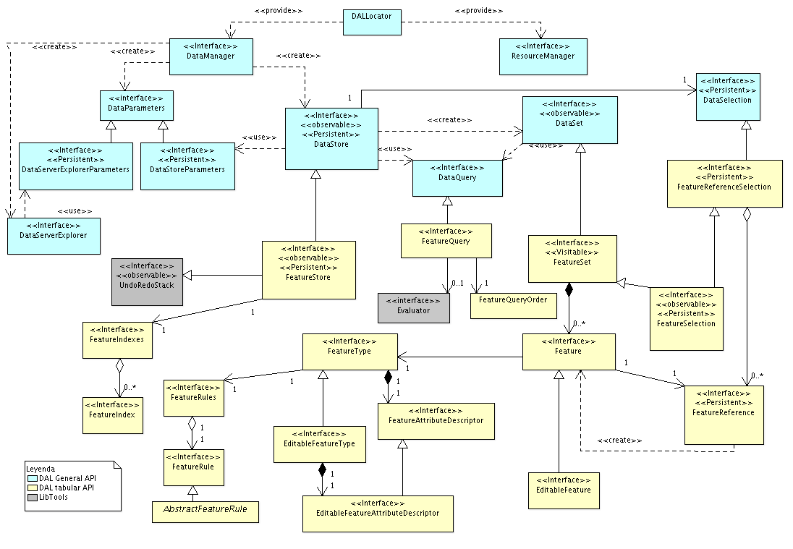

Acceso a datos tabulares
========================

.. toctree::
   :maxdepth: 3
   :glob:
   
   acceso_a_datos_tabulares/index.rst

Descripción
-----------

Partiendo de la arquitectura general del API de acceso a datos, podemos
ver como encaja la especialización del acceso a datos tabulares dentro de ella.

Dentro del acceso a datos tabulares se incluye tanto el acceso a datos de
carácter alfanumérico como vectorial, soportando que uno o varios atributos
de un ítem o fenómeno sean de tipo vectorial.

Nos encontraremos las siguientes clases e interfaces mostradas en el siguiente
gráfico.

   Acceso a datos tabulares

* FeatureStore, como especialización de *DataStore*.
  Añade funcionalidades propias del acceso a datos alfanuméricos
  y vectoriales. Conoce de *fenómenos*, cómo consultar sus valores
  o su estructura, así como de acciones específicas para acceder
  a ellos.

* FeatureSet, como especialización de *DataSet*.
  Conoce los fenómenos y es capaz de iterar sobre ellos.

* FeatureQuery, como especialización de *DataQuery*. Contiene
  información relevante sobre la definición de filtros y su ordenación
  que hace uso del conocimiento de estar trabajando sobre datos alfanuméricos
  y vectoriales.

* Feature. Aparece como contenedor de un fenómeno, permitiendo acceder
  a la información de éste.

* FeatureType. Aparece como el contenedor de la estructura de un fenómeno.
  Qué atributos tiene o de qué tipo son.

Así por ejemplo, si quisiésemos acceder a los fenómenos de un fichero shape, podríamos hacerlo con:

.. code-block:: java

  DataManager manager;
  DataStoreParameters params;
  FeatureStore store;
  FeatureSet features;
  Feature feature;

  manager = DALLocator.getDataManager();
  params = manager.createStoreParameters("Shape");
  params.setDynValue("shpfilename","data/prueba.shp");
  store = (FeatureStore)manager.createStore(params);
  features = store.getFeatureSet();

  DisposableIterator it = features.iterator();
  while( it.hasNext() ) {
    feature = (Feature)it.next();
    System.out.println(feature.getString("NOMBRE"));
  }
  it.dispose();
  features.dispose();
  store.dispose();

Y por ejemplo, si en lugar de un fichero en disco fuese una tabla de
una BBDD postgres sería algo como:

.. code-block:: java

  DataManager manager;
  DataStoreParameters params;
  FeatureStore store;
  FeatureSet features;
  Feature feature;

  manager = DALLocator.getDataManager();
  params = manager.createStoreParameters("PostgreSQL");

  params.setDynValue("host", SERVER_IP);
  params.setDynValue("port", SERVER_PORT);
  params.setDynValue("dbuser",SERVER_USER);
  params.setDynValue("password",SERVER_PASWD);
  params.setDynValue("schema",SERVER_SCHEMA);
  params.setDynValue("dbname",SERVER_DBNAME);
  params.setDynValue("table","prueba");

  store = (FeatureStore)manager.createStore(params);
  features = store.getFeatureSet();

  DisposableIterator it = features.iterator();
  while( it.hasNext() ) {
    feature = (Feature)it.next();
    System.out.println(feature.getString("nombre"));
  }
  it.dispose();
  features.dispose();
  store.dispose();

Otra alternativa mas recomendable para no tener que preocuparnos 
por liberar los recursos del :javadoc:`FeatureSet <FeatureSet>` y el iterador seria
usando un visitor sobre el :javadoc:`FeatureStore <FeatureStore>`:

.. code-block:: java

  DataManager manager;
  DataStoreParameters params;
  FeatureStore store;
  
  manager = DALLocator.getDataManager();
  params = manager.createStoreParameters("Shape");
  params.setDynValue("shpfilename","data/prueba.shp");
  store = (FeatureStore)manager.createStore(params);
  
  store.accept( new Visitor() {
      public void visit(Object obj) {
        Feature feature = (Feature)obj;
        System.out.println(feature.getString("NOMBRE"));
      }
    }
  );
  store.dispose();
