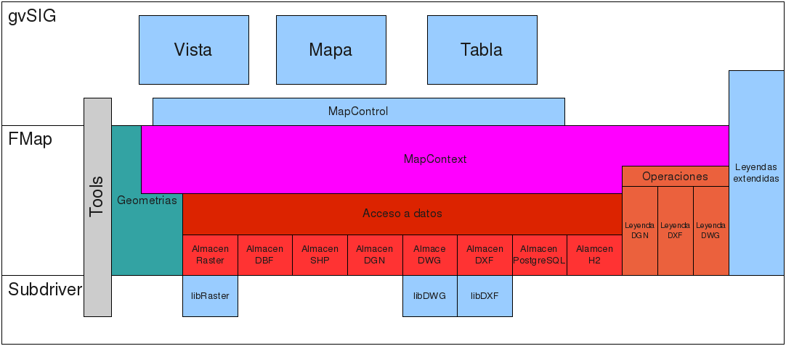

Contexto
========

En el siguiente diagrama podemos ver donde encajan los distintos componentes
de la librería de acceso a datos en gvSIG.

   Diagrama de contexto

Los componentes que formarían parte de la librería de acceso a datos serían:

* La librería de acceso a datos

* Los distintos almacenes de datos

* Las operaciones, manejo de leyendas específicos de algunos formatos.

Íntimamente relacionados con estos estaría la librería de geometrías, y las librerías 
de manejo de DWG y DXF.
