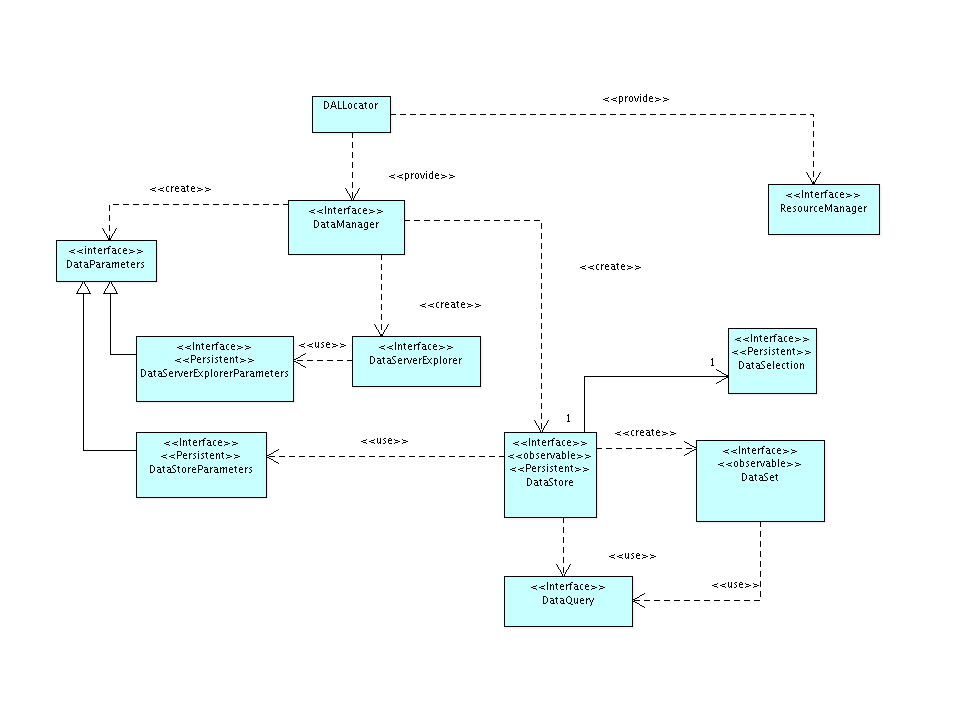

 
Descripción general de la arquitectura
======================================

.. _API: http://es.wikipedia.org/wiki/Interfaz_de_programaci%C3%B3n_de_aplicaciones
.. _SPI: http://en.wikipedia.org/wiki/Service_Provider_Interface
.. _Resource: http://downloads.gvsig.org/download/gvsig-desktop-testing/dists/2.3.0/javadocs/html/org/gvsig/fmap/dal/resource/Resource.html
.. _DataServerExplorer: http://downloads.gvsig.org/download/gvsig-desktop-testing/dists/2.3.0/javadocs/html/org/gvsig/fmap/dal/DataServerExplorer.html
.. _DataStore: http://downloads.gvsig.org/download/gvsig-desktop-testing/dists/2.3.0/javadocs/html/org/gvsig/fmap/dal/DataStore.html

El acceso a datos de gvSIG contiene dos grandes conjuntos de interfaces:

- El primero para los consumidores de datos o `API`_.

- Y el segundo, para los proveedores de datos de la librería  o `SPI`_.

La descripción de cada uno de esos grupos de interfaces se realizará por separado, distinguiendo en todo momento entre los servicios que se ofrecen al consumidor de datos y al proveedor de éstos.

En la arquitectura de la librería de acceso a datos, DAL, existen tres piezas fundamentales que se encuentran interrelacionadas entre sí:

* Control de recursos, `Resource`_. Identifica qué recursos están siendo
  usados en todo momento por los distintos proveedores de datos de la 
  librería, pudiendo solicitar que se liberen en un momento dado.
* Acceso a los servicios de un servidor de datos, `DataServerExplorer`_. 
  Permite determinar qué almacenes de datos hay en un servidor, así como 
  crear nuevos almacenes. Los principales tipos de servidores soportados 
  son:

  - Sistemas de ficheros en local, *FilesystemServerExplorer*.
  - Sistemas de bases de datos con soporte JDBC, *JDBCServerExplorer*.
  - Sistemas remotos basados en WMS/WCS.
  - Sistemas remotos basados en WFS/WFS-T, *WFSServerExplorer*.

* Acceso a los datos de un almacen, `DataStore`_. Nos permite el acceso a 
  datos de tipos como:

  - dbf/shp
  - dxf
  - GML
  - Bases de datos PostgreSQL

El API provee de una primera capa de abstracción que representa al acceso a datos independientemente de si estamos accediendo a datos tabulares, vectoriales o coberturas raster, para luego disponer de especializaciones dependiendo de si estamos accediendo a datos vectoriales o coberturas raster.

En la primera aproximación a la librería nos encontramos una serie de clases e interfaces que son independientes del tipo de datos y de su origen. Estas son:

   Figura 2

* *DALLocator*. Se trata del locator de la librería. Nos proporciona los servicios de localización del DataManager y el ResourceManager a usar por la librería.

* *DataManager*. Se trata de la factoría que nos da acceso al API de acceso a
  datos. A partir de él podemos acceder a los *almacenes* de datos o *explorar*
  los *almacenes de datos* que nos suministra un servidor o servicio dado. Es
  el punto de entrada a todo el modelo de objetos.

* *DataStore*. Representa un almacén de datos. Un fichero shape o una tabla de 
  una base de datos, y dispone de mecanismos para acceder a sus datos, su estructura
  y tipo, así como en qué forma se pueden modificar éstos.

* *DataStoreParameters*. Representa el conjunto de parámetros que se necesitan 
  para poder acceder al almacén de datos. Por ejemplo, si estamos accediendo
  a un fichero dbf, contendrá la ruta al fichero.

* *DataSet*. Representa un conjunto de datos del almacén de datos.
  El *DataStore* contiene mecanismos para acceder a los datos, permitiendo
  aplicar filtros u órdenes a éstos, así como información contextual que 
  pueda ser útil a la hora de decidir cómo ha de realizarse de forma óptima
  la recuperación de éstos desde el almacén.

* *DataQuery*. Representa el conjunto de valores que conforman las condiciones
  en las que se basará el *DataSet* para recuperar y devolver los datos.

* *DataServerExplorer*. Nos permite obtener la lista de *almacenes* disponibles en un
  servidor o servicio dado. Así podemos pedirle que nos dé la lista de tablas
  de una base de datos o de ficheros susceptibles de ser tratados como almacenes,
  por ejemplo shapes, dbfs o dxfs, que existan en una capeta dada. A partir
  de la información que nos suministre sobre cada *almacén*, podremos crear
  el *DataStore* adecuado para acceder a sus datos.

* *DataExplorerParameters*. Representa el juego de parámetros necesario para
  poder acceder al servidor o servicio y poder consular los almacenes de datos
  que éste sirve.

Así, puede pasarle un *DataStoreParameters* al *DataManager* para obtener un *DataStore*, y a partir de éste realizar consultas contra ese almacén o modificar sus datos. Una consulta devolverá un *DataSet* y a partir de él podrá acceder a los datos. Si queremos saber qué almacenes de datos tenemos en un servidor podemos pedirle un *DataServerExplorer* al *DataManager* y éste nos informará de los almacenes de datos que hay disponibles.

A partir de esta primera capa de abstracción que provee la librería, aparecen dos
grandes especializaciones de ella:

* Por un lado aparece una especialización que nos da acceso a datos de tipo
  tabular, bien sean de tipo alfanumérico o vectorial.

* Por otro, una especialización que nos abre el acceso a datos de tipo
  coberturas raster.

En adelante describiremos cada una de estas especializaciones, primero
centrándonos en el acceso a datos tabulares y después a los raster.

También trataremos más adelante cómo llevar la gestión de los recursos usados por
la librería, ficheros, conexiones a BBDD, conexiones a servicios remotos, ...
