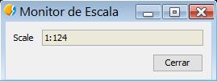

Capturando eventos: Listeners
=============================

Los *listeners* nos permiten responder a eventos que ocurren en el programa. Por ejemplo, tenemos el listener :javadoc:`ViewPortListener <ViewPortListener>` que lanza un evento cada vez que modificamos la pantalla de nuestra Vista, por ejemplo, lanzará un evento cada vez que hagamos ``Zoom In`` o ``Zoom out``.

Una forma de usar estos listeners es utilizando la herencia, creando una clase derivada de una o de varias anteriores.

.. note::

	Dejo el código de los ficheros .xml para la generación de la interfaz visual. En cada ejemplo indico los únicos componentes que necesitáis tener para que podáis crear el vuestro propio.
	
ViewPortListener
----------------

En el siguiente ejemplo vemos como creamos una clase nueva ``MonitorSuma`` que hereda de ``FormPanel`` y :javadoc:`ViewPortListener <ViewPortListener>`. Lanzamos la aplicación en las líneas::

			
	mapContext = currentView().getMapContext()
	monitor = MonitorSuma(mapContext)
	monitor.showTool("Monitor de Escala")

Vemos que al iniciar la clase añadimos nuestro objeto ``MonitorSuma`` al gestor de listener del ViewPort ``self.mapContext.getViewPort().addViewPortListener(self)`` y lo eliminamos al cerrar la aplicación ``self.mapContext.getViewPort().removeViewPortListener(self)``. De esta forma, cada vez que se modifica la extensión del ``mapContext``, se lanza el método ``extentChange()`` en el cual tenemos puesto que actualice una caja de texto (txtScale) donde aparecerá la escala actual de la Vista.

	
Ejemplo::

    # encoding: utf-8
    from gvsig import *
    from gvsig.commonsdialog import *

    from org.gvsig.fmap.mapcontext.events.listeners import ViewPortListener
    from gvsig.libs.formpanel import FormPanel
    import os

    class MonitorEscala(ViewPortListener, FormPanel):
            def __init__(self, mapContext):
                    FormPanel.__init__(self, os.path.join(os.path.dirname(__file__),"monitor_escala.xml"))

                    self.mapContext = mapContext

                    #Iniciamos valores de etiquetas
                    self.lblName.setText("Scale")
                    self.txtScale.setText(self.getScale())

                    # Agregamos listener al ViewPort
                    self.mapContext.getViewPort().addViewPortListener(self)

            def btnCerrar_click(self,*args):
                    # Eliminamos el listener
                    self.mapContext.getViewPort().removeViewPortListener(self)
                    self.hide()

            def getScale(self):
                    scale = "1:"+ str(self.mapContext.getScaleView())
                    return scale

            def changeScale(self):
                    self.txtScale.setText(self.getScale())

            # Metodo obligatorio de ViewPortListener
            def backColorChanged(self,*args):
                    pass

            # Metodo obligatorio de ViewPortListener
            def extentChanged(self,*args):
                    self.changeScale()

            # Metodo obligatorio de ViewPortListener
            def projectionChanged(self,*args):
                    pass

    def main(*args):
            if currentView() == None:
                    msgbox("Debera tener una vista abierta y activa")
                    return

            mapContext = currentView().getMapContext()
            monitor = MonitorEscala(mapContext)
            monitor.showTool("Monitor de Escala")
        
        
Contenido del fichero .xml. Contiene una caja de texto ``txtScale``, una etiqueta ``lblName`` y un botón Cerrar ``btnCerrar``.

Descarga del script: :download:`MonitorEscala <ejemplos/gvSIG-desktop-2.3.0-monitor_escala-1.0.0-0-testing-all-all-j1_7.gvspkg>`

Ejemplo Monitor: Consiste en un script que hace un sumatorio de cierto campo de las entidades que solo aparezcan visualmente en la Vista.
Descarga del script: :download:`Monitor <ejemplos/gvSIG-desktop-2.3.0-monitor-1.0.0-0-testing-all-all-j1_7.gvspkg>`

PointListener
-------------

Otro ejemplo similar al anterior es este en el que capturamos los eventos lanzados desde el :javadoc:`PointListener <PointListener>`, que hace referencia a clicks que hacemos sobre la Vista activa. También tendremos que apoyarnos en :javadoc:`PointBehavior <PointBehavior>` para poder añadir este comportamiento al *mapControl*.

En el siguiente ejemplo, capturaremos las coordenadas del mapa en el punto que hacemos click o doble click con el ratón:

   
Código::

    from gvsig import *

    from org.gvsig.fmap import IconThemeHelper
    from org.gvsig.fmap.mapcontrol.tools.Listeners import PointListener
    from org.gvsig.fmap.mapcontrol.tools.Behavior import PointBehavior
    from org.gvsig.app.project.documents.view import ViewManager

    from gvsig.libs.formpanel import FormPanel
    import os

    class Coordenadas(FormPanel, PointListener):
        def __init__(self, viewdoc):
            FormPanel.__init__(self, 
                                os.path.join(os.path.dirname(__file__),
                                            "coordenadas.xml")
                                )
            self.viewdoc = viewdoc
            self.mapControl = self.viewdoc.getWindowOfView().getMapControl()
            self.mapControl.addBehavior("TestGetXYPointTool", PointBehavior(self))
            self.mapControl.setTool("TestGetXYPointTool")
    
        def btnCerrar_click(self,*args):
            self.hide()
    
        def point(self, event):
            """Evento de PointListener"""
            p = event.getMapPoint()
            self.txtX.setText(str(p.getX()))
            self.txtY.setText(str(p.getY()))
    
        def pointDoubleClick(self, event):
            """Evento de PointListener"""
            p = event.getMapPoint()
            self.txtX.setText(str(p.getX()))
            self.txtY.setText(str(p.getY()))
    
        def getImageCursor(self):
            """Evento de PointListener"""
            return IconThemeHelper.getImage("cursor-select-by-point")
        
        def cancelDrawing(self):
            """Evento de PointListener"""
            return False

    def main(*args):
        coordenadas = Coordenadas(currentView())
        coordenadas.showTool("Coordenadas")

La interfaz contiene los componentes importantes de: ``txtX`` y ``txtY`` para que funcione correctamente.

Descarga del script: :download:`Coordenadas <ejemplos/gvSIG-desktop-2.3.0-coordenadas-1.0.0-0-testing-all-all-j1_7.gvspkg>`
