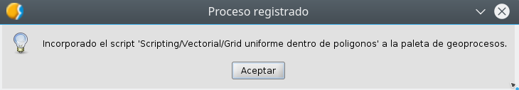
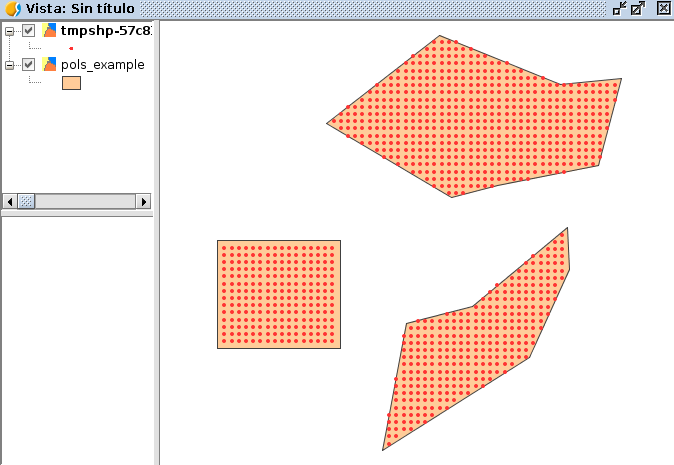
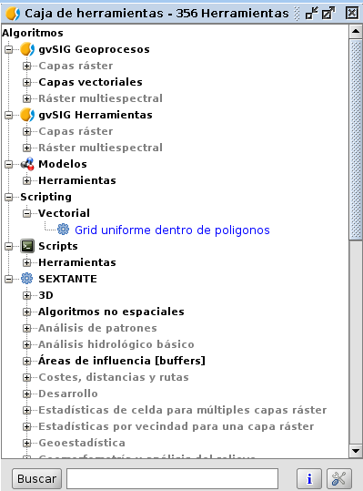
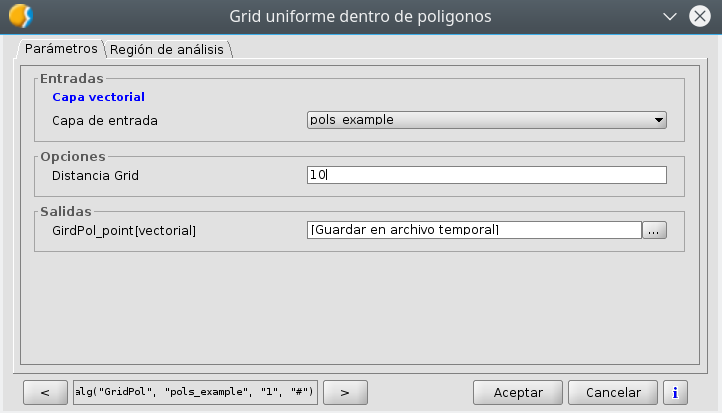
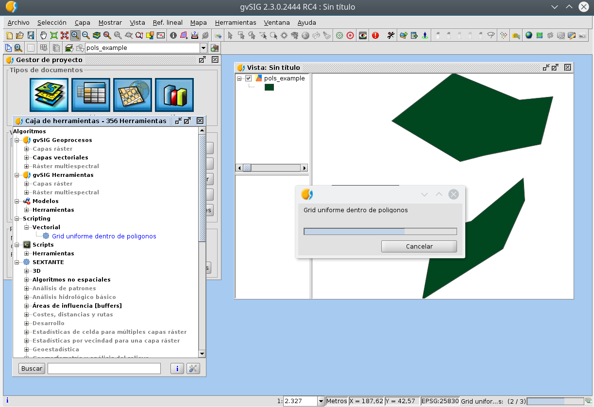
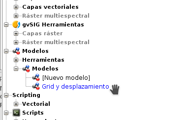

.. _label-geoprocesos:

Geoprocesos
===========

Librería Toolbox
----------------

Esta clase nos ayudará a generar nuestros geoprocesos para insertarlos en la Caja de Herramientas y permitiéndonos algunos extras que iremos explicando.

La librería Toolbox se encuentra dentro de ``gvsig.libs.toolbox`` y la podemos importar de forma similar::

    from gvsig.libs.toolbox import *

La clase principal que utilizaremos será ``ToolboxProcess`` que nos ayudará a extender de ella nuestro proceso, con todo lo necesario para gestionarlo y que funcione correctamente dentro de la Caja de Herramientas.

Las constantes de las que consta esta librería::

    SHAPE_TYPE_POINT = IVectorLayer.SHAPE_TYPE_POINT
    SHAPE_TYPE_LINE = IVectorLayer.SHAPE_TYPE_LINE
    SHAPE_TYPE_POLYGON = IVectorLayer.SHAPE_TYPE_POLYGON
    SHAPE_TYPE_MIXED = IVectorLayer.SHAPE_TYPE_MIXED
    SHAPE_TYPE_MULTIPOINT = IVectorLayer.SHAPE_TYPE_MULTIPOINT
    SHAPE_TYPE_MULTILINE = IVectorLayer.SHAPE_TYPE_MULTILINE
    SHAPE_TYPE_MULTIPOLYGON = IVectorLayer.SHAPE_TYPE_MULTIPOLYGON
    SHAPE_TYPE_WRONG = IVectorLayer.SHAPE_TYPE_WRONG
    SHAPE_TYPE_UNDEFINED = SHAPE_TYPE_WRONG

    NUMERICAL_VALUE_INTEGER = AdditionalInfoNumericalValue.NUMERICAL_VALUE_INTEGER
    NUMERICAL_VALUE_DOUBLE = AdditionalInfoNumericalValue.NUMERICAL_VALUE_DOUBLE
    

Insertar geoproceso en la Toolbox
---------------------------------

Tenemos la posibilidad de añadir nuestros scripts a la Caja de Herramientas para ser accesibles en cualquier momento además de contar con otras ventajas como la de poder añadir nuestros scripts en modelos del Model Builder o ejecutarlos desde gvpy como enseñamos en el siguiente apartado.

Para ello tenemos que seguir la siguiente plantilla, muy sencilla, creando una clase que extiende de ``ToolboxProcess``.

El ejecutar el siguiente script se registará el proceso en la Caja de Herramientas apareciendo una pantalla similar a la siguiente.

Ejemplo 1 - XYShift, desplazamiento de una capa de puntos::

	# encoding: utf-8

	from gvsig import *
	from gvsig.commonsdialog import *

	from gvsig.libs.toolbox import *
	from es.unex.sextante.gui import core
	from es.unex.sextante.gui.core import NameAndIcon

	class XYShift(ToolboxProcess):
	  
	  def defineCharacteristics(self):
		"""
	En esta operacion debemos definir los parametros de entrada y salida que va a precisar nuestro proceso.
		"""
		# Fijamos el nombre con el que se va a mostrar nuestro proceso
		self.setName("Prueba desplazamiento en X e Y")
		
		# Indicamos el grupo en el que aparecera
		self.setGroup("Vectorial")
			
		params = self.getParameters()
		# Indicamos que precisamos un parametro LAYER, del tipo punto y que es obligatorio
		params.addInputVectorLayer("LAYER","Caoa de entrada", SHAPE_TYPE_POINT,True)
		# Indicamos que precisamos un par de valores numericos, X e Y 
		params.addNumericalValue("X", "X_traslation",0, NUMERICAL_VALUE_DOUBLE)
		params.addNumericalValue("Y", "Y_traslation", 0, NUMERICAL_VALUE_DOUBLE)
		
		# Y por ultimo indicamos que precisaremos una capa de salida de puntos.
		self.addOutputVectorLayer("RESULT_POINT", "XYShift_point", SHAPE_TYPE_POINT)

	  def processAlgorithm(self):
		"""
	Esta operacion es la encargada de realizar nuestro proceso.
		"""
		features=None
	   
		try:

		  """
		  Recogemos los parametros y creamos el conjunto de entidades asociadas a la capa
		  de entrada.
		  """
		  params = self.getParameters()
		  layer = params.getParameterValueAsVectorLayer("LAYER")
		  x = params.getParameterValueAsDouble("X")
		  y = params.getParameterValueAsDouble("Y")

		  input_store = layer.getFeatureStore()

		  features = input_store.getFeatureSet()
		  """
		  Generamos la capa de salida con la misma estructura que la capa de entrada
		  """
		  output_store = self.buildOutPutStore(
			features.getDefaultFeatureType(), 
			SHAPE_TYPE_POINT,
			"XYShift_points",
			"RESULT_POINT"
		  )

		  """
		  Nos recorremos todas las entidades de entrada, y creamos las de salida desplazando la geometria
		  en los valores indicados por la X e Y de los parametros.
		  """
		  self.setRangeOfValues(0,features.getSize())
		  n = 0
		  for feature in features.iterator():
			if self.isCanceled():
			  # Si el usuario indico que quiere cancelar el proceso abortamos.
			  print "Proceso cancelado"
			  break
			
			# Incrementamos el progreso de nuestro proceso.
			#self.next()

			# Creamos una nueva entidad para nuestro almacen de salida.
			newfeature = self.createNewFeature(output_store,feature)

			# Desplazamos la geometria de la nueva entidad
			geom = newfeature.getDefaultGeometry()
			geom.move(x,y)
			
			# Guardamos la nueva entidad
			output_store.insert(newfeature)
			n+=1
			self.setCurValue(n)

		  # Cuando hemos terminado de recorrernos las entidades terminamos la edicion.
		  output_store.finishEditing()   
		  
		finally:
		  DisposeUtils.disposeQuietly(features)
		  print "Proceso terminado %s" % self.getCommandLineName() 
		  return True
		

	def main(*args):
		# Creamos nuesto geoproceso
		process = XYShift()
		# Lo registramos entre los procesos disponibles en el grupo de "Scripting"
		process.selfregister("Scripting")
		from es.unex.sextante.gui.core import SextanteGUI
		#SextanteGUI.addAlgorithmProvider(process.__class__)
		from org.gvsig.geoprocess.lib.api import GeoProcessLocator
		gm = GeoProcessLocator.getGeoProcessManager()

		alg = gm.getAlgorithms()
		for a in alg:
			print a
		#gm.registerGeoProcess(process)
		
		# Actualizamos el interface de usuario de la Toolbox
		process.updateToolbox()

		msgbox("Incorporado el script '%s/%s/%s' a la paleta de geoprocesos." % (
			"Scripting",
			process.getGroup(),
			process.getName()
		  )
		)

Ejemplo 2 - GridPol, malla uniforme de puntos dentro de polígonos en una capa::

    from gvsig import *
    from gvsig import geom
    from gvsig.commonsdialog import *

    from gvsig.libs.toolbox import *
    from es.unex.sextante.gui import core
    from es.unex.sextante.gui.core import NameAndIcon

    from es.unex.sextante.gui.core import SextanteGUI
    from org.gvsig.geoprocess.lib.api import GeoProcessLocator

    class GridPol(ToolboxProcess):

    def defineCharacteristics(self):
            """Definir los parametros de entrada y salida de nuestro proceso. """
            # Fijamos el nombre con el que se va a mostrar nuestro proceso
            self.setName("Grid uniforme dentro de poligonos")

            # Indicamos el grupo en el que aparecera
            self.setGroup("Vectorial")

            params = self.getParameters()
            
            # Indicamos que precisamos un parametro LAYER, del tipo poligono y que es obligatorio
            params.addInputVectorLayer("LAYER","Capa de entrada", SHAPE_TYPE_POLYGON, True)
            
            # Indicamos que precisamos una distancia para el grid
            params.addNumericalValue("DISTANCEGRID", "Distancia Grid",0, NUMERICAL_VALUE_INTEGER)
            
            # Y por ultimo indicamos que precisaremos una capa de salida de puntos.
            self.addOutputVectorLayer("RESULT_POINT", "GirdPol_point", SHAPE_TYPE_POINT)

    def processAlgorithm(self):
            """ Esta operacion es la encargada de realizar nuestro proceso. """
            features=None

            try:

                """
                Recogemos los parametros y creamos el conjunto de entidades asociadas a la capa
                de entrada.

                Se obtendran dos capas en la vista con el mismo tipo de datos.
                ** Una capa es la generada por nosotros desde el script
                ** La otra capa es la gestionada a traves de la Toolbox creada en output_store
                
                """
                params = self.getParameters()
                sextantelayer = params.getParameterValueAsVectorLayer("LAYER")
                distancegrid = int(params.getParameterValueAsDouble("DISTANCEGRID"))
        
                # La capa obtenida es de un tipo especial
                # para facilitar gestionamos su store
                store = sextantelayer.getFeatureStore()
                features = store.features()

                ### Capa 1: Gestionada por el script
                sch = createSchema()
                sch.append("GEOMETRY", "GEOMETRY")
                sch.get("GEOMETRY").setGeometryType(geom.POINT, geom.D2)
                shp = createShape(sch)
                

        
                ### Capa 2: Aprovechando las opciones de la Toolbox
                output_store = self.buildOutPutStore(
                        features.getDefaultFeatureType(),
                        SHAPE_TYPE_POINT,
                        "GridP_points",
                        "RESULT_POINT"
                )
                
                # Progress bar
                self.setRangeOfValues(0, features.getSize())
                n = 0
                
                for feature in features:
                    # Incrementamos barra progreso
                    self.next() 

                    # Proceso
                    extent = feature.getDefaultEnvelope()
            
                    xmin = extent.getMinimum(geom.DIMENSIONS.X)
                    xmax = extent.getMaximum(geom.DIMENSIONS.X)
                    
                    ymin = extent.getMinimum(geom.DIMENSIONS.Y)
                    ymax = extent.getMaximum(geom.DIMENSIONS.Y)
            
                    rows = int(ymax-ymin) / distancegrid
                    cols = int(xmax-xmin) / distancegrid
                    
                    x = xmin
                    y = ymax
                    
            
                    for i in range(rows+1):
                        if self.isCanceled():
                            break
                        for j in range(cols+1):
                            pt = geom.createPoint2D(x, y)
                            if feature.geometry().contains(pt):
                                # Puntos contenidos en el poligonos
                                # son agregados a la capa

                                ### Capa 1
                                shp.append(GEOMETRY=pt)
        
                                ### Capa 2
                                newfeature = self.createNewFeature(output_store, feature)
                                newfeature["GEOMETRY"] = pt
                                output_store.insert(newfeature)
        
                                
                            x += distancegrid
                        x = xmin
                        y -= distancegrid

                # Capa 1: Agregamos a la Vista activa
                shp.commit()
                currentView().addLayer(shp)
                
                # Capa 2 se encargara la toolbox de gestionarla
                return True
            
            finally:
                DisposeUtils.disposeQuietly(features)
                print "Proceso terminado %s" % self.getCommandLineName()
                return True

    def main(*args):
            # Creamos nuesto geoproceso
            process = GridPol()
            # Lo registramos entre los procesos disponibles en el grupo de "Scripting"
            process.selfregister("Scripting")
            
            # Actualizamos el interface de usuario de la Toolbox
            process.updateToolbox()

            msgbox("Incorporado el script '%s/%s/%s' a la paleta de geoprocesos." % (
                    "Scripting",
                    process.getGroup(),
                    process.getName()
            ), 
            "Proceso registrado"
            )
            

  
Una vez añadido aparecerá en nuestra Caja de Herramientas:

   
Este geoproceso tendrá una interfaz similar a la siguiente:

   
Y tendrá una barra de estado mostrando el progreso durante su ejecución, la cual hemos programado nosotros:

   
		
Lanzador de geoprocesos usando gvpy
-----------------------------------

Una vez registrado en la Toolbox el geoproceso anterior, podemos lanzarlo desde Scripting con la librería gvpy::

	from gvsig import *
	from gvsig.libs import gvpy

	def main(*args):

		x = gvpy.runalg("XYShift", "Locations", "0.0", "10.0",ADDLAYER=True, NAME="Capa desplazada")

También puedes lanzar otros geoprocesos, por ejemplo, podemos crear dos capas aleatorias de vectores y raster::

	from gvsig import *
	from gvsig.libs import gvpy

	def main(*args):

		v = gvpy.runalg("randomvector", 100, 1)
		r = gvpy.runalg("generaterandomnormal", 100, 0, CELLSIZE=100, EXTENT=[250,250,0,500,500,0])
		
Lanzando el ejemplo 2 anteriormente explicado sobre malla de puntos sobre polígonos::

    from gvsig import *
    from gvsig.libs import gvpy

    def main(*args):

            x = gvpy.runalg("GridPol", "pols_example", "2",ADDLAYER=True, NAME="Grid dentro poligono")

Un ejemplo lanzando la herramienta de Calculadora de mapas para ficheros raster::

   from gvsig import *
   from gvsig.libs import gvpy

   def main(*args):

       r1 = currentLayer() # getting raster from the view with name "rasterfile"::
       g2 = gvpy.runalg("gridcalculator", [r1], "rasterfile Band 2 * rasterfile Band 1")

Puedes encontrar más información en la :ref:`documentación de gvpy <label-gvpy>`

Scripts en el Modelizador
-------------------------

Al seguir el ejemplo anterior, estos scripts o geoprocesos pueden ser insertados en la toolbox, y por tanto, hacer uso de ellos en el Modelizador (Model Builder).

Una vez insertado podemos crear un modelo similar al siguiente:

.. figure::  images/post_geo_modelizador.png
   :align:   center
   
El cual nos aparecerá en la Caja de Herramientas:

Dando como resultado:

.. figure::  images/post_geo_model_resultado.png
   :align:   center
