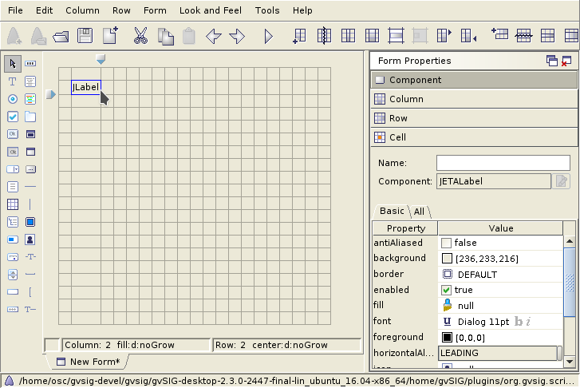

Interfaces visuales
===================

Abeille
-------

El programa Abeille lo usaremos para la creación de las interfaces visuales. En este programa podremos establecer el aspecto de las ventanas, nombres, etc. Haciendo uso de la librería FormPanel podremos cargarlo fácilmente en un script, y sacarle el máximo partido.

.. |abeille| image:: images/icon-abeille.png

Abriremos el Abeille desde el botón |abeille| situado en la barra de Herramientas del Scripting Composer.

.. note::

   Recordar que para que aparezca la herramienta de Abeille, debemos de tener instaladas las herramientas denominadas **ScriptingComposerTools** que podrás descargar desde el Administrador de Complementos.

Aparece en la imagen el programa Abeille con el ejemplo de coordenadas.xml abierto:

.. figure::  images/abeille.png
   :align:   center

Ejemplo de uso
--------------

Descargar el ejemplo explicado a continuación: :download:`CentrarCoordenadas <ejemplos/gvSIG-desktop-2.3.0-centrar_coordenadas-1.0.0-2-testing-all-all-j1_7.gvspkg>`

.. figure::  images/abeille_1.png
   :align:   center
   
Para crear una interfaz visual crearemos un nuevo formulario en Abeille.

.. figure::  images/abeille_2.png
   :align:   center

Crearemos una nueva etiqueta ``label``.

.. figure::  images/abeille_3.png
   :align:   center

Presionamos el lugar en el que queremos situarlo en la cuadrícula.

   
Ahora podemos dotarle de nombre a la etiqueta. Este nombre es con el que accederemos al componente desde nuestro script. En este caso, le daremos de nombre ``lblName``.

.. figure::  images/abeille_5.png
   :align:   center

Cambiamos el texto que contendrá esta etiqueta a: *Coordenadas*

.. figure::  images/abeille_6.png
   :align:   center

Se puede ampliar el rango de ocupación de esta casilla en el formulario para ajustarlo mejor al interfaz que vamos a crear. En este caso queremos que ocupe 3 columnas de nuestro grid, dejando una columna por cada lado para que los componentes que estamos creando no estén juntos al borde de la ventana.

.. figure::  images/abeille_7.png
   :align:   center

Vemos que el espacio que ocupa la etiqueta de Coordenas se ha ampliado. Para la interfaz de este script haremos uso de 5 columnas, 3 para situar los componentes y las otras dos de separación con los bordes. Ya podemos eliminar las columnas que no tenemos planeado utilizar. Para ello hacemos uso del control "Delete Columns":

.. figure::  images/abeille_71.png
   :align:   center

Vamos a ampliar la anchura de algunas columnas del formulario para una mejor visualización, aunque al final explicaremos otras opciones para que el panel se encargue automáticamente de este ancho y nos aseguremos de una correcta visualización. Para ello, solo tenemos que presionar sobre la columna a modificar y desplazar la señal que aparecerá arriba hacia la derecha:

.. figure::  images/abeille_72.png
   :align:   center

Repetimos el proceso para crear dos etiquetas más denominadas ``lblX`` y ``lblY``, con textos de "X: " e "Y: " respectivamente. Dejaremos una fila entre cada uno de ellos para una correcta visualización:

.. figure::  images/abeille_8.png
   :align:   center
   
Ahora crearemos un ``text field`` o campo de texto. Este campo permitirá tanto mostrar valores, como permitir al usuario introducirlos:

   
Repetimos el mismo proceso anterior para la creación de dos *text fields* denominados ``txtX`` y ``txtY``.

.. figure::  images/abeille_10.png
   :align:   center

A esta columna en la que se sitúan las cajas de texto, vamos a dotarla de la posibilidad de agrandarse en caso necesario, por ejemplo, si el usuario agranda la ventana. Esta opción ayudará a mantener a la correcta visualización de la interfaz, y nos da la opción de detallar los componentes que permitimos que cambien de tamaño.

Para ello, vamos a seleccionar alguna celda situada en la columna que contiene los componentes de Cajas de Texto, y vamos a ir al menú de arriba :menuselection:`Column --> Resize: Grow`.

.. figure::  images/abeille_101.png
   :align:   center

Vemos como ya la previsualización del formulario ha cambiado, apareciendo más grande haciendo uso de esta columna designada:

.. figure::  images/abeille_102.png
   :align:   center

El siguiente paso es crear espacio para los botones de la aplicación, que en este caso, serán dos. El primer botón destinado a realizar una acción que será la de Centrar: ``btnCenter``, y otro botón destinado a cerrar la aplicación: ``btnClose``.

Para tener mayor libertad de configuración en la posición y tamaño de estos botones, así como de ayudar a una correcta visualización de la interfaz, vamos a hacerlo de la siguiente manera.

Primero vamos a insertar un componente de tipo "Embedded Form". Esta opción nos permite insertar un formulario dentro de otro.

.. figure::  images/abeille_103.png
   :align:   center

Situaremos el nuevo componente debajo de la última etiqueta, dejando una fila de separación:

.. figure::  images/abeille_104.png
   :align:   center

Nos aparecerá una ventana para indicar qué tamaño de formulario queremos insertar, le indicaremos 4 columnas y 1 fila. De esta forma tendremos espacio para situar los dos botones y dejar separación entre ellos.

.. figure::  images/abeille_105.png
   :align:   center

Dando como resultado algo similar a:

.. figure::  images/abeille_106.png
   :align:   center

Una vez insertado, le indicaremos que ocupe también las siguientes dos columnas, de la misma forma que hicimos con la primera etiqueta Coordenadas, usando ``Increse Column Span``.

.. figure::  images/abeille_107.png
   :align:   center

Dejando una fila de separación para el borde de abajo, podemos eliminar también el resto de filas sobrantes. El resultado será similar al siguiente:

.. figure::  images/abeille_108.png
   :align:   center

Vamos a indicarle que este subformulario se alinea a la derecha de la celda en la que está contenido. Presionamos sobre la celda que contiene el subformulario y a la derecha en :menuselection:`Form Properties --> Cell --> Alignment --> Horizontal --> RIGHT`, quedando como resultado:

.. figure::  images/abeille_109.png
   :align:   center

Ahora ya podemos crear los botones en este subformulario, ``btnCenter`` y ``btnClose``. Seleccionamos la opción jButton:

.. figure::  images/abeille_110.png
   :align:   center

Y situamos los dos botones dentro del subformulario:

.. figure::  images/abeille_111.png
   :align:   center

Está la opción de ampliar este subformulario por si nos enfrentamos a un caso más complicado:

Aparecerá el formulario en una pestaña diferente:

.. figure::  images/abeille_113.png
   :align:   center

Con esto ya tendremos la interfaz preparada, solo tendremos que guardarla en el mismo directorio del script que estábamos creando con extensión ``.xml``:

.. figure::  images/abeille_114.png
   :align:   center

En cualquier momento podremos realizar cambios en este interfaz abriendo el fichero ``.xml`` de nuevo desde el Abeille.

Aquí vemos como responde la aplicación a diferentes tamaños que le vamos dando:

Desde código podemos establecer el tamaño que queremos que tenga la ventana con la línea ``self.setPreferredSize(300,300)``, quedando algo similar según el script que tengamos a::

    from gvsig import *
    from gvsig.libs.formpanel import FormPanel

    class Panel(FormPanel):
        def __init__(self):
            FormPanel.__init__(self, os.path.join(os.path.dirname(__file__), "ui_basic.xml"))
            self.setPreferredSize(300,300)

    def main(*args):
        l = Panel()
        l.showTool("Visual")
        pass

También tenemos muchas más opciones que nos permiten configurar con más detalle la forma de reaccionar de nuestros componentes en la interfaz, como por ejemplo, en el menú de opciones de Columna:

.. figure::  images/abeille_116.png
   :align:   center

Uso de FormPanel
----------------

Para la creación de script visuales nos apoyaremos en la clase FormPanel contenida en ``gvsig.libs.formpanel``. Crearemos una clase nueva que contendrá la funcionalidad de nuestro script y extenderemos desde FormPanel.

Primero vamos a crear una carpeta nueva en la que meter nuestro ejemplo.

.. figure::  images/abeille_script_1.png
   :align:   center
   
Después, un script en esta carpeta denominado *centrar_coordenadas.py*.

.. figure::  images/abeille_script_2.png
   :align:   center
   
Guardaremos el formulario explicado en el apartado anterior en esta carpeta.

Ejemplo básico de la carga de una interfaz en un script::

    from gvsig import *
    from gvsig.libs.formpanel import FormPanel
    import os

    class Panel(FormPanel):
        def __init__(self):
            FormPanel.__init__(self, os.path.join(os.path.dirname(__file__), "ui_basic.xml"))

    def main(*args):
        l = Panel()
        l.showTool("Visual")
        pass

Nos vamos a basar en esta plantilla para la creación de nuestro script de *centrar_coordenadas.py*.

Por defecto, en FormPanel viene establecido un método ``btnClose_click``, que servirá para cerrar este script. De esta forma solo tenemos que establecer en Abeille un botón denominado ``btnClose`` y ya tendremos un botón programado para el cierre de la aplicación.

Tenemos nuestro módulo listo para ser programado. Tenemos una carpeta que contiene el script y la interfaz que utilizará.

.. figure::  images/abeille_script_3.png
   :align:   center

Seguimos desarrollando las funcionalidades de FormPanel. Una de ellas es el auto enlace con eventos que se producen en los elementos de la interfaz visual. Por ejemplo, si tenemos (en nuestro ejemplo) un botón denominado ``btnCenter`` y queremos que reaccione al evento cuando lo presionemos, tan solo deberemos de crear un método en nuestra clase que contenga el nombre del elemento "btnCenter" terminado con el evento que queremos capturar "_click".

De esta forma no tenemos que preocuparnos de eventos, ya que la propia librería FormPanel nos lo gestionará::

    # encoding: utf-8

    from gvsig import *
    from gvsig.libs.formpanel import FormPanel
    import os

    class CenterCoordinates(FormPanel):
        def __init__(self):
            FormPanel.__init__(self, 
                                os.path.join(os.path.dirname(__file__), 
                                            "centrar_coordenadas.xml")
                                )

        def btnCenter_click(self, *args):
            print "Clicked!"
        
        def btnClose_click(self,*args):
            self.hide()
        
    def main(*args):
        l = CenterCoordinates()
        l.showTool("Centrar Coordenadas")
        pass
  
Al ejecutar el script nos aparecerá una interfaz similar a esta:

.. figure::  images/abeille_script_4.png
   :align:   center
  
Y lo que ocurre al presionar el botón *Centrar*, tal y como hemos programado en el método *btnCenter_click*, mostrará por consola la palabra *Clicked!*.

Si presionamos el botón de *Cerrar* se cerrará la aplicación, haciendo uso de un método ya implementado en la clase *FormPanel*, sin necesidad de programarlo nosotros mismos. En el caso de que quisiéramos encargarnos nosotros de esta función, solo tendríamos que sobrescribir el método en nuestra clase, o darle otro nombre al componente de cerrar la aplicación.

Por ejemplo, también podríamos modificar el texto de etiquetas u otros valores de una forma similar a::

    self.txtX.setText("Clicked!")
    self.txtY.setText("Clicked!")

.. figure::  images/abeille_script_7.png
   :align:   center
   
Como hemos visto, para acceder a nuestros componentes en el interfaz, lo haremos mediante *self. + nombre del componente.* Por ejemplo, vamos a implementar en el botón *Centrar*, que muestre por consola las coordenadas que el usuario escriba en las cajas de texto.

Para ello haremos referencia a los componentes de cajas de texto ``txtX`` y ``txtY`` que hemos programado en la interfaz::

    def btnCenter_click(self, *args):
        x = self.txtX.getText()
        y = self.txtY.getText()
        print "X: ", x, " Y: ", y
      
Aquí vemos como quedaría:

   
Ahora, para cumplir el propósito del script, centrar la vista en unas coordenadas que le establezcamos, solo tenemos que modificar el método *btnCenter_click* por algo similar a lo siguiente::

    # encoding: utf-8

    from gvsig import *
    from gvsig import geom
    from gvsig.libs.formpanel import FormPanel
    import os

    class CenterCoordinates(FormPanel):
        def __init__(self):
            FormPanel.__init__(self, 
                                os.path.join(os.path.dirname(__file__), 
                                            "centrar_coordenadas.xml")
                                )

        def btnCenter_click(self, *args):
            x = float(self.txtX.getText())
            y = float(self.txtY.getText())
            point = geom.createPoint2D(x, y)
            currentView().centerView(point.getEnvelope())
        
        def btnClose_click(self,*args):
            self.hide()
        
    def main(*args):
        l = CenterCoordinates()
        l.showTool("Centrar Coordenadas")
        pass

Dando como resultado algo así:

.. figure::  images/abeille_script_8.png
   :align:   center

Vemos como ha centrado la Vista en las coordenadas que hemos indicado en las cajas de texto.

Tratar con diferentes componentes
---------------------------------

Grupos de RadioButton
+++++++++++++++++++++

Una función del interfaz habitual es la creación de un grupo de RadioButton para permitir la selección entre varias opciones. Por lo general, estas opciones van agrupadas y solo se permite la selección de una de ellas. Estas agrupaciones debemos de hacerlas por código de una forma similar a la siguiente.

Después de generar la interfaz en el método ``__init__`` con ``FormPanel.__init__(..)``, tendremos que crear el grupo de botones y añadir uno a uno los que forman parte de la agrupación, por ejemplo::

    from javax.swing import ButtonGroup
    ...
    self.btgAnswers = ButtonGroup()
    self.btgAnswers.add(self.rdbOption1)
    self.btgAnswers.add(self.rdbOption2)

Siendo ``rdbOption1`` y ``rdbOption2``, componentes de tipo **RadioButton** de la interfaz.

.. figure::  images/interfaz_rdb.png
   :align:   center

Eventos autoregistrados
-----------------------

Hemos comentado que FormPanel se encarga de enlazar los eventos de los componentes con nuestro script, pero no todos los eventos posibles de cada elemento del interfaz están implementados dentro de FormPanel (pero si necesitas alguno de ellos se podrían añadir o implementar en tu propia clase). Aquí mostramos algunos de estos eventos haciendo referencia a *spinners*, *combobox*, etc::

        def btnCalcular_click(self, *args):
            self.txtField.setText("Clicked!")
            print "Clicked!"

        def chb1_change(self, *args):
            print "Check box!"

        def rb1_change(self, *args):
            print "Radio button!"

        def cmb1_change(self, *args):
            print "Combobox!"

        def sld1_focusGained(self, *args):
            print "Slider!", sld1.getValue()

        def spn1_change(self, *args):
            print "Spinner!"

        def btnClose_click(self,*args):
            self.hide()
