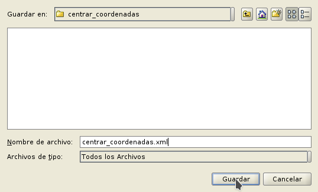

Interfaces visuales
===================

Abeille
-------

El programa Abeille lo usaremos para la creación de las interfaces visuales. En este programa podremos establecer el aspecto de las ventanas, nombres, etc. Haciendo uso de la librería FormPanel podremos cargarlo fácilmente en un script, y sacarle el máximo partido.

.. |abeille| image:: images/icon-abeille.png

Abriremos el Abeille desde el botón |abeille| situado en la barra de Herramientas del Scripting Composer.

Aparece en la imagen el programa Abeille con el ejemplo de coordenadas.xml abierto:

.. figure::  images/abeille.png
   :align:   center

Ejemplo de uso
--------------

Descargar el ejemplo explicado a continuación: :download:`CentrarCoordenadas <ejemplos/gvSIG-desktop-2.3.0-centrar_coordenadas-1.0.0-0-testing-all-all-j1_7.gvspkg>`

.. figure::  images/abeille_1.png
   :align:   center
   
Para crear una interfaz visual crearemos un nuevo formulario en Abeille.

.. figure::  images/abeille_2.png
   :align:   center

Crearemos una nueva etiqueta ``label``.

Presionamos el lugar en el que queremos situarlo en la cuadrícula.

.. figure::  images/abeille_4.png
   :align:   center
   
Ahora podemos dotarle de nombre a la etiqueta. Este nombre es con el que accederemos al componente desde nuestro script. En este caso, le daremos de nombre ``lblName``.

.. figure::  images/abeille_5.png
   :align:   center

Cambiamos el texto que contendrá esta etiqueta a: *Coordenadas*

.. figure::  images/abeille_6.png
   :align:   center
   
Se puede ampliar el rango de ocupación de esta casilla en el formulario para ajustarlo mejor al interfaz que queramos.

.. figure::  images/abeille_7.png
   :align:   center
   
Repetimos el proceso para crear dos etiquetas más ``lblX`` y ``lblY``.

.. figure::  images/abeille_8.png
   :align:   center
   
Ahora crearemos un ``text field`` o campo de texto. Este campo permitirá tanto mostrar valores, como permitir al usuario introducir unos valores.

.. figure::  images/abeille_9.png
   :align:   center
   
Repetimos el mismo proceso anterior para la creación de dos *text fields* denominados ``txtX`` y ``txtY``. Además también hemos utilizando la herramienta explicada anterior *Increase column span*, ampliamos el rango de ocupación de estas cajas de texto.

.. figure::  images/abeille_10.png
   :align:   center

También añadiremos un botón que nos permitirá cerrar la aplicación.

.. figure::  images/abeille_11.png
   :align:   center

Le otorgaremos de nombre de componente ``btnClose`` y de texto en el componente ``Cerrar``.

.. figure::  images/abeille_12.png
   :align:   center

Una de las ventajas de dotarle a este componente el nombre de ``btnClose``, es que la clase ``FormPanel`` que explicamos después, ya dotará automáticamente a este botón la capacidad de cerrar la aplicación.

Una vez acabada la interfaz podemos eliminar las columnas restantes de la cuadrícula.

.. figure::  images/abeille_13.png
   :align:   center
   
Y filas restantes.

.. figure::  images/abeille_14.png
   :align:   center

Una vez tenemos la interfaz preparada, la guardamos.

.. figure::  images/abeille_15.png
   :align:   center
   
Guardamos el formulario en formato .xml donde esté o vayamos a crear nuestro script.

Ya estaría listo la creación de nuestra interfaz para ser usada desde scripting.
   
En cualquier momento podremos realizar cambios en este interfaz. Por ejemplo, hemos decidido ampliar la funcionalidad de nuestro script, y en este caso necesitamos añadir un botón nuevo de *Centrar*, de nombre ``btnCenter``. Solo tendremos que abrir la interfaz con Abeille, modificarla, y guardarla.

.. figure::  images/abeille_17.png
   :align:   center

Uso de FormPanel
----------------

Para la creación de script visuales nos apoyaremos en la clase FormPanel contenida en ``gvsig.libs.formpanel``. Crearemos una clase nueva que contendrá la funcionalidad de nuestro script y extenderemos desde FormPanel.

Primero vamos a crear una carpeta nueva en la que meter nuestro ejemplo.

.. figure::  images/abeille_script_1.png
   :align:   center
   
Después, un script en esta carpeta denominado *centrar_coordenadas.py*.

.. figure::  images/abeille_script_2.png
   :align:   center
   
Guardaremos el formulario explicado en el apartado anterior en esta carpeta.

Ejemplo básico de la carga de una interfaz en un script::

	from gvsig import *
	from gvsig.libs.formpanel import FormPanel

	class Panel(FormPanel):
		def __init__(self):
			FormPanel.__init__(self, os.path.join(os.path.dirname(__file__), "ui_basic.xml"))
			
	def main(*args):
		l = Panel()
		l.showTool("Visual")
		pass
		
Nos vamos a basar en esta plantilla para la creación de nuestro script de *centrar_coordenadas.py*.

Por defecto, en FormPanel viene establecido un método ``btnClose_click``, que servirá para cerrar este script. De esta forma solo tenemos que establecer en Abeille un botón denominado ``btnClose`` y ya tendremos un botón programado para el cierre de la aplicación.

Tenemos nuestro módulo listo para ser programado. Tenemos una carpeta que contiene el script y la interfaz que utilizará.

.. figure::  images/abeille_script_3.png
   :align:   center

Seguimos desarrollando las funcionalidades de FormPanel. Una de ellas es el auto enlace con eventos que se podrucen en los elementos de la interfaz visual. Por ejemplo, si tenemos (en nuestro ejemplo) un botón denominado ``btnCenter`` y queremos que ciera acción cuando lo presionemos, tan solo deberemos de crear un método en nuestra clase que contenga el nombre del elemento "btnCenter" terminado con la acción que queremos coger "_click".

De esta forma no tenemos que preocuparnos de eventos, ya que la propia librería FormPanel nos lo gestionará::

    # encoding: utf-8

    from gvsig import *
    from gvsig.libs.formpanel import FormPanel
    import os

    class CenterCoordinates(FormPanel):
        def __init__(self):
            FormPanel.__init__(self, 
                                os.path.join(os.path.dirname(__file__), 
                                            "centrar_coordenadas.xml")
                                )

        def btnCenter_click(self, *args):
            print "Clicked!"
        
        def btnClose_click(self,*args):
            self.hide()
        
    def main(*args):
        l = CenterCoordinates()
        l.showTool("Centrar Coordenadas")
        pass
  
Al ejecutar el script nos aparecerá una interfaz similar a esta:

.. figure::  images/abeille_script_4.png
   :align:   center
  
Y lo que ocurre al presionar el botón *Centrar*, tal y como hemos programado en el método *btnCenter_click*, mostará por consola la palabra *Clicked!*.

.. figure::  images/abeille_script_5.png
   :align:   center

Si presionamos el botón de *Cerrar* se cerrará la aplicación, haciendo uso de un método ya implementado en la clase *FormPanel*, sin necesidad de programarlo nosotros mismos. En el caso de que quisieramos encargarnos nosotros de esta función, solo tendríamos que sobreescribir el método en nuestra clase, o darle otro nombre al componente de cerrar la aplicación.

Por ejemplo, también podríamos modificar el texto de etiquetas u otros valores de una forma similar a::

    self.txtX.setText("Clicked!")
    self.txtY.setText("Clicked!")

.. figure::  images/abeille_script_7.png
   :align:   center
   
Como hemos visto, para acceder a nuestros componentes en el interfaz, lo haremos mediante *self. + nombre del componente.* Por ejemplo, vamos a implementar en el botón *Centrar*, que muestre por consola las coordenadas que el usuario escriba en las cajas de texto.

Para ello haremos referencia a los componentes de cajas de texto ``txtX`` y ``txtY`` que hemos programado en la interfaz::

    def btnCenter_click(self, *args):
        x = self.txtX.getText()
        y = self.txtY.getText()
        print "X: ", x, " Y: ", y
      
Aquí vemos como quedaría:

.. figure::  images/abeille_script_6.png
   :align:   center
   
Ahora, para cumplir el propósito del script, centrar la vista en unas coordenadas que le establezcamos, solo tenemos que modificar el método *btnCenter_click* por algo similar a lo siguiente::

    # encoding: utf-8

    from gvsig import *
    from gvsig import geom
    from gvsig.libs.formpanel import FormPanel
    import os

    class CenterCoordinates(FormPanel):
        def __init__(self):
            FormPanel.__init__(self, 
                                os.path.join(os.path.dirname(__file__), 
                                            "centrar_coordenadas.xml")
                                )

        def btnCenter_click(self, *args):
            x = float(self.txtX.getText())
            y = float(self.txtY.getText())
            point = geom.createPoint2D(x, y)
            currentView().centerView(point.getEnvelope())
        
        def btnClose_click(self,*args):
            self.hide()
        
    def main(*args):
        l = CenterCoordinates()
        l.showTool("Centrar Coordenadas")
        pass

Dando como resultado algo así:

.. figure::  images/abeille_script_8.png
   :align:   center

Vemos como ha centrado la Vista en las coordenadas que hemos indicado en las cajas de texto.

Eventos autoregistrados
-----------------------

Hemos comentado que FormPanel se encarga de enlazar los eventos de los componentes con nuestro script, pero no todos los eventos posibles de cada elemento del interfaz están implementados dentro de FormPanel (pero si necesitas alguno de ellos se podrían añadir o implementar en tu propia clase). Aquí mostramos algunos de estos eventos haciendo referencia a *spinners*, *combobox*, etc::

		def btnCalcular_click(self, *args):
			self.txtField.setText("Clicked!")
			print "Clicked!"

		def chb1_change(self, *args):
			print "Check box!"

		def rb1_change(self, *args):
			print "Radio button!"

		def cmb1_change(self, *args):
			print "Combobox!"

		def sld1_focusGained(self, *args):
			print "Slider!", sld1.getValue()

		def spn1_change(self, *args):
			print "Spinner!"
			
		def btnClose_click(self,*args):
			self.hide()
			