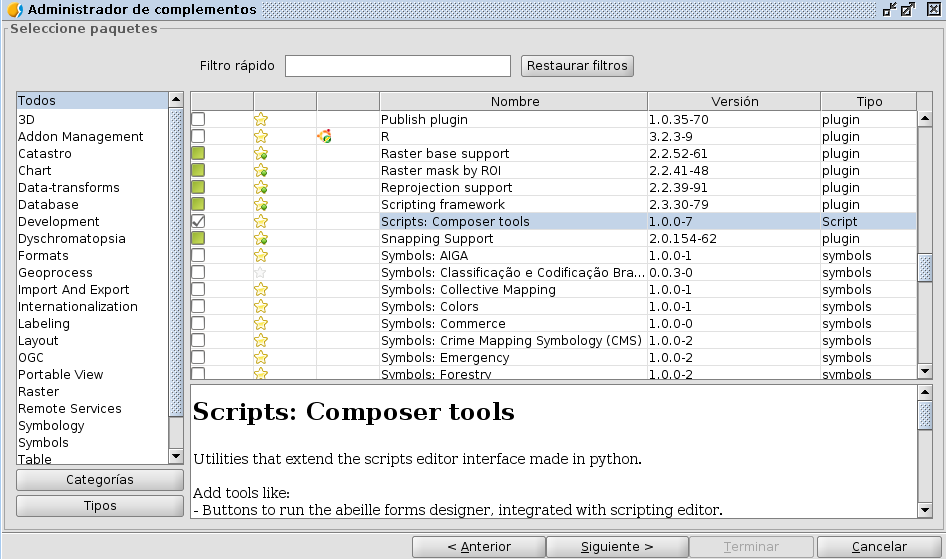
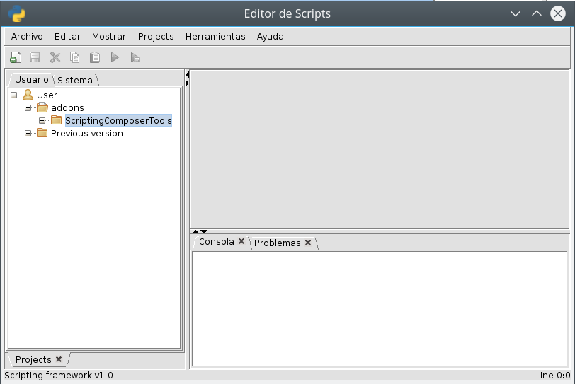
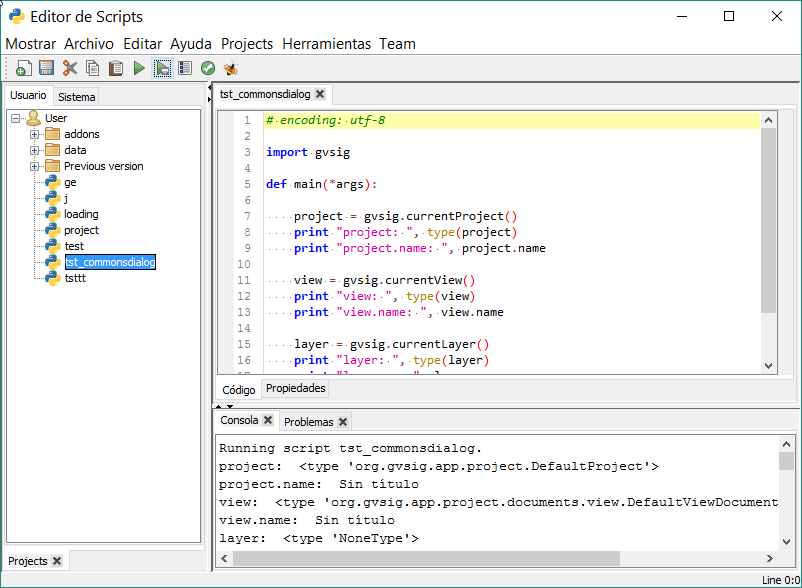
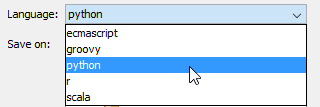
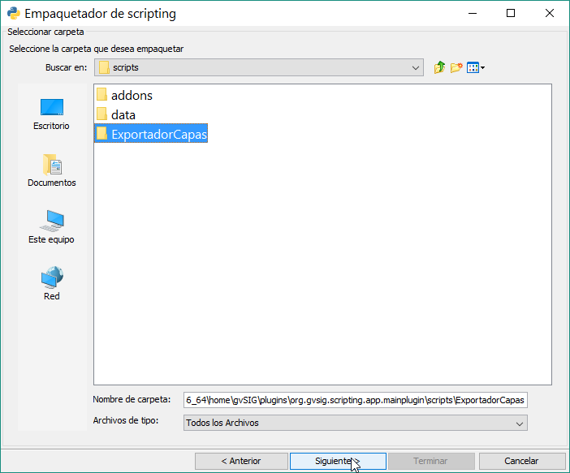
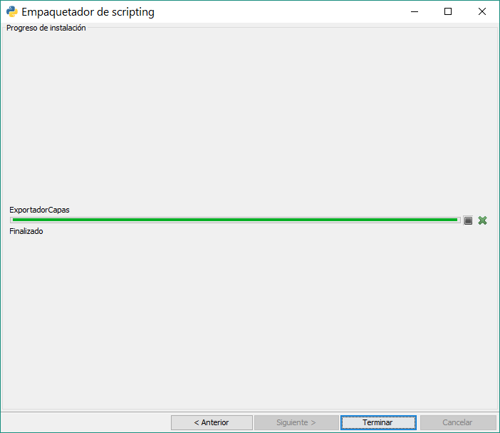

Introducción
===============

Qué es el Módulo de Scripting
-----------------------------

El Módulo de Scripting es un módulo de programación integrado completamente en gvSIG 2.

Este módulo se integró desde las versiones 2.x de gvSIG, y ha sufrido importantes mejoras en gvSIG 2.3.

Qué necesitas
-------------

Para seguir esta guía tan solo necesitas tener instalado la versión de gvSIG 2.3. El Scripting Framework o Módulo de Scripting vienen instalados por defecto.

La última versión disponible de gvSIG 2 que podrás encontrar en:
http://www.gvsig.com/es/productos/gvsig-desktop/descargas

También será necesario tener instalado el paquete de **Scripting Composer Tools**. Este paquete es un conjunto de herramientas desarrollado para facilitar la tarea del desarrollador. Incluye herramientas de autocompletado, code navigator, la herramienta de interfaces visuales Abeille, entre otros. Se podrán instalar directamente desde el **Administrador de Complementos**.

Iremos a :menuselection:`Herramientas --> Administrador de Complementos` y seleccionaremos ``Instalación estándar``.

.. figure::  images/inst_1.png
   :align:   center

Haremos una busqueda de las **Composer Tools**:

Cuando la instalación a finalizado, abriendo el :menuselection:`Herramientas --> Scripting --> Editor de Scripts`, podremos comprobar que aparece la carpeta ``ScriptingComposerTools`` y que se ha instalado correctamente.

Es necesario reiniciar gvSIG para su uso. Si volvemos a abrir el Editor de Scripts, veremos que aparecen una serie de botones extra en la barra de Herramientas:

.. figure::  images/inst_4.png
   :align:   center

Qué nos permite
----------------

Este módulo de programación nos dará la oportunidad programar nuestras propias herramientas y extensiones para gvSIG.

Los scripts los podremos modificar, adaptar, intercambiar y desarrollar de una manera sencilla, y lo más importante, rápida.

Una de las ventajas es que dada la facilidad del lenguaje Python, no será necesario tener conocimientos extensos de programación ni de cómo funciona al completo la arquitectura de gvSIG para poder desarrollar la herramienta que necesitemos.

Las posibilidades son infinitas, nos permitirá:
- Automatizar tareas
- Añadir funcionalidades
- Crear nuevos geoprocesos
- Personalizar gvSIG
- Creación de extensiones (Plugins)
- Uso de la API de gvSIG: tratamiento de espaciales, conexiones de datos, generación de mapas, etc.

Qué lenguaje utilizamos
-----------------------

El lenguaje principal en el que hemos centrado el desarrollo es Jython `<http://www.jython.org/>`_ , aunque también se pueden ejecutar scripts en Groovy, R..

**Jython es una implementación de Python realizada en Java.**

Esta implementación nos permite trabajar con la API de gvSIG (aplicación realizada en Java) usando scripts utilizando la sintaxis de Python, facilitando mucho el desarrollo y ejecución de estos, solo necesitando tener instalado gvSIG para poder programar.

Esto nos da unas ventajas enormes, por un lado, Python es un lenguaje muy sencillo de aprender, por otro lado, no se necesita de una compilación previa con un IDE externo, sino que la compilación del código necesario se realiza sobre la marcha, cada vez que ejecutamos nuestro script. Esto nos permite realizar modificaciones en nuestros script e irlo probando mientras tenemos gvSIG abierto.

Además, tiene compatibilidad con muchas de las librerías de Python existentes, y todas (o mayoría) de Java.

Cómo acceder al Módulo de Scripting
-----------------------------------

Una vez instalado gvSIG 2 ya lo podemos abrir. Para acceder a este módulo de programación lo haremos a través del menú :menuselection:`Herramientas --> Scripting`. Aquí nos encontraremos con 3 opciones:

Scripting Launcher
++++++++++++++++++

.. figure::  images/scripting_launcher.png
   :align:   center
   
Se trata de un lanzador de scripts, una lista con accesos directos a los scripts que tenemos.
Según vayamos creando y almacenando nuestros scripts, estos pasaran a formar parte de esta lista que podremos tener abierta y accesible para ejecutar un script que necesitemos en cualquier momento con un doble click. Es muy cómodo si preparamos scripts para ejecutarlos mientras estemos trabajando, una forma rápida de tenerlos a mano.

Scripting Composer
++++++++++++++++++

   
Es la pantalla principal de este módulo. Aquí podremos crear, ordenar y almacenar todos nuestros scripts.

Los botones principales: Nuevo, Abrir, Guardar, Guardar y Ejecutar, Cerrar.. Una vez creemos un fichero nuevo, podremos escribir nuestro código.

La ejecución del script aparecerá reflejada en la consola que se sitúa en la parte inferior,

Jython Console
++++++++++++++

.. figure::  images/scripting_console.png
   :align:   center
   
Es una consola que nos permitirá ejecutar código directamente, ejecutándose línea a línea. Nos permite consultar variables y ver cómo se van modificando.

Otra función interesante es que nos ofrecerá una ayuda de los comandos que están disponibles según el código que estemos escribiendo, o qué tipo de métodos tienen disponibles las diferentes clases de gvSIG.

Librerías de gvSIG para Scripting
---------------------------------

Hemos creado una librería escrita en Jython denominada ``gvsig``. Su función es inyectar métodos extra en estas clases de Java ya existentes en la API de gvSIG y ampliar mediante nuevas funciones la potencia y facilidad de uso de este módulo.

Su objetivo es el disminuir el número de líneas requeridas para realizar ciertas operaciones y hacer accesible la API de gvSIG de una manera más sencilla desde Jython.

Las librerías Java de las que se compone gvSIG están totalmente accesibles desde nuestros scripts en Jython, siendo posible sin ninguna restricción en el acceso a ellas y en la creación de extensiones de la misma forma que si las hiciéramos directamente en Java.

Organización de la librería gvsig
---------------------------------

El Módulo de Scripting viene con diversas librerías:

- ``gvsig``: pertenecen las funciones principales de gvSIG, principalmente para el acceso y manejo de datos. Contiene funciones útiles y los métodos inyectados en las clases de gvSIG. También contiene el resto de módulos que explicamos.
- ``gvsig.commonsdialog``: encargada de la generación de ventanas, desde a mensajes de alerta a rutas de ficheros.
- ``gvsig.geom``: contiene todas las funciones relacionadas con las geometrías

Además, hemos incluido otras clases importantes que nos ayudarán mucho la generación de scripts:

- ``gvsig.libs.formpanel.FormPanel``: Esta clase nos ayudará en la generación de script con interfaces visuales
- ``gvsig.libs.gvpy``: Librería para la ejecución de geoprocesos desde Scripting
- ``gvsig.libs.toolbox.ToolboxProcess``: Clase para la creación de geoprocesos que serán añadidos a la Toolbox y podrán ser utilizados desde el Modelizador.
- ``gvsig.libs.load_project.load_project()``: Función para abrir un proyecto en gvSIG desde un fichero.
- etc

Es recomendable importar tan solo las librerías necesarias para la ejecución del script.

Si nuestro script contiene otras librerías propias que también hemos programado, al realizar su importación podemos forzar la recarga de estas librerías (sino los cambios no se verán reflejados) utilizando la función `reload()`. La forma correcta de hacerlo sería::

    import lib
    reload(lib)

Creación de un script
---------------------

.. |new| image:: images/icon-new.png

Para crear un script nuevo, trabajaremos en el **Scripting Composer** presiona el botón de Nuevo |new| situado arriba a la izquierda, o en :menuselection:`Archivo --> Nuevo` se nos abrirá una pantalla sobre el tipo de script a crear.

.. figure::  images/nuevo_script.png
   :align:   center
   
En esta pantalla debemos escribir el nombre y descripción de lo que vayamos a crear. En el tipo de archivo podremos elegir qué crear. Las opciones son:

- Script: Programa con código lineal que podremos ejecutar.
- Dialog: Programa con código y una interfaz visual. (No recomendado, para scripts con interfaz visual usaremos también el tipo script)
- Project: Aún no habilitado, para futuras versiones.
- Folder: Crea una carpeta en nuestra lista de "Scripts de usuario".

Podemos elegir el lenguaje de programación que prefiramos. Los lenguajes soportados son:
- ECMAScript
- Python: es el lenguaje en que tenemos centrado el desarrollo
- Groovy
- R
- Scala

En ``Save on`` podremos elegir en qué carpeta guardamos nuestro nuevo script. Las dos últimas cajas de texto son sobre información del Autor y Versión.

Hacemos click en "Accept". Esto creará nuestro nuevo script en blanco, que aparecerá abierto para su edición. Veremos que aparece nuevo en nuestro listado de scripts de usuario y se abre una pestaña con el nombre del script. En esta pestaña un asterisco aparecerá indicando si el script contiene cambios que no han sido guardados. Debajo aparece nuestro código que por defecto trae una plantilla con la estructura básica, y debajo del todo encontramos la salida por consola.

Los scripts creados se almacenan en la carpeta de gvSIG ``C:\Users\*\gvSIG\plugins\org.gvsig.scripting.app.extension``. De forma similar en la ``/home/`` de Linux.
Ahora nos disponemos a escribir nuestro primer script. El ejemplo que nos viene por defecto es totalmente válido:

.. code-block:: python
    :linenos:
    :emphasize-lines: 5
    :caption: primer_script.py
    :name: primer-script

    # encoding: utf-8

    import gvsig

    def main(*args):

        #Remove this lines and add here your code

        print "hola mundo"
        pass

En primer lugar, realiza una importación de la librería que vamos a utilizar, la librería de scripting ``gvsig``, y luego define dentro de la función principal main(), el comando print que hará salir nuestro valor por consola.

.. figure::  images/scripting_composer_2.png
   :align:   center

En Scripting en gvSIG, la función que se va a ejecutar por defecto **será siempre la función main()**, así que debemos de introducir todo nuestro código en esta función.

.. note::

   Todos nuestros scripts deben de contener la función main() para su correcta ejecución. No será obligatorio si van a ser usados como librerías.

.. |saveandexecute| image:: images/icon-saveandexecute.png
.. |save| image:: images/icon-save.png
.. |execute| image:: images/icon-execute.png

Para ejecutar un script guardando |save| y ejecutando |execute| o directamente presionaremos el botón |saveandexecute| y veremos su ejecución por consola.

Podemos comprobar que la salida por consola es de "hola mundo", siendo este el objetivo que buscábamos. Con esto hemos ejecutado nuestro primer script con éxito.

Esta estructura es la estructura básica de un script en gvSIG 2.3. 

Si abrimos ahora el Scripting Launcher, en el menú de Scripting, veremos que ya aparece nuestro script en el nuevo listado.

Si queremos comprobar nuestros scripts en el disco duro estarán en la carpeta:

- En una vesión instalable en Windows: ``C:\Users\NombreUsuario\gvSIG\plugins\org.gvsig.scripting.app.extension\scripts``

- En una vesión portable en Windows: ``\gvSIG_carpeta_instalacion\home\gvSIG\plugins\org.gvsig.scripting.app.extension\scripts``

En esta carpeta podemos copiar o pegar los scripts, fijándonos en copiar ambos archivos ``.py`` y ``.inf``.

.. note::

    Lo recomendable es generar los scripts dentro de su propia carpeta. Esto nos permitirá usarlos como módulos dándonos varias opciones: usar ficheros autorun.py (autoejecutable al inicio de gvSIG), fichero __init__.py (nos permitirá trabajar como si fuera un módulo permitiéndonos importar librerías que estén en la misma carpeta) y la creación de paquetes de Scripts

Generando paquetes de scripts
-----------------------------

Una vez hemos creado un script en su propia carpeta con todo lo necesario, podemos generar un paquete de gvSIG ``.gvspkg`` para enviarlo o subirlo. Con este paquete podremos **realizar la instalación del script desde el Administrador de Complementos**. Su uso es muy intuitivo.

La herramienta se encuentra en el Scripting Componser, en el menú :menuselection:`Herramientas --> Paquete de script`.

Seleccionamos la carpeta que contiene nuestra extensión:

Establecemos las propiedades del paquete:

.. figure::  images/empaquetador_2.png
   :align:   center

Las opciones de salida:

La ruta será similar a esta: ``gvSIG-desktop-2.3.0-2441-RC2-win-x86_64\install\gvSIG-desktop-2.3.0-ExportadorCapas-1.0.0-0-testing-all-all-j1_7.gvspkg``. 

.. figure::  images/empaquetador_3.png
   :align:   center
   
Y terminado, ya aprecerá nuestro extensión en formato ``.gvspkg`` para poderse instalar desde el Administrador de Complementos

