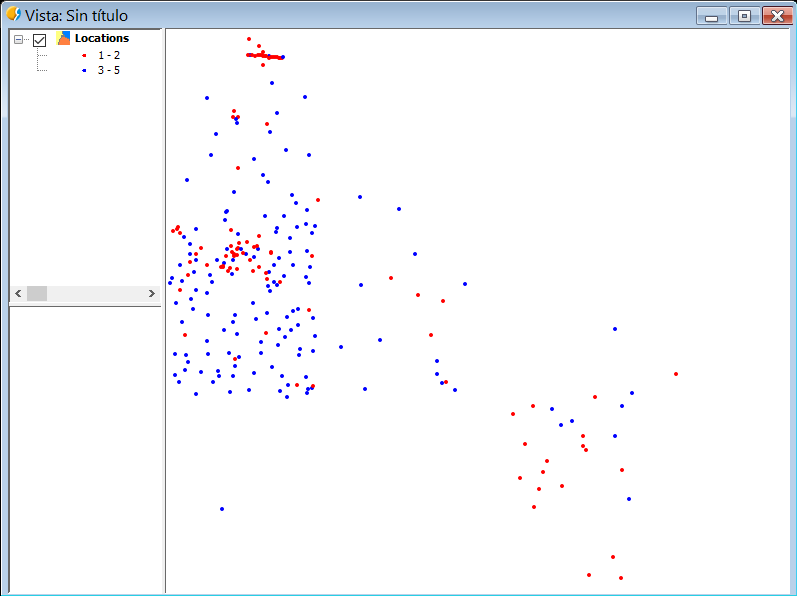
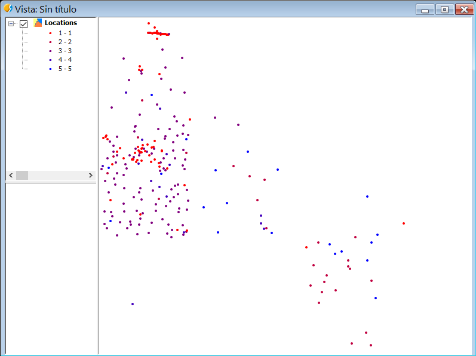
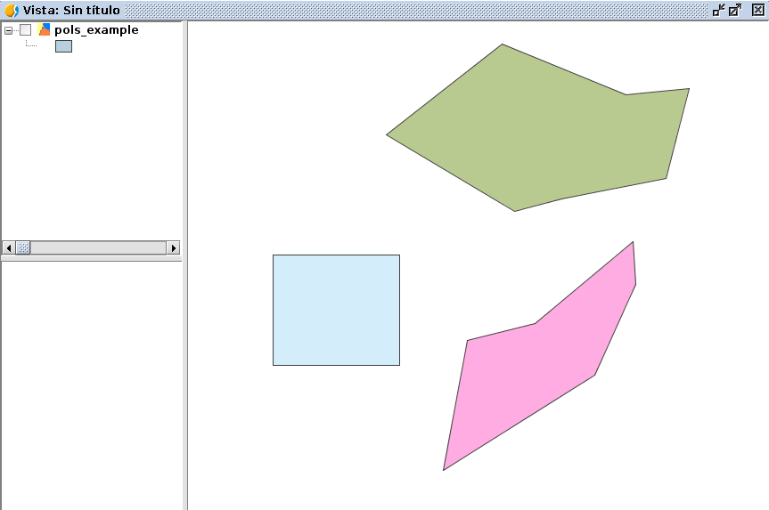

Leyendas
========

En capas vectoriales
--------------------

Podemos crear y establecer leyendas a capas vectoriales.

Un ejemplo es la creación de una leyenda de intervalos para una capa de puntos::

	# encoding: utf-8

	from gvsig import *
	from gvsig import geom
	from java.awt import Color
	from org.gvsig.symbology.fmap.mapcontext.rendering.legend.impl import VectorialIntervalLegend

	def main(*args):
		""" Create interval legend """
			
		vil = VectorialIntervalLegend(geom.POINT)
		
		vil.setStartColor(Color.red)
		vil.setEndColor(Color.blue)
		vil.setIntervalType(1)
		store = currentLayer().getFeatureStore()
		ii = vil.calculateIntervals(store, "size", 5, geom.POINT) 
		
		vil.setIntervals(ii)
		
		currentLayer().setLegend(vil)
		
Podemos ver los diferentes parámetros que soporta :javadoc:`VectorialIntervalLegend <VectorialIntervalLegend>`. Se establece un color de inicio y de final, un tipo de intervalo, y el número de intervalos que queremos.

Con 2 intervalos:

   
Con 5 intervalos:

   
Generando símbolos para capas vectoriales::

	# encoding: utf-8

	import gvsig
	from java.awt import Color
	from org.gvsig.fmap.mapcontext import MapContextLocator

	def main(*args):
		""" Legend: Creating points """
		#p1 = gvsig.simplePointSymbol()
		print gvsig.utils.COLORS
		
		p1 = gvsig.simplePointSymbol("green")
		p2 = gvsig.simplePointSymbol(gvsig.utils.COLORS["green"])
		print "simplePointSymbol Green: ", p2

		sp = MapContextLocator.getSymbolManager().getSymbolPreferences()
		color = sp.getDefaultSymbolFillColor()
		print "color: ", color

		##
		y = MapContextLocator.getSymbolManager()#.isDefaultSymbolFillColorAleatory()
		v = MapContextLocator.getMapContextManager()
		print "mapcontext: ",v
		print "defaultSymbolFillColorAleatory: ", v.isDefaultSymbolFillColorAleatory()

		xx = gvsig.getDefaultColor()
		print "getDefaultColor: ", xx

		yy = gvsig.simplePointSymbol()
		print "simplePointSymbol: ", yy

		zz = gvsig.simpleLineSymbol()
		print "simpleLineSymbol: ", zz

		uu = gvsig.simplePolygonSymbol()
		print "simplePolygonSymbol: ", uu
		
		
Capa de Graphics Layer
----------------------

Ejemplo para crear una capa de graphicslayer, esta capa se sitúa por encima del resto en nuestra Vista::

    # encoding: utf-8

    from gvsig import *
    from gvsig.geom import *
    import random

    def main(*args):
        vista=currentView()
        gp = vista.getGraphicsLayer()
        gp.removeGraphics("ejemplo")

        features = currentLayer().features()
        for feature in features:
            pol = feature.geometry()
            r = lambda: random.randint(0, 255)
            color = getColorFromRGB(r(), r(), r() ,r())
            polSymbol = simplePolygonSymbol(color)
            idPolSymbol = gp.addSymbol(polSymbol)
            gp.addGraphic("ejemplo", pol,  idPolSymbol, "Label")
            

