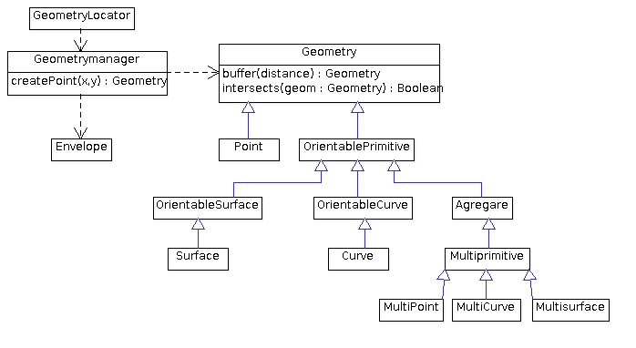

Modelo de clases simplificado
=============================

.. |m7| image:: images/modelo_7dal.png

Plugins y acciones
------------------

Plugins
+++++++
   
.. raw:: html

    
    <map name="modelo_1plugins" id="modelo_1plugins">
    <area alt="" title="" href="http://downloads.gvsig.org/download/gvsig-desktop-testing/dists/2.3.0/javadocs/html/org/gvsig/andami/PluginsLocator.html" shape="poly" coords="49,42,145,44,144,64,50,66" />
    <area alt="" title="" href="http://downloads.gvsig.org/download/gvsig-desktop-testing/dists/2.3.0/javadocs/html/org/gvsig/andami/PluginsManager.html" shape="poly" coords="195,90,302,90,302,112,194,113" />
    <area alt="" title="" href="http://downloads.gvsig.org/download/gvsig-desktop-testing/dists/2.3.0/javadocs/html/org/gvsig/andami/PluginServices.html" shape="poly" coords="193,154,299,154,297,176,195,177" />
    <area alt="" title="" href="http://downloads.gvsig.org/download/gvsig-desktop-testing/dists/2.3.0/javadocs/html/org/gvsig/andami/plugins/ExclusiveUIExtension.html" shape="poly" coords="346,162,482,162,483,186,345,186" />
    <area alt="" title="" href="http://downloads.gvsig.org/download/gvsig-desktop-testing/dists/2.3.0/javadocs/html/org/gvsig/andami/plugins/IExtension.html" shape="poly" coords="217,218,359,216,358,365,216,366" />
    </map>
    
Acciones
++++++++

.. raw:: html

    
    <map name="modelo_2acciones.png" id="modelo_2acciones.png">
        <area alt="" title="" href="http://downloads.gvsig.org/download/gvsig-desktop-testing/dists/2.3.0/javadocs/html/org/gvsig/andami/PluginsLocator.html" shape="poly" coords="25,71,126,74,128,95,29,95" />
        <area alt="" title="" href="http://downloads.gvsig.org/download/gvsig-desktop-testing/dists/2.3.0/javadocs/html/org/gvsig/andami/actioninfo/ActionInfoManager.html" shape="poly" coords="129,137,255,136,254,159,131,166" />
        <area alt="" title="" href="http://downloads.gvsig.org/download/gvsig-desktop-testing/dists/2.3.0/javadocs/html/org/gvsig/andami/actioninfo/ActionInfo.html" shape="poly" coords="338,25,468,29,473,346,339,345" />
        <area alt="" title="" href="https://docs.oracle.com/javase/7/docs/api/javax/swing/Action.html" shape="poly" coords="161,50,286,49,285,73,161,74" />
        <area alt="" title="" href="http://downloads.gvsig.org/download/gvsig-desktop-testing/dists/2.3.0/javadocs/html/org/gvsig/andami/plugins/IExtension.html" shape="poly" coords="563,49,703,50,702,198,559,199" />
        <area alt="" title="" href="http://downloads.gvsig.org/download/gvsig-desktop-testing/dists/2.3.0/javadocs/html/org/gvsig/andami/PluginServices.html" shape="poly" coords="593,258,699,256,703,277,595,284" />
    </map>
   
Proyecto y documentos
---------------------
   
.. raw:: html

    
    <map name="modelo_3proyectodocumento" id="modelo_3proyectodocumento">
    <area alt="" title="ApplicationLocator" href="http://downloads.gvsig.org/download/gvsig-desktop-testing/dists/2.3.0/javadocs/html/org/gvsig/app/ApplicationLocator.html" shape="poly" coords="26,40,150,40,149,63,26,61" />
    <area alt="" title="ApplicationManager" href="http://downloads.gvsig.org/download/gvsig-desktop-testing/dists/2.3.0/javadocs/html/org/gvsig/app/ApplicationManager.html" shape="poly" coords="194,16,499,17,500,95,192,95" />
    <area alt="" title="MDIManager" href="http://downloads.gvsig.org/download/gvsig-desktop-testing/dists/2.3.0/javadocs/html/org/gvsig/andami/ui/mdiManager/MDIManager.html" shape="poly" coords="568,34,870,34,870,97,567,95" />
    <area alt="" title="ProjectManager" href="http://downloads.gvsig.org/download/gvsig-desktop-testing/dists/2.3.0/javadocs/html/org/gvsig/app/project/ProjectManager.html" shape="poly" coords="50,128,408,130,408,193,50,192" />
    <area alt="" title="Project" href="http://downloads.gvsig.org/download/gvsig-desktop-testing/dists/2.3.0/javadocs/html/org/gvsig/app/project/Project.html" shape="poly" coords="490,130,662,129,662,177,489,175" />
    <area alt="" title="DocumentManager" href="http://downloads.gvsig.org/download/gvsig-desktop-testing/dists/2.3.0/javadocs/html/org/gvsig/app/project/documents/DocumentManager.html" shape="poly" coords="90,243,363,244,364,303,90,303" />
    <area alt="" title="Document" href="http://downloads.gvsig.org/download/gvsig-desktop-testing/dists/2.3.0/javadocs/html/org/gvsig/app/project/documents/Document.html" shape="poly" coords="451,243,667,241,667,290,449,286" />
    <area alt="" title="ViewManager" href="http://downloads.gvsig.org/download/gvsig-desktop-testing/dists/2.3.0/javadocs/html/org/gvsig/app/project/documents/view/ViewManager.html" shape="poly" coords="97,358,190,361,192,407,99,404" />
    <area alt="" title="TableManager" href="http://downloads.gvsig.org/download/gvsig-desktop-testing/dists/2.3.0/javadocs/html/org/gvsig/app/project/documents/table/TableManager.html" shape="poly" coords="178,329,279,329,282,356,178,350" />
    <area alt="" title="IWindow" href="http://downloads.gvsig.org/download/gvsig-desktop-testing/dists/2.3.0/javadocs/html/org/gvsig/andami/ui/mdiManager/IWindow.html" shape="poly" coords="292,377,354,377,355,402,289,400" />
    <area alt="" title="IDocumentWindow" href="http://downloads.gvsig.org/download/gvsig-desktop-testing/dists/2.3.0/javadocs/html/org/gvsig/app/project/documents/gui/IDocumentWindow.html" shape="poly" coords="232,424,405,426,405,471,234,470" />
    <area alt="" title="FeatureTableDocumentPanel" href="http://downloads.gvsig.org/download/gvsig-desktop-testing/dists/2.3.0/javadocs/html/org/gvsig/app/project/documents/table/gui/FeatureTableDocumentPanel.html" shape="poly" coords="89,504,280,506,279,529,88,528" />
    <area alt="" title="IView" href="http://downloads.gvsig.org/download/gvsig-desktop-testing/dists/2.3.0/javadocs/html/org/gvsig/app/project/documents/view/gui/IView.html" shape="poly" coords="346,505,412,506,412,529,348,527" />
    <area alt="" title="TableDocument" href="http://downloads.gvsig.org/download/gvsig-desktop-testing/dists/2.3.0/javadocs/html/org/gvsig/app/project/documents/table/TableDocument.html" shape="poly" coords="409,311,517,314,517,338,407,336" />
    <area alt="" title="ViewDocument" href="http://downloads.gvsig.org/download/gvsig-desktop-testing/dists/2.3.0/javadocs/html/org/gvsig/app/project/documents/view/ViewDocument.html" shape="poly" coords="451,353,644,355,643,400,448,403" />
    </map>
    
Mapcontrol
----------

.. raw:: html

    
    <map name="modelo_4mapcontrol" id="modelo_4mapcontrol">
    <area alt="" title="MapControlLocator" href="http://downloads.gvsig.org/download/gvsig-desktop-testing/dists/2.3.0/javadocs/html/org/gvsig/fmap/mapcontrol/MapControlLocator.html" shape="poly" coords="42,26,170,25,167,49,42,47" />
    <area alt="" title="MapControl" href="http://downloads.gvsig.org/download/gvsig-desktop-testing/dists/2.3.0/javadocs/html/org/gvsig/fmap/mapcontrol/MapControl.html" shape="poly" coords="249,18,556,19,553,97,255,92,252,93" />
    <area alt="" title="MapContext" href="http://downloads.gvsig.org/download/gvsig-desktop-testing/dists/2.3.0/javadocs/html/org/gvsig/fmap/mapcontext/MapContext.html" shape="poly" coords="612,33,694,34,694,77,608,78" />
    <area alt="" title="MapControlManager" href="http://downloads.gvsig.org/download/gvsig-desktop-testing/dists/2.3.0/javadocs/html/org/gvsig/fmap/mapcontext/MapContextManager.html" shape="poly" coords="32,89,200,90,201,136,34,138" />
    <area alt="" title="Behavior" href="http://downloads.gvsig.org/download/gvsig-desktop-testing/dists/2.3.0/javadocs/html/org/gvsig/fmap/mapcontrol/tools/Behavior/Behavior.html" shape="poly" coords="225,120,353,122,353,162,225,165" />
    <area alt="" title="ToolListener" href="http://downloads.gvsig.org/download/gvsig-desktop-testing/dists/2.3.0/javadocs/html/org/gvsig/fmap/mapcontrol/tools/Listeners/ToolListener.html" shape="poly" coords="427,130,529,127,528,157,426,152" />
    <area alt="" title="PointEvent" href="http://downloads.gvsig.org/download/gvsig-desktop-testing/dists/2.3.0/javadocs/html/org/gvsig/fmap/mapcontrol/tools/Events/PointEvent.html" shape="poly" coords="650,113,726,111,725,137,649,137" />
    <area alt="" title="PointBehavior" href="http://downloads.gvsig.org/download/gvsig-desktop-testing/dists/2.3.0/javadocs/html/org/gvsig/fmap/mapcontrol/tools/Behavior/PointBehavior.html" shape="poly" coords="276,218,368,216,370,241,274,239" />
    <area alt="" title="MoveBehavior" href="http://downloads.gvsig.org/download/gvsig-desktop-testing/dists/2.3.0/javadocs/html/org/gvsig/fmap/mapcontrol/tools/Behavior/MoveBehavior.html" shape="poly" coords="248,299,349,298,349,321,249,322" />
    <area alt="" title="RectangleBehavior" href="http://downloads.gvsig.org/download/gvsig-desktop-testing/dists/2.3.0/javadocs/html/org/gvsig/fmap/mapcontrol/tools/Behavior/RectangleBehavior.html" shape="poly" coords="202,379,333,377,332,402,203,399" />
    <area alt="" title="PointListener" href="http://downloads.gvsig.org/download/gvsig-desktop-testing/dists/2.3.0/javadocs/html/org/gvsig/fmap/mapcontrol/tools/Listeners/PointListener.html" shape="poly" coords="513,186,750,186,748,267,512,268" />
    <area alt="" title="AbstractPointListener" href="http://downloads.gvsig.org/download/gvsig-desktop-testing/dists/2.3.0/javadocs/html/org/gvsig/fmap/mapcontrol/tools/Listeners/AbstractPointListener.html" shape="poly" coords="789,177,934,178,934,221,786,218" />
    <area alt="" title="PanListener" href="http://downloads.gvsig.org/download/gvsig-desktop-testing/dists/2.3.0/javadocs/html/org/gvsig/fmap/mapcontrol/tools/Listeners/PanListener.html" shape="poly" coords="482,281,623,281,620,344,479,348" />
    <area alt="" title="PanListenerImpl" href="http://downloads.gvsig.org/download/gvsig-desktop-testing/dists/2.3.0/javadocs/html/org/gvsig/fmap/mapcontrol/tools/PanListenerImpl.html" shape="poly" coords="650,305,757,304,757,327,649,327" />
    <area alt="" title="ZoomOutRightButtonListener" href="http://downloads.gvsig.org/download/gvsig-desktop-testing/dists/2.3.0/javadocs/html/org/gvsig/fmap/mapcontrol/tools/ZoomOutRightButtonListener.html" shape="poly" coords="784,263,982,265,982,289,782,290" />
    <area alt="" title="RectangleListener" href="http://downloads.gvsig.org/download/gvsig-desktop-testing/dists/2.3.0/javadocs/html/org/gvsig/fmap/mapcontrol/tools/Listeners/RectangleListener.html" shape="poly" coords="444,363,603,363,601,429,440,430" />
    <area alt="" title="ZoomInListenerImpl" href="http://downloads.gvsig.org/download/gvsig-desktop-testing/dists/2.3.0/javadocs/html/org/gvsig/fmap/mapcontrol/tools/ZoomInListenerImpl.html" shape="poly" coords="650,393,788,393,786,415,652,419" />
    </map>

MapContext
----------
   
.. raw:: html

    
    <map name="modelo_5mapcontext" id="modelo_5mapcontext">
        <area alt="" title="MapContextLocator" href="http://downloads.gvsig.org/download/gvsig-desktop-testing/dists/2.3.0/javadocs/html/org/gvsig/fmap/mapcontext/MapContextLocator.html" shape="poly" coords="19,19,150,19,149,38,14,43" />
        <area alt="" title="MapContextManager" href="http://downloads.gvsig.org/download/gvsig-desktop-testing/dists/2.3.0/javadocs/html/org/gvsig/fmap/mapcontext/MapContextManager.html" shape="poly" coords="19,82,298,81,296,129,20,129" />
        <area alt="" title="MapContext" href="http://downloads.gvsig.org/download/gvsig-desktop-testing/dists/2.3.0/javadocs/html/org/gvsig/fmap/mapcontext/MapContext.html" shape="poly" coords="364,79,466,82,465,162,362,160" />
        <area alt="" title="ViewPort" href="http://downloads.gvsig.org/download/gvsig-desktop-testing/dists/2.3.0/javadocs/html/org/gvsig/fmap/mapcontext/ViewPort.html" shape="poly" coords="523,99,625,96,626,124,524,122" />
        <area alt="" title="Envelope" href="http://downloads.gvsig.org/download/gvsig-desktop-testing/dists/2.3.0/javadocs/html/org/gvsig/fmap/geom/primitive/Envelope.html" shape="poly" coords="515,170,579,171,579,192,513,191" />
        <area alt="" title="FLayers" href="http://downloads.gvsig.org/download/gvsig-desktop-testing/dists/2.3.0/javadocs/html/org/gvsig/fmap/mapcontext/layers/FLayers.html" shape="poly" coords="346,244,503,241,503,303,346,304" />
        <area alt="" title="FLayer" href="http://downloads.gvsig.org/download/gvsig-desktop-testing/dists/2.3.0/javadocs/html/org/gvsig/fmap/mapcontext/layers/FLayer.html" shape="poly" coords="58,251,122,251,123,273,52,270" />
        <area alt="" title="DataStore" href="http://downloads.gvsig.org/download/gvsig-desktop-testing/dists/2.3.0/javadocs/html/org/gvsig/fmap/dal/DataStore.html" shape="poly" coords="57,313,131,315,131,338,54,337" />
    </map>
   
Geometrías
----------

.. raw:: html
   
    
    <map name="modelo_6geometrias" id="modelo_6geometrias">
        <area alt="" title="GeometryLocator" href="http://downloads.gvsig.org/download/gvsig-desktop-testing/dists/2.3.0/javadocs/html/org/gvsig/fmap/geom/GeometryLocator.html" shape="poly" coords="33,6,148,8,146,33,32,34" />
        <area alt="" title="GeometryManager" href="http://downloads.gvsig.org/download/gvsig-desktop-testing/dists/2.3.0/javadocs/html/org/gvsig/fmap/geom/GeometryManager.html" shape="poly" coords="11,56,185,59,184,103,11,105" />
        <area alt="" title="Geometry" href="http://downloads.gvsig.org/download/gvsig-desktop-testing/dists/2.3.0/javadocs/html/org/gvsig/fmap/geom/Geometry.html" shape="poly" coords="242,49,483,49,484,112,242,110" />
        <area alt="" title="Envelope" href="http://downloads.gvsig.org/download/gvsig-desktop-testing/dists/2.3.0/javadocs/html/org/gvsig/fmap/geom/primitive/Envelope.html" shape="poly" coords="58,152,123,155,123,178,59,179" />
        <area alt="" title="Point" href="http://downloads.gvsig.org/download/gvsig-desktop-testing/dists/2.3.0/javadocs/html/org/gvsig/fmap/geom/primitive/Point.html" shape="poly" coords="242,154,307,151,307,179,244,177" />
        <area alt="" title="OrientablePrimitive" href="http://downloads.gvsig.org/download/gvsig-desktop-testing/dists/2.3.0/javadocs/html/org/gvsig/fmap/geom/primitive/OrientablePrimitive.html" shape="poly" coords="333,155,457,152,454,177,332,172" />
        <area alt="" title="OrientableSurface" href="http://downloads.gvsig.org/download/gvsig-desktop-testing/dists/2.3.0/javadocs/html/org/gvsig/fmap/geom/primitive/OrientableSurface.html" shape="poly" coords="170,215,288,216,289,239,171,239" />
        <area alt="" title="OrientableCurve" href="http://downloads.gvsig.org/download/gvsig-desktop-testing/dists/2.3.0/javadocs/html/org/gvsig/fmap/geom/primitive/OrientableCurve.html" shape="poly" coords="347,214,452,218,452,239,345,236" />
        <area alt="" title="Aggregate" href="http://downloads.gvsig.org/download/gvsig-desktop-testing/dists/2.3.0/javadocs/html/org/gvsig/fmap/geom/aggregate/Aggregate.html" shape="poly" coords="499,218,563,217,560,240,498,241" />
        <area alt="" title="Surface" href="http://downloads.gvsig.org/download/gvsig-desktop-testing/dists/2.3.0/javadocs/html/org/gvsig/fmap/geom/primitive/Surface.html" shape="poly" coords="186,275,249,274,253,293,185,294" />
        <area alt="" title="Curve" href="http://downloads.gvsig.org/download/gvsig-desktop-testing/dists/2.3.0/javadocs/html/org/gvsig/fmap/geom/primitive/Curve.html" shape="poly" coords="361,276,425,275,424,294,362,296" />
        <area alt="" title="Multiprimitive" href="http://downloads.gvsig.org/download/gvsig-desktop-testing/dists/2.3.0/javadocs/html/org/gvsig/fmap/geom/aggregate/MultiPrimitive.html" shape="poly" coords="491,274,583,274,584,296,492,297" />
        <area alt="" title="MultiPoint" href="http://downloads.gvsig.org/download/gvsig-desktop-testing/dists/2.3.0/javadocs/html/org/gvsig/fmap/geom/aggregate/MultiPoint.html" shape="poly" coords="421,332,487,326,488,349,418,355" />
        <area alt="" title="MultiCurve" href="http://downloads.gvsig.org/download/gvsig-desktop-testing/dists/2.3.0/javadocs/html/org/gvsig/fmap/geom/aggregate/MultiCurve.html" shape="poly" coords="499,330,573,330,576,351,500,354" />
        <area alt="" title="MultiSurface" href="http://downloads.gvsig.org/download/gvsig-desktop-testing/dists/2.3.0/javadocs/html/org/gvsig/fmap/geom/aggregate/MultiSurface.html" shape="poly" coords="588,332,667,330,667,350,591,349" />
    </map>
    
Acceso a datos (DAL)
--------------------
   
.. raw:: html

    
    <map name="modelo_7dal" id="modelo_7dal">
        <area alt="" title="DALLocator" href="http://downloads.gvsig.org/download/gvsig-desktop-testing/dists/2.3.0/javadocs/html/org/gvsig/fmap/dal/DALLocator.html" shape="poly" coords="48,14,128,18,131,41,50,38" />
        <area alt="" title="Evaluator" href="http://downloads.gvsig.org/download/gvsig-desktop-testing/dists/2.3.0/javadocs/html/org/gvsig/tools/evaluator/Evaluator.html" shape="poly" coords="458,19,659,18,659,64,457,67" />
        <area alt="" title="EvaluatorData" href="http://downloads.gvsig.org/download/gvsig-desktop-testing/dists/2.3.0/javadocs/html/org/gvsig/tools/evaluator/EvaluatorData.html" shape="poly" coords="761,27,943,24,944,72,760,71" />
        <area alt="" title="DataManager" href="http://downloads.gvsig.org/download/gvsig-desktop-testing/dists/2.3.0/javadocs/html/org/gvsig/fmap/dal/DataManager.html" shape="poly" coords="42,89,409,92,407,153,39,155" />
        <area alt="" title="DataStoreParameters" href="http://downloads.gvsig.org/download/gvsig-desktop-testing/dists/2.3.0/javadocs/html/org/gvsig/fmap/dal/DataStoreParameters.html" shape="poly" coords="465,89,679,87,681,136,465,141" />
        <area alt="" title="FeatureSet" href="http://downloads.gvsig.org/download/gvsig-desktop-testing/dists/2.3.0/javadocs/html/org/gvsig/fmap/dal/feature/FeatureSet.html" shape="poly" coords="698,147,889,146,891,225,695,223" />
        <area alt="" title="DataQuery" href="http://downloads.gvsig.org/download/gvsig-desktop-testing/dists/2.3.0/javadocs/html/org/gvsig/fmap/dal/DataQuery.html" shape="poly" coords="48,200,125,200,124,224,49,222" />
        <area alt="" title="DataStore" href="http://downloads.gvsig.org/download/gvsig-desktop-testing/dists/2.3.0/javadocs/html/org/gvsig/fmap/dal/DataStore.html" shape="poly" coords="483,178,575,179,574,198,484,199" />
        <area alt="" title="FeatureQuery" href="http://downloads.gvsig.org/download/gvsig-desktop-testing/dists/2.3.0/javadocs/html/org/gvsig/fmap/dal/feature/FeatureQuery.html" shape="poly" coords="113,259,314,258,315,303,116,302" />
        <area alt="" title="FeatureStore" href="http://downloads.gvsig.org/download/gvsig-desktop-testing/dists/2.3.0/javadocs/html/org/gvsig/fmap/dal/feature/FeatureStore.html" shape="poly" coords="385,257,709,257,707,320,385,319" />
        <area alt="" title="Feature" href="http://downloads.gvsig.org/download/gvsig-desktop-testing/dists/2.3.0/javadocs/html/org/gvsig/fmap/dal/feature/Feature.html" shape="poly" coords="745,266,930,266,927,353,742,353" />
    </map>