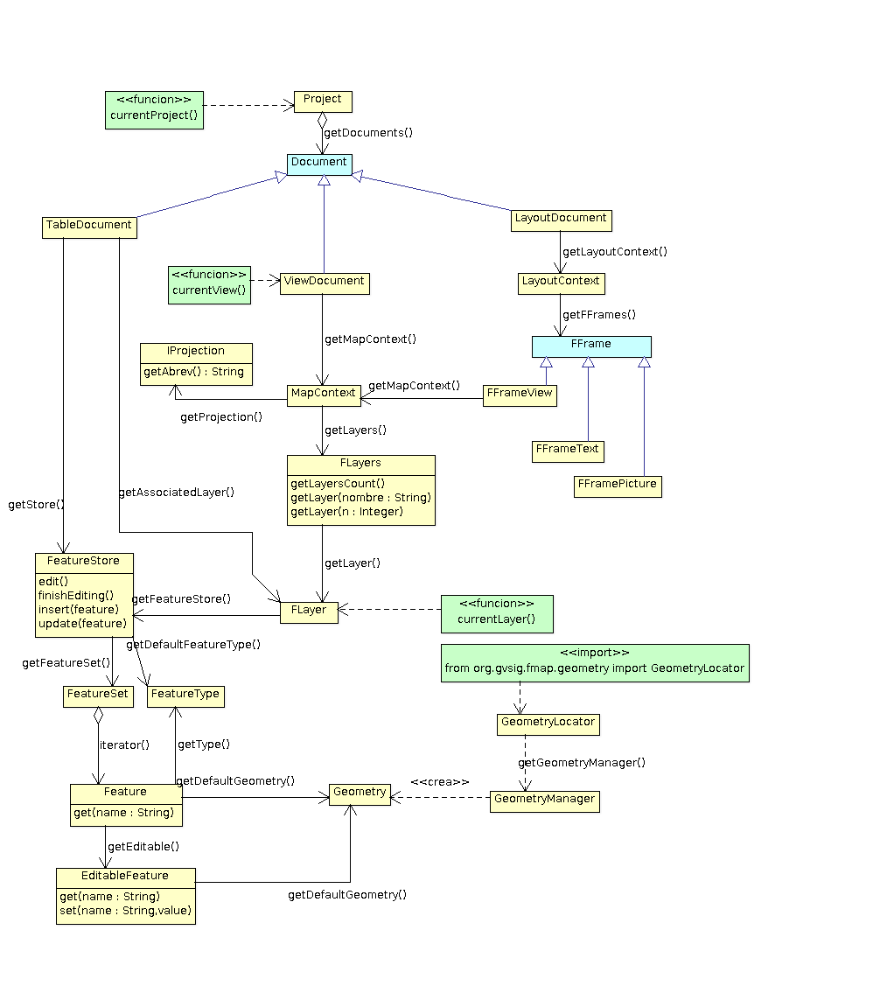
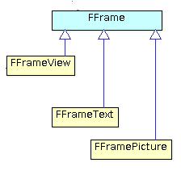

Modelo de objetos simplificado
==============================

Aquí podemos ver un esquema con los componentes de uso más común desde scripting, la relación entre ellos y cómo podemos acceder a ellos desde nuestro script. Además podemos navegar a la información de la clase Java pulsando sobre el componente.
	  
.. note::

	Desarrolladores Java y usuarios con conocimientos sobre UML. El diagrama y comentarios está pensado para que sea lo más entendible posible por un usuario sin conocimientos de java ni UML, no para ser estricto con la nomenclatura UML.

.. raw:: html

    
    <map name="map">
      <!-- #$-:Image map file created by GIMP Image Map plug-in -->
      <!-- #$-:GIMP Image Map plug-in by Maurits Rijk -->
      <!-- #$-:Please do not edit lines starting with "#$" -->
      <!-- #$VERSION:2.3 -->
      <!-- #$AUTHOR:Joaquin del Cerro Murciano --> 
	  <area shape="rect" coords="328,96,411,136" href="http://downloads.gvsig.org/download/gvsig-desktop-testing/dists/2.3.0/javadocs/html/org/gvsig/app/project/Project.html">
      <area shape="rect" coords="326,169,406,216" href="http://downloads.gvsig.org/download/gvsig-desktop-testing/dists/2.3.0/javadocs/html/org/gvsig/app/project/documents/Document.html">
      <area shape="rect" coords="315,303,427,346" href="http://downloads.gvsig.org/download/gvsig-desktop-testing/dists/2.3.0/javadocs/html/org/gvsig/app/project/documents/view/ViewDocument.html">
      <area shape="rect" coords="324,433,416,474" href="http://downloads.gvsig.org/download/gvsig-desktop-testing/dists/2.3.0/javadocs/html/org/gvsig/fmap/mapcontext/MapContext.html">
      <area shape="rect" coords="325,516,498,605" href="http://downloads.gvsig.org/download/gvsig-desktop-testing/dists/2.3.0/javadocs/html/org/gvsig/fmap/mapcontext/layers/FLayers.html">
      <area shape="rect" coords="316,683,390,719" href="http://downloads.gvsig.org/download/gvsig-desktop-testing/dists/2.3.0/javadocs/html/org/gvsig/fmap/mapcontext/layers/FLyrDefault.html">
      <area shape="rect" coords="38,629,156,733" href="http://downloads.gvsig.org/download/gvsig-desktop-testing/dists/2.3.0/javadocs/html/org/gvsig/fmap/dal/feature/FeatureStore.html">
      <area shape="rect" coords="69,777,152,813" href="http://downloads.gvsig.org/download/gvsig-desktop-testing/dists/2.3.0/javadocs/html/org/gvsig/fmap/dal/feature/FeatureSet.html">
      <area shape="rect" coords="166,779,260,815" href="http://downloads.gvsig.org/download/gvsig-desktop-testing/dists/2.3.0/javadocs/html/org/gvsig/fmap/dal/feature/FeatureType.html">
      <area shape="rect" coords="75,891,216,953" href="http://downloads.gvsig.org/download/gvsig-desktop-testing/dists/2.3.0/javadocs/html/org/gvsig/fmap/dal/feature/Feature.html">
      <area shape="rect" coords="62,990,228,1061" href="http://downloads.gvsig.org/download/gvsig-desktop-testing/dists/2.3.0/javadocs/html/org/gvsig/fmap/dal/feature/EditableFeature.html">
      <area shape="rect" coords="372,894,450,925" href="http://downloads.gvsig.org/download/gvsig-desktop-testing/dists/2.3.0/javadocs/html/org/gvsig/fmap/geom/Geometry.html">
      <area shape="rect" coords="566,811,693,844" href="http://downloads.gvsig.org/download/gvsig-desktop-testing/dists/2.3.0/javadocs/html/org/gvsig/fmap/geom/GeometryLocator.html">
      <area shape="rect" coords="555,900,686,936" href="http://downloads.gvsig.org/download/gvsig-desktop-testing/dists/2.3.0/javadocs/html/org/gvsig/fmap/geom/GeometryManager.html">
      <area shape="rect" coords="40,242,162,279" href="http://downloads.gvsig.org/download/gvsig-desktop-testing/dists/2.3.0/javadocs/html/org/gvsig/app/project/documents/table/TableDocument.html">
      <area shape="rect" coords="579,235,704,266" href="http://downloads.gvsig.org/download/gvsig-desktop-testing/dists/2.3.0/javadocs/html/org/gvsig/app/project/documents/layout/LayoutDocument.html">
      <area shape="rect" coords="588,309,693,341" href="http://downloads.gvsig.org/download/gvsig-desktop-testing/dists/2.3.0/javadocs/html/org/gvsig/app/project/documents/layout/LayoutContext.html">
      <area shape="rect" coords="606,380,747,416" href="http://downloads.gvsig.org/download/gvsig-desktop-testing/dists/2.3.0/javadocs/html/org/gvsig/app/project/documents/layout/fframes/FFrame.html">
      <area shape="rect" coords="547,437,640,472" href="http://downloads.gvsig.org/download/gvsig-desktop-testing/dists/2.3.0/javadocs/html/org/gvsig/app/project/documents/layout/fframes/FFrameView.html">
      <area shape="rect" coords="654,540,760,576" href="http://downloads.gvsig.org/download/gvsig-desktop-testing/dists/2.3.0/javadocs/html/org/gvsig/app/project/documents/layout/fframes/FFramePicture.html">
      <area shape="rect" coords="604,502,691,533" href="http://downloads.gvsig.org/download/gvsig-desktop-testing/dists/2.3.0/javadocs/html/org/gvsig/app/project/documents/layout/fframes/FFrameText.html">
    </map>
	

Cómo interpretar el diagrama
++++++++++++++++++++++++++++

En el diagrama anterior podemos ver:

- **Cajas en amarillo**, que representan a objetos que podemos encontrarnos y con los que podemos trabajar.
- **Cajas en verde**, nos indican acciones que podemos realizar desde nuestro script. Por ejemplo, podemos ver:

   
Lo interpretaremos como que disponemos de una **función**, ``currentProject()``, que podemos ejecutar desde nuestro script para obtener el objeto con el que está relacionada, en este caso el **project**. Para los elementos etiquetados como **función** precisaremos haber importado el modulo ``gvsig``::

    from gvsig import *

- **Cajas en azul**, nos indica que se trata de una entidad abstracta. Nunca encontraremos objetos de este tipo. Hacen referencia de forma genérica a un grupo de objetos con características comunes; por ejemplo, tendremos un :javadoc:`Document <Document>` que agrupa las características comunes de :javadoc:`ViewDocument <ViewDocument>`, :javadoc:`TableDocument <TableDocument>` o :javadoc:`LayoutDocument <LayoutDocument>`. En el diagrama podemos encontrarnos, por ejemplo:

   
Aquí tendríamos una entidad :javadoc:`FFrame <FFrame>` abstracta, no nos encontraremos nunca objetos de este tipo, lo que nos encontraremos será objetos de tipo :javadoc:`FFrameView <FFrameView>`, :javadoc:`FFramePicture <FFramePicture>` o :javadoc:`FFrameText <FFrameText>`, y nos indica que todos los objetos concretos relacionados con :javadoc:`FFrame <FFrame>` tendrán un conjunto de atributos y operaciones comunes.

- **Asociaciones entre objetos**, que nos indican qué a partir de un objeto podemos obtener otro o un conjunto de otros. Por ejemplo:

Nos indica que si disponemos de un objeto :javadoc:`LayoutDocument <LayoutDocument>`, podemos obtener el objeto :javadoc:`LayoutContext <LayoutContext>` invocando a la operación o método ``getLaypoutContext``::

	laypoutContext = layoutDocument.getLaypoutContext()
