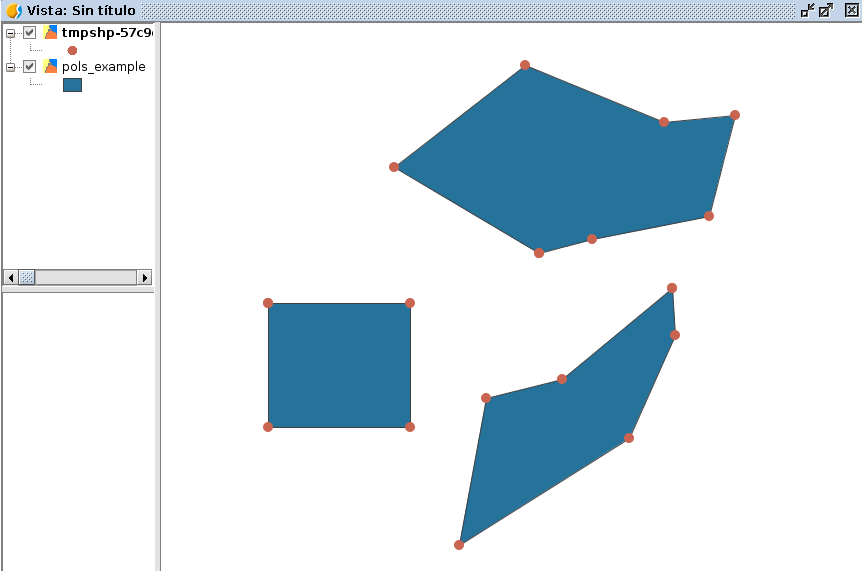

Módulo de geometrías: geom
==========================

.. py:function::createGeometry(type[, subtype=D2])

    Creates an empty geometry

    :param int type: Geometry type
	:param int subtype: Geometry dimension
	:return: Geometry
	
.. py:function::createPoint(subtype=D2, coords)

    Creates a point geometry

	:param int subtype: Geometry dimension
	:return: org.gvsig.fmap.geom.primitive Point
	
.. py:function::createMultiPoint(subtype=D2, points)

    Creates an multipoint geometry

	:param int subtype: Geometry dimension
	:param points: Points objects
	:type points: List of Points
	:return: org.gvsig.fmap.geom.aggregate MultiPoint
	
.. py:function::createLine(subtype=D2, vertexes=None)

    Creates an empty geometry

	:param int subtype: Geometry dimension
	:param vertexes:
	:type vertexes: List of Points
	:return: Geometry
	
.. createMultiLine(subtype=D2, lines=None)

    Creates an empty geometry

	:param int subtype: Geometry dimension
	:param lines:
	:type lines: List of Lines
	:return: Geometry
	
.. py:function::createPolygon(subtype=D2, vertexes=None)

    Creates an empty geometry

	:param int subtype: Geometry dimension
	:param vertexes:
	:type vertexes: List of Points
	:return: Geometry
	
.. py:function::createMultiPolygon(subtype=D2, polygons=None)

    Creates an empty geometry
	:param int subtype: Geometry dimension
	:param polygons:
	:type polygons: List of Poligons
	:return: Geometry

.. py:function::createEnvelope(pointMin=None, pointMax=None, dimension=2)

    Creates a Envelope 2D

    :param Point pointMin: Geometry
	:param Point pointMax: Geometry
	:param int dimension: Dimension of the envelope
	:return: Geometry
	
.. py:function::createGeometryFromWKT(WKT)

    Creates an empty geometry

    :param int type: Geometry type
	:param int subtype: Geometry dimension
	:return: Geometry
	
Una geometría es un objeto que contiene información geométrica. Estas geometrías tienen un tipo principal: Point, Line, Polygon.. y un subtipo o dimensión: D2, D3, D2M..

Para el Módulo de Scripting hemos creado la librería gvsig.geom que nos ayudará para crear rápidamente las geometrías que necesitemos. Para algunas operaciones más complicadas tendremos que usar la API de gvSIG.

Para establecer estos tipos y subtipos lo haremos utilizando las constantes que se incluyen en la librería.

Constantes que aparecen en la librería ``gvsig.geom`` para la creación de geometrías::

	#GeometryTypes
	AGGREGATE = Geometry.TYPES.AGGREGATE
	ARC = Geometry.TYPES.ARC
	CIRCLE = Geometry.TYPES.CIRCLE
	CURVE = Geometry.TYPES.CURVE
	ELLIPSE = Geometry.TYPES.ELLIPSE
	ELLIPTICARC = Geometry.TYPES.ELLIPTICARC
	GEOMETRY = Geometry.TYPES.GEOMETRY
	MULTICURVE = Geometry.TYPES.MULTICURVE
	MULTIPOINT = Geometry.TYPES.MULTIPOINT
	MULTISOLID = Geometry.TYPES.MULTISOLID
	MULTISURFACE = Geometry.TYPES.MULTISURFACE
	NULL = Geometry.TYPES.NULL
	POINT = Geometry.TYPES.POINT
	SOLID =  Geometry.TYPES.SOLID
	SPLINE = Geometry.TYPES.SPLINE
	SURFACE = Geometry.TYPES.SURFACE

	# Common named geometry types
	POLYGON = Geometry.TYPES.SURFACE
	LINE = Geometry.TYPES.CURVE
	MULTILINE = Geometry.TYPES.MULTICURVE
	MULTIPOLYGON = Geometry.TYPES.MULTISURFACE

	# geometrySubTypes
	D2 = Geometry.SUBTYPES.GEOM2D
	D2M = Geometry.SUBTYPES.GEOM2DM
	D3 = Geometry.SUBTYPES.GEOM3D
	D3M = Geometry.SUBTYPES.GEOM3DM
	UNKNOWN = Geometry.SUBTYPES.UNKNOWN

	# Dimensions
	DIMENSIONS = Geometry.DIMENSIONS

Ejemplo testeando la librería de geom::

    import gvsig
    reload(gvsig)
    from gvsig import *
    from gvsig import geom

    def main(*args):

        # Create Polygon
        print "\nCreate Polygon"
        x = geom.createPolygon()
        pol_1 = geom.createPolygon(vertexes=[geom.createPoint(geom.D2, 4,5),geom.createPoint(geom.D2,3,3),geom.createPoint(geom.D2,3,2),geom.createPoint(geom.D2,4,5)])
        print "pol_1: ", pol_1.convertToWKT()
        pol_2 = geom.createPolygon(vertexes=[geom.createPoint(geom.D2,4,5),geom.createPoint(geom.D2,3,3),geom.createPoint(geom.D2,3,2),geom.createPoint(geom.D2,4,5)])
        print "pol_2: ", pol_2.convertToWKT()
        pol_3 = geom.createPolygon(vertexes=[geom.createPoint(geom.D2,4,5),geom.createPoint(geom.D2,3,3),geom.createPoint(geom.D2,3,2),geom.createPoint(geom.D2,4,5)])
        print "pol_3: ", pol_3.convertToWKT()
        pol_4 = geom.createPolygon(geom.D2,[(0,0),(10,10),[3,3],[3,6],[0,0]])
        print "pol_4: ", pol_4.convertToWKT()

        # Create MultiPolygon
        print "\nCreate MultiPolygon"
        multipolygon1 = geom.createMultiPolygon()
        multipolygon1.addSurface(pol_1)
        multipolygon1.addSurface(pol_2)
        multipolygon1.addSurface(pol_3)
        print "multipolygon1: ", multipolygon1.convertToWKT()

        multipolygon2 = geom.createMultiPolygon(polygons=[pol_1, pol_2, pol_3])
        print "multipolygon2: ", multipolygon2.convertToWKT()

        p2 = geom.createPoint(geom.D2,1,2)
        print "p2:", p2
        line2 = geom.createLine(geom.D2, [[10,19],p2,[5,2]])
        print line2
        print line2.convertToWKT()

        y = geom.createPoint(geom.D3M,10,1,5,8)
        z = geom.createPoint(geom.D3,10, 1, 5)
        print "point y: ", y,type(y)
        print "point z", z, type(z)

        print "preparing 3d"
        x = geom.createLine(geom.D3M,[(10,10,100,8),(1,95,2,8)])
        print x.convertToWKT()

        # Create point
        print "\nCreate Point"
        point1 = geom.createPoint(geom.D2,10, 10)
        point2 = geom.createGeometry(geom.POINT)
        point2.setX(15)
        point2.setY(15)
        print "Point1: ", point1
        print "Point2: ", point2

        point1 = geom.createPoint(geom.D2,10, 10)
        # Create line
        print "\nCreate Line"
        line1 = geom.createGeometry(geom.LINE)
        line1.addVertex(geom.createPoint(geom.D2,0,0))
        line1.addVertex(geom.createPoint(geom.D2,10,10))
        print "Line1: ", line1.convertToWKT()

        p2 = geom.createPoint(geom.D2,1,2)
        print " === LINE == "
        line2 = geom.createLine(geom.D2, [[10,19], point1 ,p2,[5,2]])
        print "Line2 object: ", line2
        print "Line2: ", line2.convertToWKT()
        print "1", line2.getVertex(0)
        print "2", line2.getVertex(1)
        print "3", line2.getVertex(2)
        print "4", line2.getVertex(3)

        # Create polygon
        print "\nCreate Polygon"
        g = geom.createGeometry(geom.POLYGON)
        g.addVertex(geom.createPoint(geom.D2,0,0))
        g.addVertex(geom.createPoint(geom.D2,10,10))
        g.addVertex(geom.createPoint(geom.D2,10,0))
        g.addVertex(geom.createPoint(geom.D2,0, 0))

        print "JTS of the Polygon 1: ", g.convertToWKT()
        g.setVertex(2, geom.createPoint(geom.D2, 15, 15))
        print "JTS of the Polygon 1 modified: ", g.convertToWKT()

        poli_1 = geom.createPolygon(geom.D2, [[0,0],[1,1],[2,3],[3,6],[0,0]])
        print "Poli_1", poli_1.convertToWKT()
        poli_2 = geom.createPolygon(geom.D3, [[0,1,2],[1,1,5],geom.createPoint(geom.D3,2,1,5),[0,1,2]])
        print "Poli_2", poli_2

        # Create gvSIG geometry from a WKT or WKB
        print "\nCreate gvSIG geometry from WKT or WKB"
        wkt = "POLYGON ((0 0, 150 150, 100 0, 0 0))"
        x = geom.createGeometryFromWKT(wkt)
        print "Polygon from WKT: ", x
        print "Type polygon: ", type(x)

        # Create 3D geometry
        print "\nCreate 3D Geometry"
        p3d = geom.createGeometry(geom.POINT, geom.D3)
        p3d.setX(10)
        p3d.setY(10)
        p3d.setZ(100)
        print "Point 3D: ", p3d, type(p3d)
        p1_3d = geom.createPoint(geom.D3,1,3,3)
        print "Point 3D P1: ", p1_3d

        # Create Multipoint
        print "\nCreate Multipoint: "
        multipoint1 = geom.createMultiPoint(points=[geom.createPoint(geom.D2, 10,10), geom.createPoint(geom.D2,5,2), geom.createPoint(geom.D2,8,3)])
        print "multipoint1: ", multipoint1.convertToWKT()
        multipoint1.addPrimitive(geom.createPoint(geom.D2,3, 2))
        print "multipoint1 modified: ", multipoint1.convertToWKT()

        multipoint2 = geom.createMultiPoint()
        print "multipoint2: ", multipoint2.convertToWKT()

        multipoint3 = geom.createMultiPoint(geom.D3,[[19,10,8],[3,5,7],[35,5,5]])
        print "multipoint3: ", multipoint3.convertToWKT()

        # Create Polygon
        print "\nCreate Polygon"
        x = geom.createPolygon()
        pol_1 = geom.createPolygon(vertexes=[geom.createPoint(geom.D2,4,5),geom.createPoint(geom.D2,3,3),geom.createPoint(geom.D2,3,2),geom.createPoint(geom.D2,4,5)])
        print "pol_1: ", pol_1.convertToWKT()
        pol_2 = geom.createPolygon(vertexes=[geom.createPoint(geom.D2,4,5),geom.createPoint(geom.D2,3,3),geom.createPoint(geom.D2,3,2),geom.createPoint(geom.D2,4,5)])
        print "pol_2: ", pol_2.convertToWKT()
        pol_3 = geom.createPolygon(vertexes=[geom.createPoint(geom.D2,4,5),geom.createPoint(geom.D2,3,3),geom.createPoint(geom.D2,3,2),geom.createPoint(geom.D2,4,5)])
        print "pol_3: ", pol_3.convertToWKT()
        pol_4 = geom.createPolygon(geom.D2,[(0,0),(10,10),[3,3],[3,6],[0,0]])
        print "pol_4: ", pol_4.convertToWKT()

        # Create MultiPolygon
        print "\nCreate MultiPolygon"
        multipolygon1 = geom.createMultiPolygon()
        multipolygon1.addSurface(pol_1)
        multipolygon1.addSurface(pol_2)
        multipolygon1.addSurface(pol_3)
        print "multipolygon1: ", multipolygon1.convertToWKT()

        multipolygon2 = geom.createMultiPolygon(polygons=[pol_1, pol_2, pol_3])
        print "multipolygon2: ", multipolygon2.convertToWKT()

        multipolygon3 = geom.createMultiPolygon(geom.D2,[[[0,0],[1,1],[2,2],[0,0]],[[2,5],[3,5],[1,2],[2,5]],pol_4])
        print "multipolygon3: ", multipolygon3.convertToWKT()

        # CreateLine
        print "\nCreate Line"
        line1 = geom.createLine()

        line1.addVertex(geom.createPoint2D(1,1))
        line1.addVertex(geom.createPoint2D(3,3))
        print "line1: ", line1.convertToWKT()
        line2 = geom.createLine(vertexes=[geom.createPoint2D(0,0), geom.createPoint2D(10,10)])
        print "line2: ", line2.convertToWKT()
        line3 = geom.createLine(geom.D2,[[0,1],[1,5],[5,3]])
        print "line3: ", line3.convertToWKT()

        # Create MultiLine
        print "\nCreate MultiLine"
        multiline1 = geom.createMultiLine()
        multiline1.addCurve(line1)
        multiline1.addCurve(line2)
        print "multiline1: ", multiline1.convertToWKT()

        multiline2 = geom.createMultiLine(lines=[line1, line2], subtype=geom.D2)
        print "multiline2: ", multiline2.convertToWKT()

        # Create Envelope
        envelope = geom.createEnvelope(pointMin=geom.createPoint2D(10,0),pointMax=geom.createPoint2D(10,20))
        print "envelope: ", envelope
        env1 = geom.createEnvelope(point1,[38,29])
        print "env1: ", env1,type(env1)

        # Create from WKT
        print "\nCreate geometr from WKT"
        wkt = geom.createGeometryFromWKT("MULTIPOLYGON (((4 5, 3 3, 3 2, 4 5)), ((4 5, 3 3, 3 2, 4 5)), ((4 5, 3 3, 3 2, 4 5)))")
        print "wkt: ", wkt.convertToWKT()

        # Create 2D
        pg = geom.createPoint2D(19,5)
        print pg
        lg = geom.createLine2D()
        print lg
        mg = geom.createPolygon2D()
        print mg
        mg2 = geom.createPolygon2D([[1,5],[4,5],[1,3],[25,2],pg,[1,5]])
        print mg2.convertToWKT()
        x = geom.createPoint2D(1)
        print x

		

Punto
-----

Creando puntos::

	from gvsig.geom import *

	def main(*args):

		print "\nCreate Point"
		point1 = createPoint(D3, 10, 10, 5)
		point2 = createPoint(D2, 15, 7)
		
		point3 = createGeometry(POINT)
		point3.setX(15)
		point3.setY(15)

		point4 = createPoint(D3M, 5, 18, 3, 2)
		
		print "Point1: ", point1
		print "Point2: ", point2
		print "Point3: ", point3
		print "Point4: ", point4

Consola::

	Create Point
	Point1:  POINT Z (10.0 10.0 5.0)
	Point2:  POINT (15.0 7.0)
	Point3:  POINT (15.0 15.0)
	Point4:  POINT ZM (5.0 18.0 3.0 2.0)

Creando punto con 3 dimensiones::

	from gvsig.geom import *

	def main(*args):

		#Create 3D Geometry
		p3d = createGeometry(POINT, D3)
		p3d.setX(10)
		p3d.setY(10)
		p3d.setZ(100)
		
		print p3d.convertToWKT()

Consola::

	POINT Z (10 10 100)

Línea
-----

Creando líneas::

	from gvsig.geom import *

	def main(*args):

		line1 = createGeometry(LINE)
		line1.addVertex(createPoint(D2,0,0))
		line1.addVertex(createPoint(D2,10,10))
		print "Line1: ", line1.convertToWKT()
		
Consola::

	Line1:  LINESTRING (0 0, 10 10)

Accediendo a los vértices de la línea::

	from gvsig.geom import *

	def main(*args):

		line1 = createGeometry(LINE)
		line1.addVertex(createPoint(D2,0,0))
		line1.addVertex(createPoint(D2,10,10))
		print "Line1: ", line1.convertToWKT()

		p1 = createPoint(D2, 3, 01)
		p2 = createPoint(D2, 1, 2)

		# List of vertex or coordinates
		vertx = [[10,19], p1 ,p2,[5,2]]
		line2 = createLine(D2, vertx)
		
		print "\nLine2 object: ", line2
		print "Line2: ", line2.convertToWKT()
		print "1", line2.getVertex(0)
		print "2", line2.getVertex(1)
		print "3", line2.getVertex(2)
		print "4", line2.getVertex(3)

Consola::

	Line1:  LINESTRING (0 0, 10 10)

	Line2 object:  Line:2D
	Line2:  LINESTRING (10 19, 3 1, 1 2, 5 2)
	1 POINT (10.0 19.0)
	2 POINT (3.0 1.0)
	3 POINT (1.0 2.0)
	4 POINT (5.0 2.0)
	
Polígono
--------

Creando polígonos::

	from gvsig.geom import *

	def main(*args):

		g = createGeometry(POLYGON, D2)
		g.addVertex(createPoint(D2,0,0))
		g.addVertex(createPoint(D2,10,10))
		g.addVertex(createPoint(D2,10,0))
		g.addVertex(createPoint(D2,0, 0))

		print "WKT Polygon: ", g.convertToWKT()

		poli_1 = createPolygon(D2, [[0,0],[1,1],[2,3],[3,6],[0,0]])
		print "Poli_1", poli_1.convertToWKT()
		
		poli_2 = createPolygon(D3, [[0,1,2],[1,1,5],createPoint(D3,2,1,5),[0,1,2]])
		print "Poli_2", poli_2.convertToWKT()
		
Consola::

	WKT Polygon:  POLYGON ((0 0, 10 10, 10 0, 0 0))
	Poli_1 POLYGON ((0 0, 1 1, 2 3, 3 6, 0 0))
	Poli_2 POLYGON Z ((0 1 2, 1 1 5, 2 1 5, 0 1 2))

Multipunto
----------

Creando multipunto::

	from gvsig.geom import *

	def main(*args):

		# Create Multipoint
		multipoint1 = createMultiPoint(D2, [createPoint(D2, 10,10), createPoint(D2,5,2), createPoint(D2,8,3)])
		
		print "multipoint1: ", multipoint1.convertToWKT()
		
		multipoint2 = createMultiPoint()
		print "multipoint2: ", multipoint2.convertToWKT()

		multipoint3 = createMultiPoint(D3,[[19,10,8],[3,5,7],[35,5,5]])
		print "multipoint3: ", multipoint3.convertToWKT()
	
Consola::

	multipoint1:  MULTIPOINT (10 10, 5 2, 8 3)
	multipoint2:  MULTIPOINT EMPTY
	multipoint3:  MULTIPOINT Z (19 10 8, 3 5 7, 35 5 5)

Añadiendo punto a una geometría de tipo multipunto::

	from gvsig.geom import *

	def main(*args):

		# Create Multipoint
		multipoint1 = createMultiPoint(D2, [createPoint(D2, 10,10), createPoint(D2,5,2), createPoint(D2,8,3)])
		
		print "multipoint1: ", multipoint1.convertToWKT()
		
		multipoint1.addPrimitive(createPoint(D2,3, 2))
		print "multipoint1 modified: ", multipoint1.convertToWKT()
		
Consola::

	multipoint1:  MULTIPOINT (10 10, 5 2, 8 3)
	multipoint1 modified:  MULTIPOINT (10 10, 5 2, 8 3, 3 2)

Multilínea
----------

Creando multilíneas::

	from gvsig.geom import *

	def main(*args):

	# CreateLine
		print "\nCreate Line"
		line1 = createLine()
		
		line1.addVertex(createPoint2D(1,1))
		line1.addVertex(createPoint2D(3,3))
		line2 = createLine(vertexes=[createPoint2D(0,0), createPoint2D(10,10)])
		line3 = createLine(D2,[[0,1],[1,5],[5,3]])

		# Create MultiLine
		multiline1 = createMultiLine()
		multiline1.addCurve(line1)
		multiline1.addCurve(line2)
		print "multiline1: ", multiline1.convertToWKT()
		
		multiline2 = createMultiLine(D2, lines=[line1, line2])
		print "multiline2: ", multiline2.convertToWKT()

		multiline3 = createGeometry(MULTICURVE, D2)
		multiline3.addCurve(line1)
		multiline3.addCurve(line3)
		print "multiline3: ", multiline3.convertToWKT()

Consola::

	Create Line
	multiline1:  MULTILINESTRING ((1 1, 3 3), (0 0, 10 10))
	multiline2:  MULTILINESTRING ((1 1, 3 3), (0 0, 10 10))
	multiline3:  MULTILINESTRING ((1 1, 3 3), (0 1, 1 5, 5 3))

Multipolígono
-------------

Creando multipolígonos::

	from gvsig.geom import *

	def main(*args):

		# Create Polygon
		x = createPolygon()
		pol_1 = createPolygon(vertexes=[createPoint(D2,4,5),createPoint(D2,3,3),createPoint(D2,3,2),createPoint(D2,4,5)])
		pol_2 = createPolygon(vertexes=[createPoint(D2,4,5),createPoint(D2,3,3),createPoint(D2,3,2),createPoint(D2,4,5)])
		pol_3 = createPolygon(vertexes=[createPoint(D2,4,5),createPoint(D2,3,3),createPoint(D2,3,2),createPoint(D2,4,5)])
		pol_4 = createPolygon(D2,[(0,0),(10,10),[3,3],[3,6],[0,0]])

		# Create MultiPolygon
		multipolygon1 = createMultiPolygon()
		multipolygon1.addSurface(pol_1)
		multipolygon1.addSurface(pol_2)
		multipolygon1.addSurface(pol_3)
		print "multipolygon1: ", multipolygon1.convertToWKT()

		multipolygon2 = createMultiPolygon(polygons=[pol_1, pol_2, pol_3]) #2D as default
		print "multipolygon2: ", multipolygon2.convertToWKT()

		multipolygon3 = createMultiPolygon(D2, [[[0,0],[1,1],[2,2],[0,0]],
												[[2,5],[3,5],[1,2],[2,5]],
												pol_4])
		print "multipolygon3: ", multipolygon3.convertToWKT()

		multipolygon4 = createMultiPolygon()
		print "multipolygon4: ", multipolygon4.convertToWKT()
	
Consola::

	multipolygon1:  MULTIPOLYGON (((4 5, 3 3, 3 2, 4 5)), ((4 5, 3 3, 3 2, 4 5)), ((4 5, 3 3, 3 2, 4 5)))
	multipolygon2:  MULTIPOLYGON (((4 5, 3 3, 3 2, 4 5)), ((4 5, 3 3, 3 2, 4 5)), ((4 5, 3 3, 3 2, 4 5)))
	multipolygon3:  MULTIPOLYGON (((0 0, 1 1, 2 2, 0 0)), ((2 5, 3 5, 1 2, 2 5)), ((0 0, 10 10, 3 3, 3 6, 0 0)))
	multipolygon4:  MULTIPOLYGON EMPTY

	
Envelope
--------

Crear Envelope del tipo :javadoc:`Envelope2D <Envelope2D>` ::

	from gvsig.geom import *

	def main(*args):

		# Create Envelope
		envelope = createEnvelope(pointMin=createPoint2D(10,0),pointMax=createPoint2D(10,20))
		print "envelope: ", envelope
		point1 = createPoint(D2, 0, 0)
		env1 = createEnvelope(point1,[38,29])
		print "env1: ", env1
		print "env1 type: ", type(env1)
		
Consola::

	envelope:  POLYGON ((10.0 0.0, 10.0 20.0, 10.0 20.0, 10.0 0.0, 10.0 0.0))
	env1:  POLYGON ((0.0 0.0, 0.0 29.0, 38.0 29.0, 38.0 0.0, 0.0 0.0))
	env1 type:  <type 'org.gvsig.fmap.geom.jts.primitive.Envelope2D'>
	
WKT
---
Crear geometría desde un WKT::
		
	from gvsig.geom import *

	def main(*args):

		# Create from WKT
		wkt = createGeometryFromWKT("MULTIPOLYGON (((4 5, 3 3, 3 2, 4 5)), ((4 5, 3 3, 3 2, 4 5)), ((4 5, 3 3, 3 2, 4 5)))")
		print "wkt: ", wkt.convertToWKT()
		
Consola::

	wkt:  MULTIPOLYGON (((4 5, 3 3, 3 2, 4 5)), ((4 5, 3 3, 3 2, 4 5)), ((4 5, 3 3, 3 2, 4 5)))
		

		
Operaciones espaciales
----------------------

Puedes consultar todas las operaciones espaciales en el interfaz de geometrías :javadoc:`Geometry <Geometry>`

Distancia entre puntos::

	from gvsig.geom import *

	def main(*args):
		# Creamos punto2
		point1 = createPoint(D2, 0, 0)
		point2 = createPoint(D2, 10, 10)
		print "Distance 2D: ", point1.distance(point2)
		
		point3 = createPoint(D3, 0, 0, 100)
		point4 = createPoint(D3, 10, 10, 0)
		print "Distance 2D: ", point3.distance(point4)

Consola::

	Distance 2D:  14.1421356237
	Distance 2D:  14.1421356237
		
Moviendo un punto::

	from gvsig.geom import *

	def main(*args):
		# Creamos punto2
		point1 = createPoint(D2, 10, 10)

		print "Point 1: ", point1.convertToWKT()
		
		#Move point
		point1.move(5, -3)

		print "Moved point by 5, -3: ", point1.convertToWKT()
	
Consola::

	Point 1:  POINT (10 10)
	Moved point by 5, -3:  POINT (15 7)

Operaciones entre polígonos y líneas::

	from gvsig.geom import *

	def main(*args):
		# Creamos punto2
		point1 = createPoint(D2, 0, 0)
		buffer1 = point1.buffer(10)

		line1 = createLine(D2, [[-5, -5],[10, 10]])

		print "Intersects?: ", buffer1.intersects(line1)
		print "Intersection: ", buffer1.intersection(line1).convertToWKT()
	
Consola::

	Intersects?:  True
	Intersection:  LINESTRING (-5 -5, 7.071067811865473 7.071067811865473)	

Operaciones espaciales entre polígonos::

	from gvsig.geom import *

	def main(*args):
		# Creamos punto2
		point1 = createPoint(D2, 0, 0)

		# Aplicamos un area de influencia buffer(m)
		buffer1 = point1.buffer(10)
		print "Buffer1 Area: ", buffer1.area()

		# Creamos punto 2
		point2 = createPoint(D2, 8, 0)
		buffer2 = point2.buffer(5)
		print "Buffer2 Area: ", buffer2.area()

		# Union
		buffer12_union = buffer1.union(buffer2)
		print "Buffer12 Union Area: ", buffer12_union.area()

		# Differencia
		buffer12_diff = buffer1.difference(buffer2)
		print "Buffer12 Difference Area: ", buffer12_diff.area()
		
Consola::

	Buffer1 Area:  312.144515226
	Buffer2 Area:  78.0361288065
	Buffer12 Union Area:  335.886462528
	Buffer12 Difference Area:  257.850333721

Creando un polígono, aplicarle un área de influencia, añadirle un anillo interno y agregarlo en una capa nueva::

	from gvsig import *
	from gvsig.geom import *

	def main(*args):

		pol_1 = createPolygon(D2M, [(0,0),(300,0),(300,300),(0,300),(0,0)])

		# Add interior ring
		pol_1x = createPolygon(D2M, pol_1).buffer(200)
		pol_1x.addInteriorRing(pol_1)

		schema = createSchema()
		schema.append("ID", "STRING", 5)
		schema.append("GEOMETRY", "GEOMETRY")
		schema.get('GEOMETRY').setGeometryType(POLYGON, D2M)
		
		shape = createShape(schema ,CRS='EPSG:25830')

		shape.edit()
		shape.append(ID=1, GEOMETRY=pol_1x)
		shape.commit()

		currentView().addLayer(shape)
		

   
Ejemplo para extraer todos los vértices de una capa de polígonos en forma de multipuntos::

    # encoding: utf-8

    from gvsig import *
    from gvsig import geom

    def main(*args):
        """ Extraer vertices de poligonos como multipuntos """
        
        layer = currentLayer()
        features = layer.features()

        sch = createFeatureType()
        sch.append("GEOMETRY", "GEOMETRY")
        sch.get("GEOMETRY").setGeometryType(geom.MULTIPOINT, geom.D2)
        shp = createShape(sch)
        
        for feature in features:
            gf = feature.geometry()
            shp.append(GEOMETRY=gf.toPoints())

        shp.commit()
        currentView().addLayer(shp)
        
Resultado:

   
Con una pequeña modificación, podemos hacer que añada un punto por cada vértice, recorriendo las geometrías de multipunto y extrayendo uno a uno sus puntos::

    # encoding: utf-8

    from gvsig import *
    from gvsig import geom

    def main(*args):
        """ Extraer vertices de poligonos como multipuntos """
        
        layer = currentLayer()
        features = layer.features()

        sch = createFeatureType()
        sch.append("GEOMETRY", "GEOMETRY")
        sch.get("GEOMETRY").setGeometryType(geom.POINT, geom.D2)
        shp = createShape(sch)
        
        for feature in features:
            gf = feature.geometry()

            for p in gf:
                shp.append(GEOMETRY=p)

        shp.commit()
        currentView().addLayer(shp)
        
Otra forma de recorrer los vertices podría ser haciendo uso del método ``getVertex`` y ``getNumVertices``::

    # encoding: utf-8

    from gvsig import *
    from gvsig import geom

    def main(*args):
        """ Extraer vertices de poligonos como multipuntos """
        
        layer = currentLayer()
        features = layer.features()
        
        for feature in features:
            gf = feature.geometry()
            numvertices = gf.getNumVertices()
            print "Vertices: ", numvertices
            for i in range(0, numvertices):
                print gf.getVertex(i) #geometria de tipo punto
                
Dando por consola una salida similar a::

    Vertices:  7
    POINT (274.17769116287 194.9280163662371)
    POINT (275.81171697787 166.3325646037371)
    POINT (248.03327812287003 105.05659654123708)
    POINT (145.90666468537003 40.5125768487371)
    POINT (162.24692283537004 128.74997085873707)
    POINT (207.99964565537007 140.1881515637371)
    POINT (274.17769116287 194.9280163662371)
    ...

Transformación entre proyecciones
---------------------------------

En el siguiente ejemplo vemos como transformar una geometría entre dos proyecciones::

    # encoding: utf-8

    from gvsig import *
    from gvsig.geom import *

    def main(*args):
        """ Convertir geometria entre proyecciones """
        
        crs1 = getCRS('EPSG:4326')
        crs2 = getCRS('EPSG:32630')
        
        #Get IProjection
        #view1 = currentProject().getViews()[0].getProjection()
        #view2 = currentProject().getViews()[1].getProjection()

        #Get ICoordTrans
        ICoordTrans1 = crs1.getCT(crs2)
        
        point = createPoint2D(-0.375,39.466) #Valencia
        print "point: ", point
        point.reProject(ICoordTrans1)
        print "reprojected: ", point
