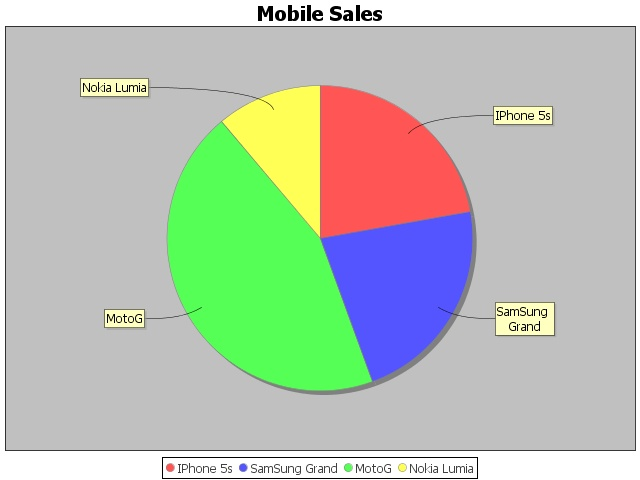

Usando librerías externas
=========================

GDAL
----
Hemos incluido una de las aplicaciones más comunes de uso en GDAL que se denomina ogr2ogr. Para usarla desde un script podemos usar las siguientes líneas, modificando las rutas por las de nuestros datos. El resultado es una transformación de un fichero geojson a un shape::

	from gvsig import *

	from gvsig import uselib
	uselib.use_plugin("org.gvsig.gdal.app.mainplugin")
	from org.gvsig.gdal.app.mainplugin.common import ogr2ogr

	def gdalapp(argsAsString):
		import shlex
		x = shlex.split(argsAsString)
		print "Function: ", x.pop(0)
		print "Args: ", x
		ogr2ogr.main(x)

	def main(*args):

		"""ogr2ogr from gdal"""
		"""
		ogr2ogr.main(["-t_srs", "CRS:84", 
					  "-f", 
					  "ESRI Shapefile", 
					  "C:/temp/j1", 
					  "C:/temp/countries.geojson",
					  "-overwrite",
					  "-skipfailures"
					  ])
		"""

		
		gdalapp("ogr2ogr -t_srs 'EPSG:4326' -f 'ESRI Shapefile' C://temp//j1.shp D://gvdata//countries023.geojson -overwrite -skipfailures")
		loadShapeFile("C:/temp/j1.shp")

jfreechart
----------
Una librería que viene con gvSIG es jfreechart y la podemos usar para generar gráficas.

Generar gráfica y guardarla en formato ``.jpeg`` en disco.

   
Código::

	from java.io import File
	from org.jfree.chart import ChartUtilities
	from org.jfree.chart import ChartFactory
	from org.jfree.chart import JFreeChart
	from org.jfree.data.general import DefaultPieDataset

	#Save chart into png file

	def main():
		  dataset = DefaultPieDataset( )
		  dataset.setValue("IPhone 5s", float( 20 ) )
		  dataset.setValue("SamSung Grand", float( 20 ) )
		  dataset.setValue("MotoG", float( 40 ) )
		  dataset.setValue("Nokia Lumia", float( 10 ) )

		  chart = ChartFactory.createPieChart(
			 "Mobile Sales", # chart title
			 dataset, # data
			 True, # include legend
			 True,
			 False)
			 
		  width = 640
		  height = 480
		  pieChart = File( "D:/pieChart.jpeg" )
		  ChartUtilities.saveChartAsJPEG( pieChart , chart , width , height )
	   

Otro ejemplo que genera una pantalla con el resultado.

.. figure::  images/simple_pie_chart.png
   :align:   center
   
Código::

	from org.jfree.chart import ChartFactory 
	from org.jfree.chart import ChartFrame 
	from org.jfree.chart import JFreeChart
	from org.jfree.data.general import DefaultPieDataset
	from org.jfree.ui import RefineryUtilities
	"""
	* A simple introduction to using JFreeChart. This demo is described in the
	* JFreeChart Developer Guide.
	* Translated from Java to Jython by Alfonso Reyes
	"""
	class First:
		"""
		* The starting point for the demo.
		*
		* @param args ignored.
		"""
		# create a dataset...
		data = DefaultPieDataset()
		data.setValue("Category 1", 43.2)
		data.setValue("Category 2", 27.9)
		data.setValue("Category 3", 79.5)
		# create a chart...
		chart = ChartFactory.createPieChart(
			"Sample Pie Chart",
			data,
			True, # legend?
			True, #tooltips?
			False # URLs?
		)
		# create and display a frame...
		
		frame = ChartFrame("First", chart)
		#frame.setSize(100 , 100) #Position
		#RefineryUtilities.centerFrameOnScreen( frame )
		frame.pack()
		frame.setVisible(True)

	def main():
		app = First()
		
		
jOpenDocument
-------------

Editando ODT
++++++++++++

Abrir nuevo documento de LibreOffice

jOpenDocument - Insert Field - fieldName

Insertar una imagen
Click derecho sobre la Imagen: Imagen - Opciones - Nombre: Imagen1

Editando ODS
++++++++++++

.. note::

    Después de modificarlo hay que abrirlo y presionas ``Control+Mayusculas+F9`` para recalcular las celdas

Ejemplos
++++++++

Editar Spreadsheet ODS::

    from gvsig import *

    from java.io import File
    from java.util import Date

    from org.jopendocument.model import OpenDocument
    from org.jopendocument.dom.spreadsheet import SpreadSheet
    from org.jopendocument.dom import OOUtils

    def main(*args):
        #Ejemplo de Edicion de ficheros ODS con jOpenDocument
        
        #basado en http://www.jopendocument.org/start_spreadsheet_2.html
        #ficheros plantilla http://www.jopendocument.org/downloads.html

        pathTemplate = r"C:/joo/invoice.ods"
        pathOutput = r"C:/joo/fillingTest1.ods"

        #Acceso al spreadsheet y numero de hoja
        file = File(pathTemplate)
        sheet = SpreadSheet.createFromFile(file).getSheet(0)

        #Establecer fecha actual a la castilla I10
        sheet.getCellAt("I10").setValue(Date())

        #Modifica el valor a la celda 1,1. Seria B2
        sheet.setValueAt("Template - 1", 1, 1)

        #Varias modificaciones
        sheet.getCellAt("B27").setValue("On site support")
        sheet.getCellAt("F24").setValue(301)
        sheet.getCellAt("H27").setValue(350)
        sheet.getSpreadSheet().getTableModel("Products").setValueAt(10, 5, 4) #F27

        #Guardamos fichero
        outputFile = File(pathOutput)
        OOUtils.open(sheet.getSpreadSheet().saveAs(outputFile))

Editar Spreadsheet ODT::

    from gvsig import *
    import sys
    from geom import *

    from java.io import File
    #from org.jdom import Namespace
    from java.util.Map import *
    import java.util.ArrayList as ArrayList

    from org.jopendocument.dom.template import JavaScriptFileTemplate
    from org.jopendocument.util.CollectionUtils import createMap

    def main(*args):
        #Ejemplo de Edicion de ficheros ODT con jOpenDocument
        
        #basado en http://www.jopendocument.org/start_text_2.html
        #ficheros plantilla http://www.jopendocument.org/downloads.html

        pathTemplate = r"C:\joo\test.odt"
        pathOutput = r"C:\joo\test4"
        
        #Creamos template
        templateFile = File(pathTemplate)
        outFile = File(pathOutput)
        template = JavaScriptFileTemplate(templateFile)

        # Principal: Establacer valores de un campo
        template.setField("toto", "value set using setField()")
        template.setField("a", "14")
        #Haciendo doble click sobre la linea verde aparece el nombre 
        #al que hay que hacer referencia
        template.hideParagraph("p1") #showParagraph
        template.showSection("section1") #hideSection

        #Values de la tabla
        months = ArrayList()
        months.add(createMap("name","January",   "min", "-12", "max", "3"))
        months.add(createMap("name", "February", "min", "-8",  "max", "5"))
        months.add(createMap("name", "March", "min", "-5", "max", "12"))
        months.add(createMap("name", "April", "min", "-1", "max", "15"))
        months.add(createMap("name", "May", "min", "3", "max", "21"))
        template.setField("months", months)
        
        ddoc = template.createDocument()
        ddoc.saveAs(outFile)

Reemplazar imagen::

    pathImg = r"C:/joo/img02.png"
    ddoc = template.createDocument()
    #ddoc.getDescendantByName("draw:frame","Imagen1").setAttribute("href", "file:///" + pathImg,Namespace.getNamespace("xlink", "http://www.w3.org/1999/xlink"))  
    ddoc.saveAs(outFile)
	
	
